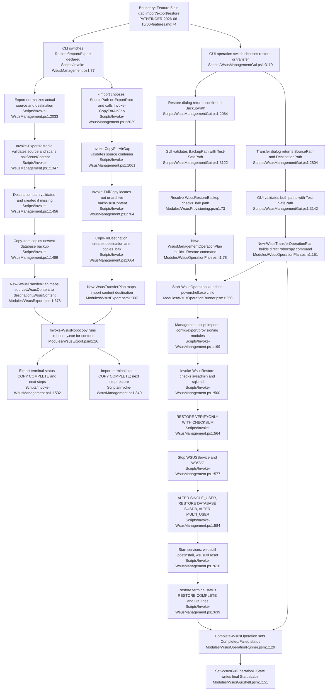

# Feature 5 — Air-gap transfer, import/export & database restore

## Sources consulted
- `PATHFINDER-2026-06-15/00-features.md:74-85`
- `Scripts/WsusManagementGui.ps1:332-338`
- `Scripts/WsusManagementGui.ps1:2064-2176`
- `Scripts/WsusManagementGui.ps1:2804-2868`
- `Scripts/WsusManagementGui.ps1:3119-3149`
- `Scripts/WsusManagementGui.ps1:3185-3258`
- `Scripts/Invoke-WsusManagement.ps1:77-124`
- `Scripts/Invoke-WsusManagement.ps1:179-223`
- `Scripts/Invoke-WsusManagement.ps1:294-355`
- `Scripts/Invoke-WsusManagement.ps1:500-642`
- `Scripts/Invoke-WsusManagement.ps1:664-730`
- `Scripts/Invoke-WsusManagement.ps1:764-844`
- `Scripts/Invoke-WsusManagement.ps1:1061-1178`
- `Scripts/Invoke-WsusManagement.ps1:1347-1540`
- `Scripts/Invoke-WsusManagement.ps1:2027-2048`
- `Modules/WsusProvisioning.psm1:73-124`
- `Modules/WsusOperationPlan.psm1:54-84`
- `Modules/WsusOperationPlan.psm1:161-172`
- `Modules/WsusExport.psm1:26-147`
- `Modules/WsusExport.psm1:378-428`
- `Modules/WsusOperationRunner.psm1:129-214`
- `Modules/WsusOperationRunner.psm1:250-562`
- `Modules/WsusGuiShell.psm1:151-210`
- `Modules/WsusOperationCompletion.psm1:10-68`

## Concrete findings
- GUI restore path uses `Show-RestoreDialog`, validates the selected `.bak` path with `Test-SafePath`, resolves it with `Resolve-WsusRestoreBackup`, then creates a `restore` management operation plan with `ContentPath`, `SqlInstance`, and `BackupFile` (`Scripts/WsusManagementGui.ps1:2064-2176`, `3119-3137`; `Modules/WsusProvisioning.psm1:73-124`).
- GUI transfer path uses `Show-TransferDialog`, validates source/destination with `Test-SafePath`, then creates `New-WsusTransferOperationPlan` in forced Embedded mode (`Scripts/WsusManagementGui.ps1:2804-2868`, `3139-3149`).
- `New-WsusTransferOperationPlan` emits direct `robocopy` source→destination with `/E /ZB /COPY:DAT /DCOPY:T /R:1 /W:1 /NDL /NP` and maps robocopy exit codes `0..7` to process exit 0 (`Modules/WsusOperationPlan.psm1:161-172`).
- GUI execution and terminal status are owned by `Start-WsusOperation` / `Complete-WsusOperation` plus `Invoke-WsusGuiOperationCompletion` (`Scripts/WsusManagementGui.ps1:3185-3258`; `Modules/WsusOperationRunner.psm1:129-214`, `250-562`; `Modules/WsusGuiShell.psm1:151-210`; `Modules/WsusOperationCompletion.psm1:10-68`).
- CLI exposes `-Restore`, `-Import`, `-Export`, `-BackupPath`, `-SourcePath`, `-DestinationPath`, `-NonInteractive`, `-ExportRoot`, `-ContentPath`, and `-SqlInstance` (`Scripts/Invoke-WsusManagement.ps1:77-130`). Main dispatch routes `-Restore` to `Invoke-WsusRestore`, `-Import` to `Invoke-CopyForAirGap`, and `-Export` to `Invoke-ExportToMedia` (`Scripts/Invoke-WsusManagement.ps1:2027-2048`).
- `Invoke-CopyForAirGap` validates the source, then `Invoke-FullCopy` locates the newest `.bak` and `WsusContent`, and `Copy-ToDestination` copies the `.bak` plus uses `New-WsusTransferPlan -Direction Import` and `Invoke-WsusTransferPlan` for content (`Scripts/Invoke-WsusManagement.ps1:1061-1178`, `764-844`, `664-730`; `Modules/WsusExport.psm1:378-428`).
- `Invoke-ExportToMedia` validates source/destination, copies the newest backup with `Copy-Item`, and uses `New-WsusTransferPlan -Direction Export` plus `Invoke-WsusTransferPlan` to send `WsusContent` to `destination\WsusContent` (`Scripts/Invoke-WsusManagement.ps1:1347-1540`; `Modules/WsusExport.psm1:378-428`).
- `New-WsusTransferPlan` normalizes `ContentSource` and `ContentDestination` by appending `WsusContent` unless the provided path already ends in `WsusContent` (`Modules/WsusExport.psm1:378-413`).
- `Invoke-WsusRobocopy` validates source existence, runs `robocopy.exe` with `/E /XO /MT:16 /R:2 /W:5 /NP /NDL` plus optional `/MAXAGE`, `/XF`, `/XD`, `/LOG`, and treats `0..7` as success (`Modules/WsusExport.psm1:26-147`).
- `Invoke-WsusRestore` requires SQL sysadmin, locates `sqlcmd.exe`, verifies backup with `RESTORE VERIFYONLY WITH CHECKSUM`, stops `WSUSService` and `W3SVC`, switches SUSDB to `SINGLE_USER`, runs `RESTORE DATABASE SUSDB WITH REPLACE`, switches back to `MULTI_USER`, restarts services, runs `wsusutil postinstall`, then `wsusutil reset`, and prints `RESTORE COMPLETE` (`Scripts/Invoke-WsusManagement.ps1:500-642`).
- Current-state caveat: `ErrorActionPreference` in `Invoke-WsusManagement.ps1` is `Continue`, so some failures can log/return without a nonzero exit; GUI status is based on child process exit code.

## Mermaid flowchart

## External dependencies
- `powershell.exe` child process.
- `robocopy.exe` for direct GUI transfer and CLI import/export content movement.
- `sqlcmd.exe` for backup verification and SUSDB restore.
- SQL Server instance containing `SUSDB`, with current user sysadmin rights.
- Windows services `WSUSService` and `W3SVC` during restore.
- `wsusutil.exe` for postinstall and reset/content re-verification.
- Filesystem/external media or UNC paths.
- Optional GUI notification/history/secret cleanup modules on completion.

## Confidence
- High for current-state happy path through GUI restore/transfer, CLI import/export, robocopy placement, SUSDB restore, and GUI terminal status.
- Gap: no runtime execution; non-happy-path exit-code behavior is a current-state caveat only.
