# Feature 9 — Client deployment, GPO import & check-in

## Sources consulted
- `PATHFINDER-2026-06-15/00-features.md:123-135`
- `Scripts/WsusManagementGui.ps1:520-535`
- `Scripts/WsusManagementGui.ps1:1471-1490`
- `Scripts/WsusManagementGui.ps1:3307-3386`
- `DomainController/Set-WsusGroupPolicy.ps1:1-60`
- `DomainController/Set-WsusGroupPolicy.ps1:109-135`
- `DomainController/Set-WsusGroupPolicy.ps1:186-250`
- `DomainController/Set-WsusGroupPolicy.ps1:253-286`
- `DomainController/Set-WsusGroupPolicy.ps1:288-424`
- `DomainController/Set-WsusGroupPolicy.ps1:426-510`
- `DomainController/Set-WsusGroupPolicy.ps1:512-638`
- `DomainController/WSUS GPOs/{A806083D-AB0A-4A33-B009-081B64F0A72D}/bkupInfo.xml:1-1`
- `DomainController/WSUS GPOs/{50621A3B-C077-42A9-B0D7-128351D3D8D9}/bkupInfo.xml:1-1`
- `DomainController/WSUS GPOs/{D1E8733B-4D86-428E-9B2D-C310CE37BFED}/bkupInfo.xml:1-1`
- `Scripts/Invoke-WsusClientCheckIn.ps1:1-268`
- `Modules/WsusUtilities.psm1:89-153`
- `Modules/WsusUtilities.psm1:236-270`
- `Scripts/Invoke-WsusManagement.ps1:1958-2016`

## Concrete findings
- GUI entry is the `BtnCreateGpo` WPF nav button (`Scripts/WsusManagementGui.ps1:527-531`), and it is gated with other WSUS-required buttons (`Scripts/WsusManagementGui.ps1:1483-1488`).
- `BtnCreateGpo.Add_Click` searches for a `DomainController` source folder, asks confirmation, creates `C:\WSUS\WSUS GPO` if needed, and copies the full `DomainController` directory there (`Scripts/WsusManagementGui.ps1:3307-3340`).
- GUI then counts GPO backup directories, checks for `Set-WsusGroupPolicy.ps1`, and prints DC-side instructions to copy `C:\WSUS\WSUS GPO` to a domain controller and run `Set-WsusGroupPolicy.ps1 -WsusServerUrl "http://YOURSERVER:8530"` (`Scripts/WsusManagementGui.ps1:3342-3379`).
- `Set-WsusGroupPolicy.ps1` is the DC-side entry. It requires admin rights, accepts `-WsusServerUrl` and `-BackupPath`, and directly invokes `Invoke-WsusGroupPolicyImport` (`DomainController/Set-WsusGroupPolicy.ps1:1-60`, `634-635`).
- `Invoke-WsusGroupPolicyImport` installs/loads GroupPolicy/GPMC if missing, imports `GroupPolicy`, runs prerequisites, detects the domain, verifies backup path, parses backup manifests, builds GPO definitions, imports matched backups, then calls `Push-GPUpdateToAll` and `Show-Summary` (`DomainController/Set-WsusGroupPolicy.ps1:543-625`).
- Domain detection uses `Get-ADDomain` with environment-variable fallback (`DomainController/Set-WsusGroupPolicy.ps1:109-134`).
- `Get-GpoDefinitions` creates three logical GPOs: `WSUS Update Policy`, `WSUS Inbound Allow`, `WSUS Outbound Allow` (`DomainController/Set-WsusGroupPolicy.ps1:218-250`), and the three backup manifests confirm those source names.
- OU resolution reuses `Member Servers` / `Member_Servers` when present and creates missing child OUs as needed (`DomainController/Set-WsusGroupPolicy.ps1:186-215`, `253-286`).
- `Import-WsusGpo` removes old links and GPOs, creates a new GPO, imports the backup, sets WSUS registry values for the update-policy GPO, removes stale registry policy values, and links the GPO to target OUs (`DomainController/Set-WsusGroupPolicy.ps1:315-419`).
- `Push-GPUpdateToAll` enumerates enabled AD computers excluding domain controllers, optionally pings each, remotely creates a temporary `SYSTEM` scheduled task via `schtasks.exe` to run `gpupdate /force /wait:0`, runs it, then deletes it (`DomainController/Set-WsusGroupPolicy.ps1:426-510`).
- `Invoke-WsusClientCheckIn.ps1` is the client-side follow-up path: it imports `WsusUtilities`, verifies admin, stops update-related services, optionally renames `C:\Windows\SoftwareDistribution`, removes `SusClientId` registry values, restarts services, triggers detection via `wuauclt`, `USOClient`, and `Microsoft.Update.Session`, then reads WSUS policy registry values and shows status (`Scripts/Invoke-WsusClientCheckIn.ps1:1-268`; `Modules/WsusUtilities.psm1:236-265`).
- CLI menu option 9 dispatches `Invoke-WsusClientCheckIn.ps1`; the GUI Create GPO path does not directly call it (`Scripts/Invoke-WsusManagement.ps1:1977-2014`).

## Mermaid flowchart

```mermaid
flowchart TD
  A["Operator clicks Create GPO button<br/>Scripts/WsusManagementGui.ps1:531"] --> B["BtnCreateGpo.Add_Click starts<br/>Scripts/WsusManagementGui.ps1:3307"]
  B --> C["Locate DomainController source folder<br/>Scripts/WsusManagementGui.ps1:3308-3317"]
  C --> D["Confirm copy to C:\\WSUS\\WSUS GPO<br/>Scripts/WsusManagementGui.ps1:3324-3326"]
  D --> E["Create destination directory if missing<br/>Scripts/WsusManagementGui.ps1:3332-3336"]
  E --> F["Copy DomainController files recursively<br/>Scripts/WsusManagementGui.ps1:3338-3340"]
  F --> G["Count WSUS GPO backups and verify import script<br/>Scripts/WsusManagementGui.ps1:3342-3346"]
  G --> H["Show DC handoff instructions<br/>Scripts/WsusManagementGui.ps1:3348-3379"]
  H --> I["Admin runs Set-WsusGroupPolicy.ps1 on DC<br/>DomainController/Set-WsusGroupPolicy.ps1:56-60"]
  I --> J["Invoke-WsusGroupPolicyImport executes<br/>DomainController/Set-WsusGroupPolicy.ps1:543-548"]
  J --> K["Install/load GroupPolicy GPMC prerequisites<br/>DomainController/Set-WsusGroupPolicy.ps1:550-563"]
  K --> L["Detect AD domain DN and DNS name<br/>DomainController/Set-WsusGroupPolicy.ps1:569-573"]
  L --> M["Parse GUID backup manifests for GPODisplayName<br/>DomainController/Set-WsusGroupPolicy.ps1:575-601"]
  M --> N["Build three GPO definitions and targets<br/>DomainController/Set-WsusGroupPolicy.ps1:603-605"]
  N --> O["For each definition select matching backup<br/>DomainController/Set-WsusGroupPolicy.ps1:610-617"]
  O --> P["Import-WsusGpo removes old links and old GPO<br/>DomainController/Set-WsusGroupPolicy.ps1:315-337"]
  P --> Q["New-GPO then Import-GPO from backup<br/>DomainController/Set-WsusGroupPolicy.ps1:339-342"]
  Q --> R["Set WSUS URL, install schedule, deadlines<br/>DomainController/Set-WsusGroupPolicy.ps1:344-375"]
  R --> S["Remove stale registry policy values<br/>DomainController/Set-WsusGroupPolicy.ps1:378-400"]
  S --> T["New-GPLink links GPO to target OUs<br/>DomainController/Set-WsusGroupPolicy.ps1:403-420"]
  T --> U["Push-GPUpdateToAll enumerates enabled computers<br/>DomainController/Set-WsusGroupPolicy.ps1:624-625"]
  U --> V["Get-ADComputer excludes Domain Controllers<br/>DomainController/Set-WsusGroupPolicy.ps1:439-440"]
  V --> W["schtasks creates SYSTEM task running gpupdate /force /wait:0<br/>DomainController/Set-WsusGroupPolicy.ps1:463-464"]
  W --> X["schtasks runs task then deletes it<br/>DomainController/Set-WsusGroupPolicy.ps1:469-478"]
  X --> Y["Client applies WSUS policy from GPO<br/>DomainController/Set-WsusGroupPolicy.ps1:501-505"]
  Y --> Z["Optional client admin runs check-in script<br/>Scripts/Invoke-WsusClientCheckIn.ps1:23-26"]
  Z --> AA["Client imports WsusUtilities and verifies admin<br/>Scripts/Invoke-WsusClientCheckIn.ps1:69-83"]
  AA --> AB["Stop Windows Update services<br/>Scripts/Invoke-WsusClientCheckIn.ps1:88-104"]
  AB --> AC["Optionally rename SoftwareDistribution cache<br/>Scripts/Invoke-WsusClientCheckIn.ps1:109-132"]
  AC --> AD["Remove SusClientId validation registry values<br/>Scripts/Invoke-WsusClientCheckIn.ps1:137-160"]
  AD --> AE["Restart update services<br/>Scripts/Invoke-WsusClientCheckIn.ps1:166-183"]
  AE --> AF["Trigger wuauclt and USOClient detection<br/>Scripts/Invoke-WsusClientCheckIn.ps1:188-198"]
  AF --> AG["Search via Microsoft.Update.Session COM<br/>Scripts/Invoke-WsusClientCheckIn.ps1:200-209"]
  AG --> AH["Read WSUS policy registry and show status<br/>Scripts/Invoke-WsusClientCheckIn.ps1:218-268"]
```

## External dependencies
- Local filesystem (`DomainController` source; `C:\WSUS\WSUS GPO` staging destination; GPO backup folders).
- GroupPolicy/GPMC, ActiveDirectory, `Get-ADDomain`, `Get-ADOrganizationalUnit`, `Get-ADComputer`.
- `schtasks.exe`, `gpupdate.exe`, ICMP / RPC / SMB for remote policy push.
- Windows Update client services, registry keys, `wuauclt`, `USOClient`, `Microsoft.Update.Session` COM.
- Optional GUI history/notification modules are not on the primary path.

## Error and fallback notes
- GUI aborts when no `DomainController` folder is found or user declines confirmation.
- DC import exits early on missing prerequisites, missing backup path, or no parseable backups.
- Missing backup for one named GPO warns and skips just that GPO.
- Remote `gpupdate` failures do not stop the whole script; clients are expected to catch up on normal refresh/reboot.
- Client check-in catches and warns through many steps, then continues to summary where possible.

## Confidence
- High for static current-state happy path and side effects.
- Gap: no live domain controller or client execution; GUI Create GPO only stages files and prints DC instructions, it does not directly invoke `Set-WsusGroupPolicy.ps1` or the client check-in script.
