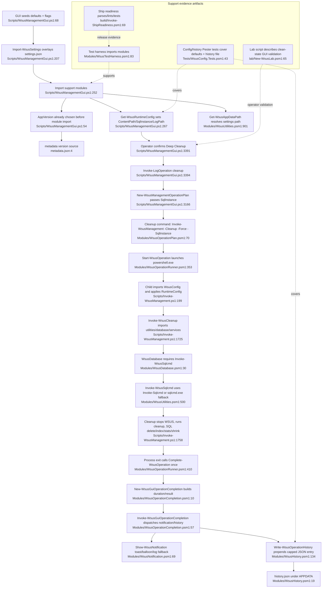

# Feature 10 — Configuration, shared utilities, history, notifications & support evidence

Representative happy path traced: GUI operator clicks Deep Cleanup, which exercises runtime config lookup, shared utilities/database helpers, history persistence, and completion notification.

## Sources consulted
- `PATHFINDER-2026-06-15/00-features.md:137-159`
- `Scripts/WsusManagementGui.ps1:48-55`, `60-104`, `205-239`, `241-285`, `300-309`, `3131-3169`, `3184-3258`, `3388-3396`, `3636-3638`, `3714-3716`
- `Modules/WsusConfig.psm1:26-78`, `153-194`, `455-490`, `622-694`, `702-726`
- `metadata.json:1-7`
- `Modules/WsusUtilities.psm1:39-88`, `146-218`, `408-555`, `901-917`, `923-994`
- `Modules/WsusOperationPlan.psm1:54-84`
- `Modules/WsusOperationRunner.psm1:250-384`, `386-422`, `442-475`, `545-562`
- `Modules/WsusOperationCompletion.psm1:10-68`
- `Scripts/Invoke-WsusManagement.ps1:75-130`, `132-154`, `165-242`, `247-256`, `1710-1916`, `2052-2057`
- `Modules/WsusDatabase.psm1:30-470`
- `Modules/WsusHistory.psm1:1-21`, `75-99`, `134-192`, `215-248`
- `Modules/WsusNotification.psm1:5-40`, `69-193`
- `Modules/WsusTestHarness.psm1:48-117`, `119-183`
- `Tests/WsusArchitectureInterfaces.Tests.ps1:1-31`
- `Tests/WsusConfig.Tests.ps1:13-126`
- `Tests/WsusHistory.Tests.ps1:13-180`
- `build/Invoke-ShipReadiness.ps1:1-174`
- `lab/New-WsusLab.ps1:1-17`, `65-83`

## Concrete findings
- GUI starts with script defaults for `%APPDATA%\WsusManager\settings.json`, `C:\WSUS`, `.\SQLEXPRESS`, log path, notification flags, and history flag, then overlays saved settings through `Import-WsusSettings` (`Scripts/WsusManagementGui.ps1:68-103`, `207-239`).
- After importing modules, GUI calls `Get-WsusRuntimeConfig` and `Get-WsusAppDataPath`, then resets content path, SQL instance, export root, log directory/path, and install path from centralized config (`Scripts/WsusManagementGui.ps1:267-279`).
- `WsusConfig.psm1` defines defaults, optionally merges `C:\WSUS\wsus-config.json`, exposes keyed lookup via `Get-WsusConfig`, and returns typed runtime config via `Get-WsusRuntimeConfig` (`Modules/WsusConfig.psm1:26-78`, `153-194`, `455-490`, `658-694`).
- `Get-WsusAppVersion` reads repo-root `metadata.json` and falls back to `4.1.0` (`Modules/WsusConfig.psm1:622-654`; `metadata.json:1-7`). [INFERENCE] GUI startup currently sets `$script:AppVersion` before importing `WsusConfig`, so the GUI may still prefer its inline fallback unless the function was preloaded.
- Representative operator action is Deep Cleanup: button asks for confirmation, then `Invoke-LogOperation "cleanup"` builds `New-WsusManagementOperationPlan -Id cleanup -SqlInstance $script:SqlInstance` (`Scripts/WsusManagementGui.ps1:3391-3395`, `3166-3169`; `Modules/WsusOperationPlan.psm1:54-84`).
- `Start-WsusOperation` launches `powershell.exe` and passes environment/working-directory state; child `Invoke-WsusManagement.ps1` imports `WsusConfig`, reapplies runtime config when parameters are absent, and writes daily log lines (`Modules/WsusOperationRunner.psm1:353-422`; `Scripts/Invoke-WsusManagement.ps1:199-256`).
- `Invoke-WsusCleanup` imports `WsusUtilities`, `WsusDatabase`, and `WsusServices`, then uses shared helpers for SQL wrapper behavior and DB cleanup (`Scripts/Invoke-WsusManagement.ps1:1722-1915`; `Modules/WsusDatabase.psm1:30-470`; `Modules/WsusUtilities.psm1:408-555`).
- `Invoke-WsusSqlcmd` centralizes SQL execution: prefer `Invoke-Sqlcmd`, otherwise integrated-auth `sqlcmd.exe` fallback, but never password-based command-line fallback (`Modules/WsusUtilities.psm1:500-555`).
- On child exit, GUI builds `New-WsusGuiOperationCompletion`, then `Invoke-WsusGuiOperationCompletion` dispatches history, notification, and cleanup callbacks (`Scripts/WsusManagementGui.ps1:3223-3238`; `Modules/WsusOperationCompletion.psm1:10-68`).
- `Write-WsusOperationHistory` writes `%APPDATA%\WsusManager\history.json`, prepends the new entry, trims to 100 entries, and retries on file-lock contention (`Modules/WsusHistory.psm1:134-192`).
- `Show-WsusNotification` appends result/duration, optionally beeps, then tries Windows toast, then `NotifyIcon` balloon, then host/log fallback (`Modules/WsusNotification.psm1:69-193`).
- Support evidence layer: `WsusTestHarness` imports modules and resolves repo layout for tests (`Modules/WsusTestHarness.psm1:48-117`), architecture/config/history tests assert these support seams, `build/Invoke-ShipReadiness.ps1` is the release validation aggregator, and `lab/New-WsusLab.ps1` documents clean-state GUI validation steps.

## Mermaid flowchart

## External dependencies
- Windows PowerShell 5.1 / `powershell.exe` child process.
- Filesystem paths `%APPDATA%\WsusManager\settings.json`, `%APPDATA%\WsusManager\history.json`, `C:\WSUS\wsus-config.json`, `C:\WSUS\Logs`, repo `metadata.json`.
- SQL Server tooling/modules and SUSDB.
- WSUS PowerShell module / WSUS service.
- Windows toast/`NotifyIcon` / system sound APIs.
- Support-only dependencies: Pester, PSScriptAnalyzer, AutomatedLab, Hyper-V, Windows Server ISOs.

## Confidence and gaps
- Confidence: high for the traced Deep Cleanup support flow and support-system data flow.
- Gaps:
  - no execution.
  - version initialization order looks drift-prone.
  - error/fallback branches exist but are secondary here.
