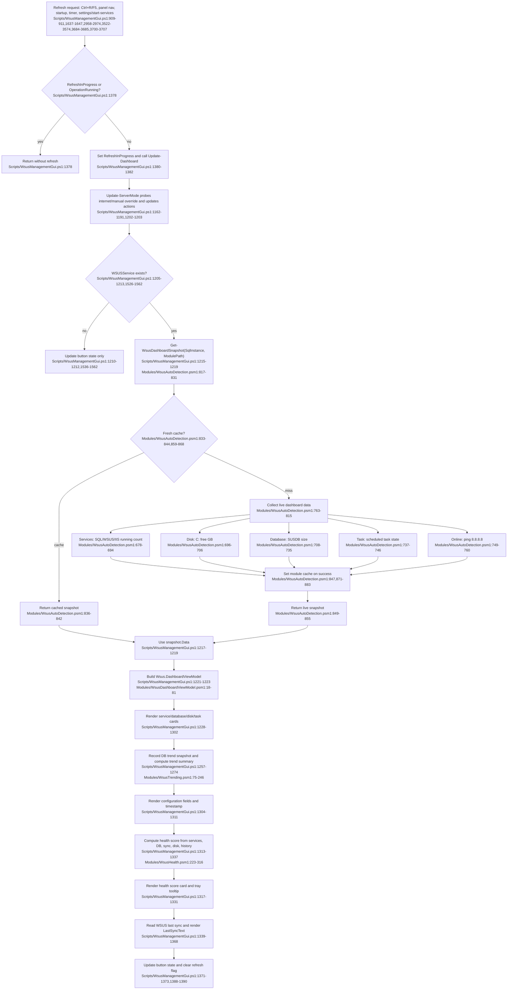

# Feature 2 — Dashboard, auto-detection & health presentation

## Sources consulted
- `PATHFINDER-2026-06-15/00-features.md:35-45`
- `Scripts/WsusManagementGui.ps1:207-239`
- `Scripts/WsusManagementGui.ps1:241-265`
- `Scripts/WsusManagementGui.ps1:540-680`
- `Scripts/WsusManagementGui.ps1:880-930`
- `Scripts/WsusManagementGui.ps1:1136-1191`
- `Scripts/WsusManagementGui.ps1:1202-1373`
- `Scripts/WsusManagementGui.ps1:1375-1390`
- `Scripts/WsusManagementGui.ps1:1526-1562`
- `Scripts/WsusManagementGui.ps1:1637-1647`
- `Scripts/WsusManagementGui.ps1:2958-2974`
- `Scripts/WsusManagementGui.ps1:3522-3574`
- `Scripts/WsusManagementGui.ps1:3678-3707`
- `Modules/WsusAutoDetection.psm1:27-46`
- `Modules/WsusAutoDetection.psm1:48-84`
- `Modules/WsusAutoDetection.psm1:89-118`
- `Modules/WsusAutoDetection.psm1:123-193`
- `Modules/WsusAutoDetection.psm1:198-263`
- `Modules/WsusAutoDetection.psm1:268-324`
- `Modules/WsusAutoDetection.psm1:329-408`
- `Modules/WsusAutoDetection.psm1:668-735`
- `Modules/WsusAutoDetection.psm1:737-890`
- `Modules/WsusAutoDetection.psm1:898-919`
- `Modules/WsusDashboardViewModel.psm1:18-87`
- `Modules/WsusHealth.psm1:27-40`
- `Modules/WsusHealth.psm1:99-177`
- `Modules/WsusHealth.psm1:223-316`
- `Modules/WsusHealth.psm1:976-1005`
- `Modules/WsusTrending.psm1:3-280`
- `Modules/WsusServices.psm1:98-128`
- `Modules/WsusDatabase.psm1:50-73`
- `Modules/WsusUtilities.psm1:408-555`
- `Modules/WsusHostEnvironment.psm1:33-50`

## Concrete findings
- Refresh requests enter through `Ctrl+R/F5`, dashboard navigation, settings save, service-start completion, startup, and the dashboard timer (`Scripts/WsusManagementGui.ps1:909-911`, `1637-1647`, `2958-2974`, `3522-3574`, `3684-3685`, `3700-3707`).
- `Invoke-DashboardRefreshSafe` is the concurrency guard: it exits when `RefreshInProgress` or `OperationRunning` is set, otherwise calls `Update-Dashboard` and clears the guard in `finally` (`Scripts/WsusManagementGui.ps1:1375-1390`).
- `Update-Dashboard` first calls `Update-ServerMode`, which probes internet/manual override and updates header state plus maintenance/schedule quick actions (`Scripts/WsusManagementGui.ps1:1162-1191`, `1202-1203`).
- It then checks whether `WSUSService` exists and returns early for not-installed systems after only updating button state (`Scripts/WsusManagementGui.ps1:1205-1213`, `1526-1562`).
- On the happy path it calls `Get-WsusDashboardSnapshot -SqlInstance $script:SqlInstance -ModulePath $script:ModulesDir` and consumes `snapshot.Data` (`Scripts/WsusManagementGui.ps1:1215-1219`).
- `Get-WsusDashboardSnapshot` serves a 30-second module-global cache when fresh, otherwise calls `Get-WsusDashboardData`, then `Set-WsusDashboardCache`, and returns `Source='Live'` (`Modules/WsusAutoDetection.psm1:817-890`).
- `Get-WsusDashboardData` collects service state, disk free space, database size, task status, online status, and `CollectedAt` (`Modules/WsusAutoDetection.psm1:763-815`).
- `New-WsusDashboardViewModel` shapes cards for services/database/disk/task plus configuration fields (`Modules/WsusDashboardViewModel.psm1:18-81`), and `Update-Dashboard` binds those into WPF card controls (`Scripts/WsusManagementGui.ps1:1228-1302`).
- Database-card trend augmentation writes `%APPDATA%\WsusManager\trends.json` through `Add-WsusTrendSnapshot`, then reads/derives days-until-full and growth summary with `Get-WsusTrendSummary` (`Scripts/WsusManagementGui.ps1:1257-1274`; `Modules/WsusTrending.psm1:11-246`).
- Health score is computed separately via `Get-WsusHealthScore -SqlInstance -ContentPath`, not via the dashboard view model, then rendered into `HealthScoreValue`, `HealthScoreBar`, `HealthScoreGrade`, and tray tooltip (`Scripts/WsusManagementGui.ps1:1313-1337`; `Modules/WsusHealth.psm1:223-316`, `976-992`).
- Last sync is rendered by calling `Get-WsusServer`, reading subscription sync timestamps, and formatting recency text (`Scripts/WsusManagementGui.ps1:1339-1368`).
- Current-state gaps: `snapshot.DataUnavailable` is returned but unused, cache is not keyed by `SqlInstance`, and `dashboardData.IsOnline` is collected but the UI instead uses a separate `Update-ServerMode` ping path.

## Mermaid flowchart

## External dependencies
- Windows WPF/.NET UI stack.
- Windows services via `Get-Service` for `WSUSService`, SQL, IIS.
- `%APPDATA%\WsusManager\settings.json`, `%APPDATA%\WsusManager\trends.json`, `%APPDATA%\WsusManager\history.json`.
- SQL Server / SUSDB via `Invoke-WsusSqlcmd` or `Invoke-Sqlcmd` / `sqlcmd.exe` fallback.
- Windows Scheduled Tasks API for `WSUS Monthly Maintenance` state.
- Network ping to `8.8.8.8`.
- WSUS Administration API for sync recency.
- IIS / WebAdministration and certificate store for SSL detection.

## Confidence and gaps
- Confidence: high for current happy-path dashboard/status flow.
- Gaps:
  - no live probes or execution.
  - `snapshot.DataUnavailable` and `dashboardView.Health` are not consumed by the GUI.
  - cache is module-global, not per `SqlInstance`.
