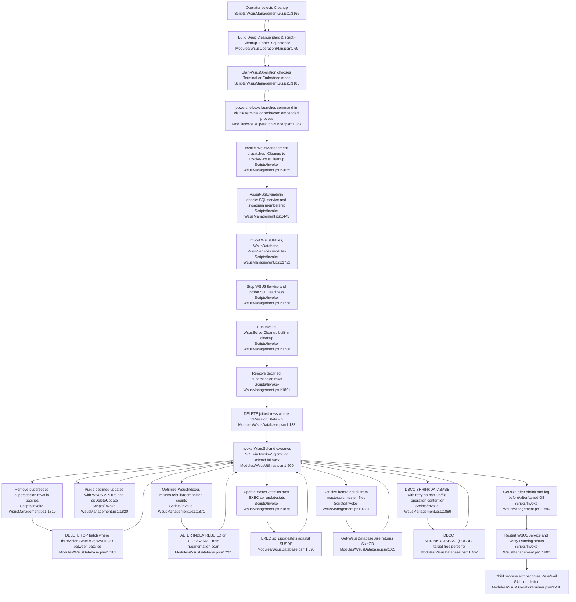

# Feature 7 — Database maintenance utilities

## Sources consulted
- `PATHFINDER-2026-06-15/00-features.md:101-110`
- `Scripts/WsusManagementGui.ps1:3166-3258`
- `Modules/WsusOperationPlan.psm1:54-71`
- `Modules/WsusOperationRunner.psm1:129-214`, `250-562`
- `Modules/WsusOperationCompletion.psm1:10-68`
- `Scripts/Invoke-WsusManagement.ps1:98-130`, `358-473`, `1710-1916`, `1953-2012`, `2049-2057`
- `Scripts/Invoke-WsusMonthlyMaintenance.ps1:1-13`, `246-276`, `1179-1385`, `1405-1454`, `1489-1492`
- `Modules/WsusDatabase.psm1:30-520`, `872-889`
- `Modules/WsusUtilities.psm1:45-55`, `408-555`

## Concrete findings
- GUI cleanup uses `New-WsusManagementOperationPlan -Id cleanup`, which becomes `& <script> -Cleanup -Force -SqlInstance <sql>` with title `Deep Cleanup` and 60-minute timeout (`Scripts/WsusManagementGui.ps1:3166-3169`; `Modules/WsusOperationPlan.psm1:69-70`).
- `Start-WsusOperation` chooses Terminal or Embedded mode, launches `powershell.exe`, and maps exit code 0 to success through `Complete-WsusOperation` and GUI completion callbacks (`Scripts/WsusManagementGui.ps1:3185-3258`; `Modules/WsusOperationRunner.psm1:353-415`; `Modules/WsusOperationCompletion.psm1:21-67`).
- CLI entry exposes `-Cleanup`, and interactive menu option 6 also runs cleanup (`Scripts/Invoke-WsusManagement.ps1:98-106`, `2010-2012`, `2055-2056`).
- `Invoke-WsusCleanup` first requires SQL sysadmin via `Assert-SqlSysadmin`, which checks SQL service state and tests `Invoke-Sqlcmd` or `sqlcmd.exe` fallback with integrated auth (`Scripts/Invoke-WsusManagement.ps1:381-472`, `1717-1720`).
- Cleanup imports `WsusUtilities`, `WsusDatabase`, and `WsusServices` (`Scripts/Invoke-WsusManagement.ps1:1722-1728`); `WsusDatabase` imports `WsusUtilities` if `Invoke-WsusSqlcmd` is not already available (`Modules/WsusDatabase.psm1:30-44`).
- Deep-cleanup sequence stops `WSUSService`, probes SQL readiness, runs `Invoke-WsusServerCleanup`, deletes declined and superseded supersession rows, purges declined updates with `spDeleteUpdate`, optimizes indexes, updates statistics, measures size, shrinks SUSDB, then restarts `WSUSService` (`Scripts/Invoke-WsusManagement.ps1:1758-1915`).
- Declined supersession cleanup deletes `tbRevisionSupersedesUpdate` rows joined to `tbRevision` where `State = 2`; superseded cleanup batch-deletes rows where `State = 3` with `WAITFOR` between batches (`Modules/WsusDatabase.psm1:114-220`).
- `Optimize-WsusIndexes` scans `sys.dm_db_index_physical_stats`, skips indexed views/small indexes, rebuilds or reorganizes fragmented indexes, and returns counts (`Modules/WsusDatabase.psm1:226-328`).
- `Update-WsusStatistics` runs `EXEC sp_updatestats` (`Modules/WsusDatabase.psm1:382-405`).
- `Get-WsusDatabaseSize` reads SUSDB size from `master.sys.master_files` (`Modules/WsusDatabase.psm1:50-73`).
- `Invoke-WsusDatabaseShrink` executes `DBCC SHRINKDATABASE(SUSDB, 10)` and retries only on serialized/backup/file-operation errors (`Modules/WsusDatabase.psm1:411-489`).
- Monthly maintenance reuses the same DB helpers for cleanup, ultimate cleanup, backup sizing, and summary warnings (`Scripts/Invoke-WsusMonthlyMaintenance.ps1:1179-1454`, `1489-1492`).
- `Get-WsusDatabaseStats` and `Add-WsusPerformanceIndexes` are exported but not part of the primary happy path traced here.
- `Invoke-WsusSqlcmd` prefers `Invoke-Sqlcmd` and falls back to `sqlcmd.exe` only for integrated-auth mode; credentialed fallback is refused to avoid exposing passwords on the command line (`Modules/WsusUtilities.psm1:500-554`).

## Mermaid flowchart

## External dependencies
- Windows PowerShell 5.1 / `powershell.exe` child process.
- SQL Server / SQL Express hosting `SUSDB`; `spDeleteUpdate`, `sp_updatestats`, `DBCC SHRINKDATABASE`.
- SQL sysadmin permission.
- `SQLPS` or `SqlServer` module `Invoke-Sqlcmd`, or local `sqlcmd.exe`.
- `UpdateServices` module and WSUS API (`Invoke-WsusServerCleanup`, `Get-WsusServer`).
- Windows service control for `WSUSService`.
- GUI history/notification callbacks when launched from GUI.

## Confidence and gaps
- Confidence: high for GUI/CLI deep-cleanup happy path and SQL wrapper behavior.
- Gaps:
  - `Get-WsusDatabaseStats` is exported but not wired into this primary path.
  - no live SUSDB execution performed.
  - `sqlcmd.exe` fallback returns raw output, so property-based consumers are source-inferred only.
