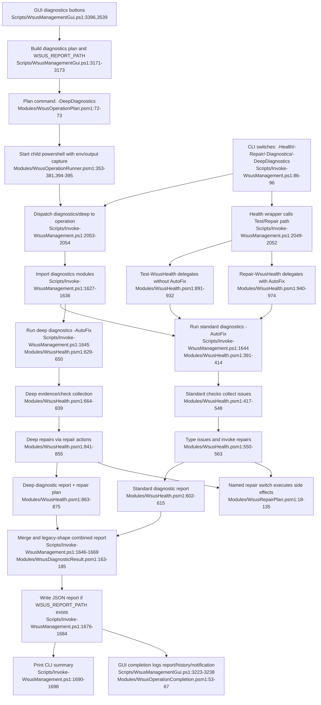

# Feature 6 — Diagnostics, health checks & repair actions

## Sources consulted
- `PATHFINDER-2026-06-15/00-features.md:87-99`
- `Scripts/WsusManagementGui.ps1:3171-3176`, `3215-3238`, `3396-3396`, `3539-3539`
- `Modules/WsusOperationPlan.psm1:30-83`
- `Modules/WsusOperationRunner.psm1:250-316`, `353-381`, `394-415`, `590-610`
- `Modules/WsusOperationCompletion.psm1:10-68`
- `Scripts/Invoke-WsusManagement.ps1:80-100`, `1546-1703`, `2048-2055`
- `Modules/WsusHealth.psm1:29-42`, `99-124`, `322-388`, `391-627`, `629-889`, `891-974`
- `Modules/WsusDiagnosticResult.psm1:1-195`
- `Modules/WsusHostEnvironment.psm1:11-250`
- `Modules/WsusRepairPlan.psm1:1-141`
- `Modules/WsusPermissions.psm1:181-223`
- `Modules/WsusFirewall.psm1:318-365`
- `Modules/WsusServices.psm1:110-122`
- `Modules/WsusUtilities.psm1:408-455`
- `Modules/WsusRepairHarness.psm1:1-22`

## Concrete findings
- GUI diagnostics buttons call `Invoke-LogOperation "diagnostics"`, which builds `New-WsusManagementOperationPlan -Id diagnostics`, injects `WSUS_REPORT_PATH`, and on completion passes the resulting report path through `New-WsusGuiOperationCompletion` / `Invoke-WsusGuiOperationCompletion` (`Scripts/WsusManagementGui.ps1:3171-3175`, `3223-3238`, `3396`, `3539`).
- `New-WsusManagementOperationPlan` maps diagnostics to `& <script> -DeepDiagnostics -ContentPath <content> -SqlInstance <sql>` with 30-minute timeout (`Modules/WsusOperationPlan.psm1:72-73`).
- CLI switches `-Diagnostics` and `-DeepDiagnostics` dispatch to `Invoke-WsusDiagnosticsOperation`; `-Health` and `-Repair` dispatch through the health wrapper path (`Scripts/Invoke-WsusManagement.ps1:92-96`, `2049-2055`).
- `Invoke-WsusDiagnosticsOperation` imports utility/permission/firewall/service/host/repair/health modules, then runs `Invoke-WsusDiagnostics -AutoFix` and `Invoke-WsusDeepDiagnostics -AutoFix`, merges reports, optionally writes JSON to `$env:WSUS_REPORT_PATH`, and prints a final summary (`Scripts/Invoke-WsusManagement.ps1:1627-1698`).
- `Invoke-WsusDiagnostics` performs standard checks over SQL Server, SQL Browser, WSUS, IIS, SQL firewall, IIS content path, WsusPool, WSUS firewall, SUSDB existence, NETWORK SERVICE login, and content permissions, then converts issues to typed results and optionally invokes repairs (`Modules/WsusHealth.psm1:391-615`).
- `Invoke-WsusDeepDiagnostics` collects deeper evidence for content path, ACLs, SQL networking, IIS `/Content` and `WsusPool`, BITS, SUSDB file/download state, `wsusutil checkhealth`, WSUS API progress, and recent WSUS/IIS/SQL logs, then converts/repairs/returns a report with checks, recommendations, and repair plan (`Modules/WsusHealth.psm1:629-875`).
- `WsusDiagnosticResult.psm1` is the typed seam: it normalizes issues, derives `Repairable`, constructs reports, and merges report structures (`Modules/WsusDiagnosticResult.psm1:25-185`).
- `Invoke-WsusRepairAction` validates named repair actions and executes concrete side effects: SQL protocol registry updates, ACL repair, IIS content path repair, service starts, `wsusutil reset`, WsusPool start/tune, firewall repair, and SQL login grants (`Modules/WsusRepairPlan.psm1:18-135`).
- `Test-WsusHealth` and `Repair-WsusHealth` are compatibility wrappers over diagnostics with/without `AutoFix` (`Modules/WsusHealth.psm1:891-974`).
- `WsusRepairHarness.psm1` is explicitly test-only and not part of the runtime happy path.

## Mermaid flowchart

## External dependencies
- Windows PowerShell 5.1 and child `powershell.exe`.
- Windows services: SQL Server, SQL Browser, WSUSService, W3SVC, BITS.
- SQL Server/SUSDB via `Invoke-WsusSqlcmd` or `Invoke-Sqlcmd`.
- Windows registry for WSUS setup, SQL networking, BITS policy.
- IIS `WebAdministration`, `IIS:\Sites\WSUS Administration\Content`, `IIS:\AppPools\WsusPool`.
- Firewall and NTFS ACL helpers.
- `wsusutil.exe` (`checkhealth`, `reset`).
- WSUS Administration API.
- Windows Event Log.
- GUI history/notification/secret cleanup dependencies.

## Error and fallback notes
- Module import failures can short-circuit diagnostics.
- Deep checks can degrade to `SKIP`/`WARN` when WebAdministration, WSUS API, or event logs are unavailable.
- Repair failures are captured in `FixesFailed` and reflected in report healthiness.
- Report write failure is warning-only and does not change combined result.

## Confidence
- High for current-state source flow and named repair side effects.
- Gap: read-only tracing only; no runtime execution.
