# Feature 1 — GUI shell & operation orchestration

Scope traced: current-state source flow from GUI startup/navigation to a representative long-running operation: Online Sync / maintenance via `BtnMaintenance` → `Invoke-LogOperation` → `New-WsusMaintenanceOperationPlan` → `Start-WsusOperation`.

Assumptions:
- Happy path assumes WSUS is installed.
- Server mode is Online.
- `sqlcmd.exe` exists and connects.
- The user completes the Online Sync dialog with at least one product selected.
- Live Terminal mode remains enabled unless saved settings override it.
- Embedded mode is noted as a fallback branch.

## Sources consulted
- `PATHFINDER-2026-06-15/00-features.md:18-33`
- `Scripts/WsusManagementGui.ps1:15-103`
- `Scripts/WsusManagementGui.ps1:207-265`
- `Scripts/WsusManagementGui.ps1:300-308`
- `Scripts/WsusManagementGui.ps1:850-878`
- `Scripts/WsusManagementGui.ps1:894-923`
- `Scripts/WsusManagementGui.ps1:1058-1134`
- `Scripts/WsusManagementGui.ps1:1388-1669`
- `Scripts/WsusManagementGui.ps1:2179-2467`
- `Scripts/WsusManagementGui.ps1:2996-3270`
- `Scripts/WsusManagementGui.ps1:3273-3424`
- `Scripts/WsusManagementGui.ps1:3426-3612`
- `Scripts/WsusManagementGui.ps1:3634-3835`
- `Modules/WsusGuiShell.psm1:13-210`
- `Modules/WsusGuiShell.psm1:213-293`
- `Modules/WsusOperationPlan.psm1:30-128`
- `Modules/WsusOperationRunner.psm1:48-83`
- `Modules/WsusOperationRunner.psm1:129-214`
- `Modules/WsusOperationRunner.psm1:216-248`
- `Modules/WsusOperationRunner.psm1:250-562`
- `Modules/WsusOperationRunner.psm1:583-614`
- `Modules/WsusOperationCompletion.psm1:10-68`
- `Modules/WsusHistory.psm1:1-192`
- `Modules/WsusNotification.psm1:69-191`
- `Modules/WsusDialogs.psm1:28-32`
- `Scripts/Invoke-WsusMonthlyMaintenance.ps1:75-110`
- `Scripts/Invoke-WsusMonthlyMaintenance.ps1:720-805`
- `Scripts/Invoke-WsusMonthlyMaintenance.ps1:1118-1132`
- `Scripts/Invoke-WsusMonthlyMaintenance.ps1:1503-1576`

## Concrete findings
- Startup initializes paths, defaults, log path, operation flags, live terminal, notification, and history flags at `Scripts/WsusManagementGui.ps1:15-103`.
- `Import-WsusSettings` reads `%APPDATA%\WsusManager\settings.json` and can override content path, SQL instance, server mode, LiveTerminalMode, notification, tray, history, and SyncProducts at `Scripts/WsusManagementGui.ps1:207-239`.
- GUI imports `WsusGuiShell`, `WsusOperationCompletion`, `WsusOperationPlan`, `WsusOperationRunner`, `WsusHistory`, `WsusNotification`, and others from the discovered `Modules` directory at `Scripts/WsusManagementGui.ps1:241-265`.
- After module import the GUI redefines file-backed `Write-Log` and writes `New-WsusGuiLifecycleLogEntry -Event Starting` to `C:\WSUS\Logs\WsusOperations_yyyy-MM-dd.log` at `Scripts/WsusManagementGui.ps1:300-308`; lifecycle message construction is in `Modules/WsusGuiShell.psm1:268-293`.
- The XAML is loaded via `[Windows.Markup.XamlReader]::Load`, and named controls are captured into `$script:controls` at `Scripts/WsusManagementGui.ps1:872-878`.
- Keyboard shortcuts route `Ctrl+D` / `Ctrl+S` / `Ctrl+H` / `Ctrl+R` into the same button and event flow at `Scripts/WsusManagementGui.ps1:894-913`.
- `Show-Panel` updates page title, panel visibility, active nav styling, dashboard refresh, and fade-in animation at `Scripts/WsusManagementGui.ps1:1637-1669`.
- Representative operation entry point is `$controls.BtnMaintenance.Add_Click({ Invoke-LogOperation "maintenance" "Online Sync" })` at `Scripts/WsusManagementGui.ps1:3388-3389`.
- Startup side effects include splash setup, version labels, live terminal state text, icon/logo resolution, dashboard refresh, dashboard `DispatcherTimer`, tray `NotifyIcon`, close cleanup, lifecycle logs, and final `ShowDialog()` at `Scripts/WsusManagementGui.ps1:3634-3802`.
- `Invoke-LogOperation` refuses concurrent operations via `$script:OperationRunning` and a duplicate-suppressed popup at `Scripts/WsusManagementGui.ps1:2996-3002`.
- For `maintenance`, it runs SQL preflight: finds `sqlcmd.exe`, executes `sqlcmd -S $sqlInstance -E -C -Q "SELECT 1"`, logs success/failure, and blocks if SQL fails at `Scripts/WsusManagementGui.ps1:3004-3033`.
- It also blocks maintenance in Air-Gap mode at `Scripts/WsusManagementGui.ps1:3035-3038`.
- `Invoke-LogOperation` resolves `Invoke-WsusManagement.ps1`, `Invoke-WsusMonthlyMaintenance.ps1`, and scheduled task module paths using `Find-WsusScript`; maintenance requires the monthly maintenance script or shows a popup and logs error at `Scripts/WsusManagementGui.ps1:3040-3067`.
- `Show-MaintenanceDialog` creates the Online Sync modal, optionally reads live WSUS product categories through `Microsoft.UpdateServices.Administration.AdminProxy`, and on Run Sync captures `Profile`, `ExportPath`, and checked `SelectedProducts`; it persists selected products through `Save-Settings` before closing at `Scripts/WsusManagementGui.ps1:2179-2467`.
- The maintenance switch case calls `New-WsusMaintenanceOperationPlan -MaintenanceScriptPath $maint -Profile $opts.Profile -ExportPath $opts.ExportPath -SelectedProducts $opts.SelectedProducts` at `Scripts/WsusManagementGui.ps1:3151-3157`.
- The plan builder constructs `& <Invoke-WsusMonthlyMaintenance.ps1> -Unattended -MaintenanceProfile '<Profile>' -NoTranscript -UseWindowsAuth`, adds `-ExportPath` or `-SkipExport`, appends selected products, sets title `Online Sync (<Profile>)`, and timeout 180 at `Modules/WsusOperationPlan.psm1:106-127`.
- `Invoke-LogOperation` computes `$useTerminal = $script:LiveTerminalMode -and -not $script:ForceEmbeddedMode`, defaults to Terminal under current defaults/settings, and either writes live-terminal explanatory text to `LogOutput` or clears/appends embedded start text at `Scripts/WsusManagementGui.ps1:3185-3195`.
- GUI passes Window, controls, operation buttons/inputs, log/status/cancel controls, script root, `SetOperationRunning`, and `UpdateButtonState` to `Start-WsusOperation` at `Scripts/WsusManagementGui.ps1:3197-3208`.
- It builds `$onComplete` to create a completion object and wire log, notification, history, and secret cleanup callbacks at `Scripts/WsusManagementGui.ps1:3223-3238`.
- `Start-WsusOperation` calls `Set-WsusGuiOperationUiState -State Running`, which expands the log panel, sets `StatusLabel` to `Running: <Title>`, shows the cancel button, disables operation buttons and inputs, and lowers opacity at `Modules/WsusOperationRunner.psm1:316-351` and `Modules/WsusGuiShell.psm1:151-210`.
- `Start-WsusOperation` builds `System.Diagnostics.ProcessStartInfo` for `powershell.exe`, sets working directory, injects plan environment variables, and for Terminal mode uses shell execute with `-NoProfile -ExecutionPolicy Bypass -Command "<plan command>"`; Embedded mode redirects stdout/stderr/stdin and wraps all PowerShell streams to stdout at `Modules/WsusOperationRunner.psm1:353-383`.
- It starts the process, stores it in runner state and context, and returns it to `$script:CurrentProcess` at `Modules/WsusOperationRunner.psm1:386-399` and `Scripts/WsusManagementGui.ps1:3257-3258`.
- Runner registers a process `Exited` event that maps exit code 0 to success and calls `Complete-WsusOperation` at `Modules/WsusOperationRunner.psm1:402-421`.
- Terminal mode starts a 2-second keystroke timer; Embedded fallback registers output/error event handlers, formats/dedupes lines, appends to `LogOutput` via Dispatcher, starts stdout/stderr async reads, and uses a 2-second stdin flush timer at `Modules/WsusOperationRunner.psm1:424-511`.
- Timeout watchdog is a `DispatcherTimer` set from plan timeout; on tick it stops/kills the process, sets timed-out status/log text, and completes as failure at `Modules/WsusOperationRunner.psm1:516-558`.
- GUI cancel calls `Stop-CurrentOperation`, which delegates to `Stop-WsusOperation`, stops GUI timers, unregisters events, kills/disposes the process, resets caches/state, reenables buttons, hides cancel, and logs cancellation at `Scripts/WsusManagementGui.ps1:1564-1635` and `Scripts/WsusManagementGui.ps1:3522-3531`; runner-level `Stop-WsusOperation` kills child processes via CIM and then the parent at `Modules/WsusOperationRunner.psm1:216-248`.
- `Complete-WsusOperation` guards against double completion, stops runner timers, unregisters runner events, sets Completed/Failed UI, re-enables controls, clears running flag, clears runner process, and invokes the GUI callback at `Modules/WsusOperationRunner.psm1:163-213`.
- `Invoke-WsusGuiOperationCompletion` optionally logs a diagnostic report path, shows notification, writes operation history, and cleans secret environment keys at `Modules/WsusOperationCompletion.psm1:10-68`.
- History writes a newest-first capped JSON array to `%APPDATA%\WsusManager\history.json` with retries at `Modules/WsusHistory.psm1:134-192`.
- Notifications append result text, optionally beep, try Windows toast, fall back to tray balloon, then log/`Write-Host` fallback at `Modules/WsusNotification.psm1:69-191`.
- The spawned child script accepts planned `-Unattended`, `-MaintenanceProfile`, `-NoTranscript`, `-UseWindowsAuth`, and `-SelectedProducts` parameters at `Scripts/Invoke-WsusMonthlyMaintenance.ps1:75-110` and within the child happy path resolves `windowsupdate.microsoft.com`, configures selected WSUS product categories, starts synchronization, filters approval candidates by selected products, and optionally exports backups/content with `robocopy.exe` at `Scripts/Invoke-WsusMonthlyMaintenance.ps1:720-805`, `1118-1132`, and `1503-1576`.

## Mermaid flowchart

```mermaid
flowchart TD
  A["Startup params, WPF assemblies, DPI, defaults, log path, flags<br/>Scripts/WsusManagementGui.ps1:15-103"] --> B["Import settings: paths, mode, LiveTerminal, notifications, history, products<br/>Scripts/WsusManagementGui.ps1:207-239"]
  B --> C["Import core modules: GuiShell, Completion, Plan, Runner, History, Notification<br/>Scripts/WsusManagementGui.ps1:241-265"]
  C --> D["Write lifecycle start log<br/>Scripts/WsusManagementGui.ps1:300-308<br/>Modules/WsusGuiShell.psm1:268-293"]
  D --> E["Load XAML window and collect named controls<br/>Scripts/WsusManagementGui.ps1:872-878"]
  E --> F["Initialize splash, dashboard timer, tray icon, close cleanup, ShowDialog<br/>Scripts/WsusManagementGui.ps1:3634-3802"]
  F --> G["User clicks Online Sync; BtnMaintenance calls Invoke-LogOperation maintenance<br/>Scripts/WsusManagementGui.ps1:3388-3389"]
  G --> H["Invoke-LogOperation gates concurrency, SQL/sqlcmd preflight, Online-only, script discovery<br/>Scripts/WsusManagementGui.ps1:2996-3067"]
  H --> I["Show-MaintenanceDialog gathers Profile, ExportPath, SelectedProducts<br/>Scripts/WsusManagementGui.ps1:2179-2467"]
  I --> J["Run Sync validates products, updates SyncProducts, Save-Settings, closes dialog<br/>Scripts/WsusManagementGui.ps1:2435-2451"]
  J --> K["Create maintenance operation plan and command<br/>Scripts/WsusManagementGui.ps1:3151-3157<br/>Modules/WsusOperationPlan.psm1:106-127"]
  K --> L["Choose Terminal/Embedded mode and prime log panel<br/>Scripts/WsusManagementGui.ps1:3185-3195"]
  L --> M["Build runner context and completion hooks<br/>Scripts/WsusManagementGui.ps1:3197-3238"]
  M --> N["Start-WsusOperation sets Running UI<br/>Modules/WsusOperationRunner.psm1:316-351<br/>Modules/WsusGuiShell.psm1:151-210"]
  N --> O["Create powershell.exe ProcessStartInfo, environment, command, working directory<br/>Modules/WsusOperationRunner.psm1:353-383"]
  O --> P["Start child process and store CurrentProcess<br/>Modules/WsusOperationRunner.psm1:386-399<br/>Scripts/WsusManagementGui.ps1:3257-3258"]
  P --> Q["Child Invoke-WsusMonthlyMaintenance receives unattended/profile/auth/products args<br/>Scripts/Invoke-WsusMonthlyMaintenance.ps1:75-110"]
  Q --> R["Terminal visible console or Embedded fallback captures streams<br/>Modules/WsusOperationRunner.psm1:424-511"]
  R --> S["Exit event and watchdog govern completion or timeout<br/>Modules/WsusOperationRunner.psm1:402-421,516-558"]
  S --> T["Complete-WsusOperation stops timers/events, updates UI, clears running flag<br/>Modules/WsusOperationRunner.psm1:163-213"]
  T --> U["Completion callback logs report, notifies, writes history, cleans env secrets<br/>Scripts/WsusManagementGui.ps1:3228-3238<br/>Modules/WsusOperationCompletion.psm1:10-68"]
  U --> V["Persistent history JSON and toast/balloon/beep side effects<br/>Modules/WsusHistory.psm1:134-192<br/>Modules/WsusNotification.psm1:69-191"]
```

## External dependencies
- WPF/.NET assemblies: `PresentationFramework`, `PresentationCore`, `WindowsBase`, `System.Windows.Forms` (`Scripts/WsusManagementGui.ps1:21`; `Modules/WsusDialogs.psm1:28-32`).
- Windows DPI APIs: `shcore.dll` `SetProcessDpiAwareness` and `user32.dll` `SetProcessDPIAware` (`Scripts/WsusManagementGui.ps1:24-49`).
- Filesystem/AppData: settings `%APPDATA%\WsusManager\settings.json`, daily logs under `C:\WSUS\Logs`, and history `%APPDATA%\WsusManager\history.json` (`Scripts/WsusManagementGui.ps1:68-76`, `207-239`; `Modules/WsusHistory.psm1:19-20`).
- SQL command-line client: `sqlcmd.exe` searched in common SQL Server client paths and invoked with Windows auth preflight (`Scripts/WsusManagementGui.ps1:317-329`, `3004-3033`).
- WSUS Admin API: GUI maintenance dialog uses `Microsoft.UpdateServices.Administration.dll` and `AdminProxy::GetUpdateServer('localhost',$false,8530)` for product categories (`Scripts/WsusManagementGui.ps1:2296-2309`).
- PowerShell child host: `powershell.exe -NoProfile -ExecutionPolicy Bypass -Command ...` (`Modules/WsusOperationRunner.psm1:353-399`).
- Windows Dispatcher/eventing/timers: `System.Windows.Threading.DispatcherTimer`, `Register-ObjectEvent`, process `Exited`, Dispatcher marshaling (`Modules/WsusOperationRunner.psm1:402-421`, `424-511`, `516-558`).
- Windows Management/CIM and process APIs for cancellation: `Get-CimInstance Win32_Process`, `Stop-Process`, `Process.Kill()` (`Modules/WsusOperationRunner.psm1:216-248`).
- Windows notifications: Windows Runtime toast APIs, `System.Windows.Forms.NotifyIcon`, `System.Media.SystemSounds` (`Modules/WsusNotification.psm1:126-191`).
- Representative child operation dependencies: DNS to `windowsupdate.microsoft.com`, WSUS subscription/admin objects, selected product/category APIs, filesystem copy/export, and `robocopy.exe` for content export (`Scripts/Invoke-WsusMonthlyMaintenance.ps1:720-805`, `1118-1132`, `1503-1576`).

## Error or fallback branches noted
- Concurrent operation shows warning popup and returns (`Scripts/WsusManagementGui.ps1:2999-3002`).
- SQL preflight failures show popup/log and return (`Scripts/WsusManagementGui.ps1:3004-3033`).
- Air-Gap mode blocks maintenance/schedule (`Scripts/WsusManagementGui.ps1:3035-3038`).
- Missing scripts/modules show popups/logs and return (`Scripts/WsusManagementGui.ps1:3056-3073`).
- User cancels Online Sync dialog: `Show-MaintenanceDialog` returns `Cancelled = true`, operation returns before planning (`Scripts/WsusManagementGui.ps1:2179-2180`, `3151-3153`).
- Embedded mode is used when LiveTerminalMode is off or ForceEmbeddedMode is set; it redirects output/error and appends log lines in the bottom panel (`Scripts/WsusManagementGui.ps1:3185-3195`; `Modules/WsusOperationRunner.psm1:373-382`, `442-511`).
- Timeout kills the process and completes failure (`Modules/WsusOperationRunner.psm1:516-558`).
- Process-start exception completes failure, resets UI, cleans environment keys, then rethrows to GUI catch path (`Modules/WsusOperationRunner.psm1:394-399`; `Scripts/WsusManagementGui.ps1:3257-3268`).

## Confidence and gaps
- Confidence: high for current source-level GUI orchestration, side effects, and operation-lifecycle flow.
- Gap: read-only static tracing only; no GUI run was performed.
- Gap: runtime behavior can vary with saved settings, installed WSUS/SQL state, notification platform support, and the child maintenance script’s environment.
