# Feature 3 — Install & provisioning

## Sources consulted
- `PATHFINDER-2026-06-15/00-features.md:47-59`
- `Scripts/WsusManagementGui.ps1:65-80`
- `Scripts/WsusManagementGui.ps1:241-265`
- `Scripts/WsusManagementGui.ps1:327-350`
- `Scripts/WsusManagementGui.ps1:688-708`
- `Scripts/WsusManagementGui.ps1:1193-1200`
- `Scripts/WsusManagementGui.ps1:2994-3050`
- `Scripts/WsusManagementGui.ps1:3075-3117`
- `Scripts/WsusManagementGui.ps1:3183-3268`
- `Scripts/WsusManagementGui.ps1:3273-3304`
- `Scripts/WsusManagementGui.ps1:3445-3462`
- `Scripts/Invoke-WsusManagement.ps1:1-100`
- `Scripts/Invoke-WsusManagement.ps1:164-223`
- `Scripts/Invoke-WsusManagement.ps1:1959-2020`
- `Scripts/Install-WsusWithSqlExpress.ps1:1-220`
- `Scripts/Install-WsusWithSqlExpress.ps1:219-343`
- `Scripts/Install-WsusWithSqlExpress.ps1:344-468`
- `Scripts/Install-WsusWithSqlExpress.ps1:469-653`
- `Scripts/Install-WsusWithSqlExpress.ps1:654-718`
- `Scripts/Install-WsusWithSqlExpress.ps1:720-779`
- `Scripts/Install-WsusWithSqlExpress.ps1:780-879`
- `Scripts/Install-WsusWithSqlExpress.ps1:881-944`
- `Scripts/Install-WsusWithSqlExpress.ps1:946-1093`
- `Modules/WsusConfig.psm1:1-80`
- `Modules/WsusConfig.psm1:153-180`
- `Modules/WsusConfig.psm1:658-694`
- `Modules/WsusProvisioning.psm1:23-71`
- `Modules/WsusProvisioning.psm1:126-150`
- `Modules/WsusUtilities.psm1:955-975`
- `Modules/WsusOperationPlan.psm1:1-115`
- `Modules/WsusOperationRunner.psm1:89-127`
- `Modules/WsusOperationRunner.psm1:129-214`
- `Modules/WsusOperationRunner.psm1:250-561`
- `Modules/WsusFirewall.psm1:21-64`
- `Modules/WsusFirewall.psm1:91-141`
- `Modules/WsusFirewall.psm1:198-253`
- `Modules/WsusPermissions.psm1:21-78`
- `Modules/WsusPermissions.psm1:226-277`

## Concrete findings
- GUI install action is `BtnRunInstall.Add_Click({ Invoke-LogOperation "install" ... })` (`Scripts/WsusManagementGui.ps1:3462`).
- Default GUI inputs are `ContentPath=C:\WSUS`, `SqlInstance=.\SQLEXPRESS`, `InstallPath=C:\WSUS\SQLDB`, `SaUser=sa` (`Scripts/WsusManagementGui.ps1:68-73`). Runtime config can later reset `InstallPath` to `ContentPath\SQLDB` (`Scripts/WsusManagementGui.ps1:267-278`; `Modules/WsusConfig.psm1:658-694`).
- Password strength/confirmation gates enablement of `BtnRunInstall` (`Scripts/WsusManagementGui.ps1:1193-1200`, `3273-3304`).
- GUI validates installer path with `Test-SafePath` and locates the install script through `Find-WsusScript` (`Scripts/WsusManagementGui.ps1:3078-3089`; `Modules/WsusOperationRunner.psm1:89-127`).
- `Resolve-WsusInstallerPath` checks installer folder existence and presence of one of `SQL2025-SSEI-Expr.exe`, `SQLEXPRADV_x64_ENU.exe`, or `SQLEXPR_x64_ENU.exe` (`Modules/WsusProvisioning.psm1:53-70`).
- GUI converts password to `SecureString`, then `New-WsusInstallOperationPlan` converts it back only for `WSUS_INSTALL_SA_PASSWORD` child-process env and keeps the command line free of plaintext secrets (`Scripts/WsusManagementGui.ps1:3103-3115`; `Modules/WsusOperationPlan.psm1:95-103`; `Modules/WsusUtilities.psm1:955-964`).
- `Start-WsusOperation` launches `powershell.exe` with working directory, environment, mode, and timeout, disables UI, and restores it on completion (`Scripts/WsusManagementGui.ps1:3210-3215,3257-3258`; `Modules/WsusOperationRunner.psm1:316-381,410-557`).
- CLI menu option 1 directly executes `Install-WsusWithSqlExpress.ps1` and therefore shares the same installer happy path without the GUI operation-plan wrapper (`Scripts/Invoke-WsusManagement.ps1:1959-1963,2005-2006`).
- `Install-WsusWithSqlExpress.ps1` resolves installer path, sets install constants, starts transcript, reads/validates the SA password, writes temporary encrypted password file, prepares SQL media/setup, writes `ConfigurationFile.ini`, runs silent SQL setup, and scrubs `SAPWD` from the config file (`Scripts/Install-WsusWithSqlExpress.ps1:78-173`, `344-467`).
- It optionally installs SSMS, enables IFI, enables SQL TCP/Named Pipes, fixes ports/services, installs WSUS role/features, creates `C:\WSUS` directories, applies ACLs, grants SQL permissions, pre-sets WSUS wizard suppression registry values, runs `wsusutil.exe postinstall`, configures optional HTTPS, recreates WSUS and SQL firewall rules, sets WSUS registry/API configuration, ensures services and WsusPool are running, verifies IIS `/Content`, applies final `WsusPool` ACLs, removes the password file, and prints the completion banner (`Scripts/Install-WsusWithSqlExpress.ps1:469-1093`).
- Current-state duplication: install script duplicates firewall and ACL logic inline instead of calling `WsusFirewall.psm1` / `WsusPermissions.psm1` helpers even though those modules exist and are imported by the GUI.

## Mermaid flowchart

```mermaid
flowchart TD
  G0["GUI opens Install panel and resets fields<br/>Scripts/WsusManagementGui.ps1:3275"] --> G1["User enters installer path and SA passwords<br/>Scripts/WsusManagementGui.ps1:693"]
  G1 --> G2["Password strength and confirmation enable BtnRunInstall<br/>Scripts/WsusManagementGui.ps1:3282"]
  G2 --> G3["BtnRunInstall calls Invoke-LogOperation install<br/>Scripts/WsusManagementGui.ps1:3462"]
  G3 --> G4["Locate Install-WsusWithSqlExpress.ps1<br/>Scripts/WsusManagementGui.ps1:3078"]
  G4 --> G5["Validate installer path with Test-SafePath<br/>Scripts/WsusManagementGui.ps1:3085"]
  G5 --> G6["Resolve installer folder and SQL installer candidate<br/>Scripts/WsusManagementGui.ps1:3091<br/>Modules/WsusProvisioning.psm1:53-70"]
  G6 --> G7["Convert SA password and build install operation plan<br/>Scripts/WsusManagementGui.ps1:3114<br/>Modules/WsusOperationPlan.psm1:95-103"]
  G7 --> G8["Start child powershell.exe with WSUS_INSTALL_SA_PASSWORD env<br/>Scripts/WsusManagementGui.ps1:3258<br/>Modules/WsusOperationRunner.psm1:354-381"]
  C0["CLI menu option 1 invokes installer script directly<br/>Scripts/Invoke-WsusManagement.ps1:2005-2006"] --> S0["Install script parameters receive defaults/CLI/GUI args<br/>Scripts/Install-WsusWithSqlExpress.ps1:25"]
  G8 --> S0
  S0 --> S1["Import provisioning helpers and resolve installer path<br/>Scripts/Install-WsusWithSqlExpress.ps1:53-130"]
  S1 --> S2["Set install constants and start transcript<br/>Scripts/Install-WsusWithSqlExpress.ps1:135-173"]
  S2 --> S3["Read env/arg SA password, validate, write encrypted temp file<br/>Scripts/Install-WsusWithSqlExpress.ps1:347"]
  S3 --> S4["Prepare SQL media and setup.exe<br/>Scripts/Install-WsusWithSqlExpress.ps1:383"]
  S4 --> S5["Write SQL ConfigurationFile.ini and run setup.exe<br/>Scripts/Install-WsusWithSqlExpress.ps1:406-447"]
  S5 --> S6["Optional SSMS install + SQL post-config TCP/NP/1433 + restart SQL services<br/>Scripts/Install-WsusWithSqlExpress.ps1:469-559"]
  S6 --> S7["Install WSUS role/features<br/>Scripts/Install-WsusWithSqlExpress.ps1:603"]
  S7 --> S8["Create C:\\WSUS directories and ACLs<br/>Scripts/Install-WsusWithSqlExpress.ps1:621"]
  S8 --> S9["Grant SQL permissions to current user and NETWORK SERVICE<br/>Scripts/Install-WsusWithSqlExpress.ps1:676"]
  S9 --> S10["Preset WSUS wizard suppression registry keys<br/>Scripts/Install-WsusWithSqlExpress.ps1:726"]
  S10 --> S11["Run wsusutil postinstall against .\\SQLEXPRESS and C:\\WSUS<br/>Scripts/Install-WsusWithSqlExpress.ps1:745"]
  S11 --> S12["Optional HTTPS setup<br/>Scripts/Install-WsusWithSqlExpress.ps1:764"]
  S12 --> S13["Recreate WSUS firewall rules 8530/8531/API<br/>Scripts/Install-WsusWithSqlExpress.ps1:792"]
  S13 --> S14["Set WSUS registry/API configuration and restart WsusService<br/>Scripts/Install-WsusWithSqlExpress.ps1:849"]
  S14 --> S15["Configure languages/classifications/upstream options<br/>Scripts/Install-WsusWithSqlExpress.ps1:886"]
  S15 --> S16["Recreate SQL firewall rules 1433/1434<br/>Scripts/Install-WsusWithSqlExpress.ps1:952"]
  S16 --> S17["Start/verify SQL, Browser, IIS, WSUS, WsusPool<br/>Scripts/Install-WsusWithSqlExpress.ps1:980"]
  S17 --> S18["Verify IIS /Content physicalPath and apply final WsusPool ACL<br/>Scripts/Install-WsusWithSqlExpress.ps1:1032-1053"]
  S18 --> S19["Remove password file and print installation complete banner<br/>Scripts/Install-WsusWithSqlExpress.ps1:1060-1093"]
  S19 --> G9["GUI runner maps exit code 0 to success and runs completion callbacks<br/>Modules/WsusOperationRunner.psm1:410<br/>Scripts/WsusManagementGui.ps1:3228-3238"]
```

## External dependencies
- Windows PowerShell 5.1/admin context and `powershell.exe` child process.
- WPF/System.Windows.Forms for GUI controls and folder selection.
- Local SQL Express installer files and optional SSMS installer.
- Windows Server role cmdlets/features (`Install-WindowsFeature`, `UpdateServices-*`).
- SQL services/tools: `MSSQL$SQLEXPRESS`, `SQLBrowser`, `sqlcmd.exe`.
- `secedit`, `icacls`, registry hives for SQL and WSUS setup.
- `wsusutil.exe` and WSUS Administration API.
- NetSecurity firewall cmdlets.
- IIS/WebAdministration and `WsusPool`.
- Optional HTTPS helper script and certificate thumbprint.

## Confidence and gaps
- Confidence: high for current happy path and side effects.
- Gaps:
  - no live install executed.
  - `wsusutil` warnings do not always stop the script.
  - SQL permission setup can degrade to manual instructions when `sqlcmd.exe` is missing.
  - install path duplicates firewall/ACL logic rather than using module helpers.
