# Feature 4 — Online sync, product policy, maintenance, backup & export

## Sources consulted
- `PATHFINDER-2026-06-15/00-features.md:61-72`
- `Scripts/WsusManagementGui.ps1:2179-2215,2259-2348,2428-2452,3138-3157,3197-3265`
- `Modules/WsusOperationPlan.psm1:106-128`
- `Modules/WsusOperationRunner.psm1:250-423`
- `Scripts/Invoke-WsusManagement.ps1:1985-2011`
- `Scripts/Invoke-WsusMonthlyMaintenance.ps1:75-110,164-216,218-278,334-453,453-474,504-539,540-900,900-1253,1244-1636`
- `Modules/WsusConfig.psm1:26-80,658-735`
- `Modules/WsusServices.psm1:35-95`
- `Modules/WsusDatabase.psm1:50-210,202-220,226-445,445-500`
- `Modules/WsusUtilities.psm1:408-555`

## Concrete findings
- GUI happy path starts in `Show-MaintenanceDialog`, which captures profile, export path, and a non-empty `SelectedProducts` list; it can populate products from WSUS subscription categories and persists selected products in `$script:SyncProducts` via `Save-Settings` (`Scripts/WsusManagementGui.ps1:2179-2450`).
- GUI dispatch for operation `maintenance` calls `New-WsusMaintenanceOperationPlan` and passes the plan command into `Start-WsusOperation` (`Scripts/WsusManagementGui.ps1:3151-3157,3197-3258`).
- The plan builder constructs `& maintenance-script -Unattended -MaintenanceProfile '<Profile>' -NoTranscript -UseWindowsAuth`, adds `-ExportPath` or `-SkipExport`, appends `-SelectedProducts`, and sets timeout 180 minutes (`Modules/WsusOperationPlan.psm1:106-128`).
- CLI alternative path is menu option 5, which directly executes `Scripts\Invoke-WsusMonthlyMaintenance.ps1` (`Scripts/Invoke-WsusManagement.ps1:1985-2011`).
- The maintenance script imports `WsusUtilities`, `WsusConfig`, `WsusDatabase`, and `WsusServices`, loads runtime config into SQL/content/log paths and ports, and sets SQL auth mode (`Scripts/Invoke-WsusMonthlyMaintenance.ps1:153-170,246-275`; `Modules/WsusConfig.psm1:26-80,658-691`).
- `Test-Prerequisites` validates SQL service, WSUS service, disk free space, export path access, WSUS API connection, and SQL sysadmin permission (`Scripts/Invoke-WsusMonthlyMaintenance.ps1:334-472`).
- Main happy path starts MSSQL$SQLEXPRESS and WSUSService, loads the WSUS API, connects to localhost WSUS, and retrieves the subscription object (`Scripts/Invoke-WsusMonthlyMaintenance.ps1:685-715`; `Modules/WsusServices.psm1:53-66`).
- Sync phase resolves `windowsupdate.microsoft.com`, stops any in-progress synchronization, merges selected product categories into the subscription, and starts synchronization while polling progress/status (`Scripts/Invoke-WsusMonthlyMaintenance.ps1:723-895`; helper `Test-WsusSelectedCategoryTitle` at `218-229`).
- After sync, it monitors content download progress and fetches updates via `wsus.GetUpdates(UpdateScope)` (`Scripts/Invoke-WsusMonthlyMaintenance.ps1:901-947`).
- Decline policy computes expired, superseded, >6 month old, ARM64, legacy `23H2 and lower`, Preview/Beta, non-stable Edge, WSL, and Office legacy updates, then calls `update.Decline()` (`Scripts/Invoke-WsusMonthlyMaintenance.ps1:969-1094`; `Test-WsusLegacyBuildTitle` at `231-244`).
- Approval policy selects not-declined, not-superseded, not-expired, not already install-approved, <6 month old updates in approved classifications; it excludes Preview/Beta, ARM64, `25H2`, legacy builds, x86/32-bit, and Upgrades; when `SelectedProducts` is set it filters to those products, safety-skips if more than 200 candidates remain, otherwise calls `update.Approve('Install', targetGroup)` (`Scripts/Invoke-WsusMonthlyMaintenance.ps1:1096-1177`).
- Cleanup imports `UpdateServices`, runs `Invoke-WsusServerCleanup`, then attempts deeper SQL cleanup via `Invoke-WsusSqlcmd` (`Scripts/Invoke-WsusMonthlyMaintenance.ps1:1186-1269`).
- Database maintenance calls `Optimize-WsusIndexes` and `Update-WsusStatistics` (`Scripts/Invoke-WsusMonthlyMaintenance.ps1:1279-1298`; `Modules/WsusDatabase.psm1:226-329,382-405`).
- Ultimate cleanup optionally stops WSUSService, removes supersession records, purges declined updates with `spDeleteUpdate`, shrinks SUSDB, then restarts WSUSService (`Scripts/Invoke-WsusMonthlyMaintenance.ps1:1303-1403`; `Modules/WsusDatabase.psm1:114-220,411-489`).
- Backup phase writes `SUSDB_yyyyMMdd.bak`, records DB size, runs `BACKUP DATABASE SUSDB`, reads backup file size, and deletes backups older than 90 days (`Scripts/Invoke-WsusMonthlyMaintenance.ps1:1405-1479`).
- Export phase validates/creates `ExportPath`, copies the selected backup, then `robocopy`s `WsusContent` to `ExportPath\WsusContent`; exit codes under 8 are success (`Scripts/Invoke-WsusMonthlyMaintenance.ps1:1503-1590`).
- Terminal state sets result summary, duration, decline/approve/database/backup/export counts, logs `Maintenance complete`, and stops logging (`Scripts/Invoke-WsusMonthlyMaintenance.ps1:1591-1635`).

## Mermaid flowchart

```mermaid
flowchart TD
  A["Operator selects Online Sync / Run Sync<br/>Scripts/WsusManagementGui.ps1:2179"] --> B["Dialog captures Profile, ExportPath, SelectedProducts<br/>Scripts/WsusManagementGui.ps1:2435"]
  B --> C["maintenance switch creates operation plan<br/>Scripts/WsusManagementGui.ps1:3151"]
  C --> D["New-WsusMaintenanceOperationPlan builds child command<br/>Modules/WsusOperationPlan.psm1:106"]
  D --> E["Start-WsusOperation launches powershell.exe and tracks exit<br/>Modules/WsusOperationRunner.psm1:250"]
  M["CLI menu option 5 executes monthly script directly<br/>Scripts/Invoke-WsusManagement.ps1:2010"] --> F
  E --> F["Invoke-WsusMonthlyMaintenance accepts profile/export/products<br/>Scripts/Invoke-WsusMonthlyMaintenance.ps1:75"]
  F --> G["Import modules and load runtime config<br/>Scripts/Invoke-WsusMonthlyMaintenance.ps1:153"]
  G --> H["Set SQL credential mode / Windows auth<br/>Scripts/Invoke-WsusMonthlyMaintenance.ps1:250"]
  H --> I["Apply profile to operations and skip flags<br/>Scripts/Invoke-WsusMonthlyMaintenance.ps1:631"]
  I --> J["Preflight SQL service, WSUS service, disk, export path, WSUS API, SQL sysadmin<br/>Scripts/Invoke-WsusMonthlyMaintenance.ps1:664"]
  J --> K["Start MSSQL$SQLEXPRESS and WSUSService<br/>Scripts/Invoke-WsusMonthlyMaintenance.ps1:692"]
  K --> L["Load WSUS API, GetUpdateServer, GetSubscription<br/>Scripts/Invoke-WsusMonthlyMaintenance.ps1:696"]
  L --> N["DNS preflight for windowsupdate.microsoft.com<br/>Scripts/Invoke-WsusMonthlyMaintenance.ps1:732"]
  N --> O["Stop existing sync if needed before subscription change<br/>Scripts/Invoke-WsusMonthlyMaintenance.ps1:744"]
  O --> P["Merge SelectedProducts into subscription categories and Save<br/>Scripts/Invoke-WsusMonthlyMaintenance.ps1:763"]
  P --> Q["StartSynchronization and poll progress<br/>Scripts/Invoke-WsusMonthlyMaintenance.ps1:800"]
  Q --> R["Read final sync info and record sync phase<br/>Scripts/Invoke-WsusMonthlyMaintenance.ps1:869"]
  R --> S["Monitor content download progress<br/>Scripts/Invoke-WsusMonthlyMaintenance.ps1:913"]
  S --> T["Fetch updates with UpdateScope via WSUS API<br/>Scripts/Invoke-WsusMonthlyMaintenance.ps1:937"]
  T --> U["Compute decline sets and call update.Decline()<br/>Scripts/Invoke-WsusMonthlyMaintenance.ps1:969"]
  U --> V["Compute approvals and call update.Approve('Install', All Computers)<br/>Scripts/Invoke-WsusMonthlyMaintenance.ps1:1096"]
  V --> W["Run Invoke-WsusServerCleanup<br/>Scripts/Invoke-WsusMonthlyMaintenance.ps1:1186"]
  W --> X["Run deep cleanup SQL via Invoke-WsusSqlcmd<br/>Scripts/Invoke-WsusMonthlyMaintenance.ps1:1215"]
  X --> Y["Optimize indexes and update statistics<br/>Scripts/Invoke-WsusMonthlyMaintenance.ps1:1279"]
  Y --> Z["Ultimate cleanup: stop WSUS, purge supersession and declined updates, shrink, restart<br/>Scripts/Invoke-WsusMonthlyMaintenance.ps1:1303"]
  Z --> AA["Backup SUSDB to ContentPath .bak<br/>Scripts/Invoke-WsusMonthlyMaintenance.ps1:1405"]
  AA --> AB["Delete old backups older than 90 days<br/>Scripts/Invoke-WsusMonthlyMaintenance.ps1:1459"]
  AB --> AC["Export backup and robocopy WsusContent to ExportPath\\WsusContent<br/>Scripts/Invoke-WsusMonthlyMaintenance.ps1:1503"]
  AC --> AD["Set MaintenanceResults, print summary, Stop-WsusLogging<br/>Scripts/Invoke-WsusMonthlyMaintenance.ps1:1591"]
```

## External dependencies
- Microsoft Update / Windows Update endpoints, especially DNS/connectivity to `windowsupdate.microsoft.com`.
- Local WSUS Administration API assembly and WSUS server service/API on localhost port 8530.
- Windows services `MSSQL$SQLEXPRESS` and `WSUSService`.
- SQL Server Express instance `.\SQLEXPRESS` hosting `SUSDB`; SQL sysadmin permission.
- `SqlServer` or `SQLPS` PowerShell module or `sqlcmd.exe` fallback.
- `UpdateServices` module for `Invoke-WsusServerCleanup`.
- Filesystem paths `C:\WSUS`, `C:\WSUS\WsusContent`, `C:\WSUS\Logs`, `C:\WSUS\Exports` or operator-supplied `ExportPath`.
- `robocopy.exe` for content export.
- `powershell.exe` child process when launched from GUI.

## Error and fallback branches noted
- Preflight can fail early and exit 1.
- If current sync cannot stop, subscription category configuration is skipped.
- If `GetUpdates` fails, decline/approve are skipped but cleanup/database maintenance proceed.
- If more than 200 updates meet approval criteria, auto-approval is skipped as a safety stop.
- Export is skipped when `SkipExport` is set, no `ExportPath` exists, or access validation fails.
- Current source anomaly: deep-cleanup SQL here-string has suspicious duplicated PowerShell text around `Scripts/Invoke-WsusMonthlyMaintenance.ps1:1215-1219` and may fail while later phases continue.

## Confidence
- High for current-source happy path and side effects.
- Gap: no runtime execution or live WSUS API verification was performed.
