# Feature 8 — Scheduled maintenance automation

## Sources consulted
- `PATHFINDER-2026-06-15/00-features.md:112-121`
- `Scripts/WsusManagementGui.ps1:2470-2801`
- `Scripts/WsusManagementGui.ps1:2996-3270`
- `Scripts/WsusManagementGui.ps1:3273-3390`
- `Scripts/WsusManagementGui.ps1:1202-1235`
- `Scripts/WsusManagementGui.ps1:1291-1301`
- `Modules/WsusOperationPlan.psm1:19-29`
- `Modules/WsusOperationPlan.psm1:130-158`
- `Modules/WsusOperationRunner.psm1:129-214`
- `Modules/WsusOperationRunner.psm1:250-562`
- `Modules/WsusOperationCompletion.psm1:10-68`
- `Modules/WsusUtilities.psm1:944-965`
- `Modules/WsusScheduledTask.psm1:24-454`
- `Modules/WsusAutoDetection.psm1:89-117`, `672-680`, `737-884`
- `Modules/WsusDashboardViewModel.psm1:18-54`
- `Modules/WsusGuiShell.psm1:13-40`, `151-215`
- `Scripts/Invoke-WsusMonthlyMaintenance.ps1:75-83`, `248-260`

## Concrete findings
- Primary GUI call site is `$controls.BtnSchedule.Add_Click({ Invoke-LogOperation "schedule" "Schedule Task" })` (`Scripts/WsusManagementGui.ps1:3390`).
- `Invoke-LogOperation` prevents concurrent operations, blocks schedule in Air-Gap mode, resolves `WsusScheduledTask.psm1`, and dispatches the schedule branch (`Scripts/WsusManagementGui.ps1:2999-3073,3158-3165`).
- `Show-ScheduleTaskDialog` collects schedule, day, time, profile, RunAsUser, and password. Defaults are Weekly / Tuesday / day 1 / 23:00 / Full / current Windows identity (`Scripts/WsusManagementGui.ps1:2470-2665`).
- Dialog validation enforces HH:mm, valid monthly day, nonblank username/password, and best-effort local admin membership checks before returning `ScheduleDialogResult` with plaintext `Password` (`Scripts/WsusManagementGui.ps1:2726-2791`).
- GUI converts the plaintext password to `SecureString` with `ConvertTo-WsusSecureString`, then `New-WsusScheduleOperationPlan` converts it back to plaintext only to set `WSUS_TASK_PASSWORD` in the child-process environment (`Scripts/WsusManagementGui.ps1:3161`; `Modules/WsusUtilities.psm1:955-965`; `Modules/WsusOperationPlan.psm1:19-29,153-157`).
- `New-WsusScheduleOperationPlan` quotes values, builds args for schedule/time/profile/user plus `-DayOfWeek` or `-DayOfMonth`, and returns a `Wsus.OperationPlan` titled `Schedule Task (<Schedule>)` with 30-minute timeout (`Modules/WsusOperationPlan.psm1:130-158`).
- Child process imports `WsusScheduledTask.psm1` and calls `New-WsusMaintenanceTask`; that function auto-detects `Invoke-WsusMonthlyMaintenance.ps1`, validates admin/script path/time/user/password, and builds a PowerShell scheduled-task action running `Invoke-WsusMonthlyMaintenance.ps1 -Unattended -Profile <profile>` (`Modules/WsusScheduledTask.psm1:158-267`; `Scripts/Invoke-WsusMonthlyMaintenance.ps1:75-83`).
- Monthly schedules use XML registration; daily/weekly schedules use `New-ScheduledTaskTrigger` / `New-ScheduledTaskSettingsSet` (`Modules/WsusScheduledTask.psm1:268-343`).
- Before registering, `New-WsusMaintenanceTask` deletes any existing task with the same name, then registers either as `SYSTEM` service account or with `-User/-Password -RunLevel Highest` (`Modules/WsusScheduledTask.psm1:345-414`).
- GUI completion can write history, show notifications, and clear `WSUS_TASK_PASSWORD` environment keys (`Scripts/WsusManagementGui.ps1:3225-3239`; `Modules/WsusOperationCompletion.psm1:10-68`; `Modules/WsusUtilities.psm1:944-953`).
- Dashboard status path reads `Get-WsusDashboardTaskStatus`, which queries the `WSUS Monthly Maintenance` scheduled task and is rendered into Card4 via `New-WsusDashboardViewModel` and `Update-Dashboard` (`Modules/WsusAutoDetection.psm1:737-810,817-884`; `Modules/WsusDashboardViewModel.psm1:18-54`; `Scripts/WsusManagementGui.ps1:1202-1235,1291-1301`).
- Current-state gap: the child schedule command pipes `New-WsusMaintenanceTask` to `Out-Null` and does not inspect its `Success` flag, so some validation failures may still exit 0 and look `Completed` to the GUI.

## Mermaid flowchart

```mermaid
flowchart TD
  A["User clicks Schedule Task<br/>Scripts/WsusManagementGui.ps1:3390"] --> B["Invoke-LogOperation schedule guards: no concurrent op, Online only, find task module<br/>Scripts/WsusManagementGui.ps1:2999"]
  B --> C["Show-ScheduleTaskDialog opens WPF dialog with schedule/profile/user/password fields<br/>Scripts/WsusManagementGui.ps1:2470"]
  C --> D["Create button validates time, DOM, username, password, admin membership<br/>Scripts/WsusManagementGui.ps1:2727"]
  D --> E["Dialog returns ScheduleDialogResult incl plaintext Password<br/>Scripts/WsusManagementGui.ps1:2782"]
  E --> F["Convert password string to SecureString<br/>Scripts/WsusManagementGui.ps1:3161"]
  F --> G["New-WsusScheduleOperationPlan builds args and command<br/>Modules/WsusOperationPlan.psm1:130"]
  G --> H["SecureString converted to plaintext WSUS_TASK_PASSWORD env value<br/>Modules/WsusOperationPlan.psm1:153"]
  H --> I["Start-WsusOperation sets Running status and injects env into child ProcessStartInfo<br/>Modules/WsusOperationRunner.psm1:316"]
  I --> J["Child powershell imports task module and converts env password to SecureString<br/>Modules/WsusOperationPlan.psm1:155"]
  J --> K["New-WsusMaintenanceTask validates admin, script path, time, user, password<br/>Modules/WsusScheduledTask.psm1:183"]
  K --> L["Build action: PowerShell.exe -File maintenance script -Unattended -Profile<br/>Modules/WsusScheduledTask.psm1:263"]
  L --> M{"Schedule type<br/>Modules/WsusScheduledTask.psm1:280"}
  M -->|Monthly| N["Build Task Scheduler XML ScheduleByMonth + Exec action<br/>Modules/WsusScheduledTask.psm1:283"]
  M -->|Weekly/Daily| O["Build New-ScheduledTaskTrigger and settings<br/>Modules/WsusScheduledTask.psm1:326"]
  N --> P["Remove existing task if found<br/>Modules/WsusScheduledTask.psm1:345"]
  O --> P
  P --> Q["Register-ScheduledTask XML or action/trigger/settings with user/password or SYSTEM<br/>Modules/WsusScheduledTask.psm1:352"]
  Q --> R["Return success and clear PlainPassword local variable<br/>Modules/WsusScheduledTask.psm1:390"]
  R --> S["Runner captures output, process exit marks Completed/Failed<br/>Modules/WsusOperationRunner.psm1:410"]
  S --> T["Completion callback logs/notifications/history and clears secret env keys<br/>Scripts/WsusManagementGui.ps1:3225"]
  T --> U["Dashboard snapshot asks Get-WsusDashboardTaskStatus<br/>Modules/WsusAutoDetection.psm1:817"]
  U --> V["Get-ScheduledTask reads WSUS Monthly Maintenance state<br/>Modules/WsusAutoDetection.psm1:737"]
  V --> W["Task card displays state and Ready/Warning color<br/>Scripts/WsusManagementGui.ps1:1291"]
```

## External dependencies
- WPF/PresentationFramework.
- Windows identity/principal APIs and ADSI WinNT provider.
- `powershell.exe` child process and scheduled-task action host.
- PowerShell `ScheduledTasks` module/cmdlets and Windows Task Scheduler service/store.
- `Get-LocalUser` for local account validation.
- `Invoke-WsusMonthlyMaintenance.ps1` as scheduled action target.
- GUI operation history and notification modules when enabled.

## Error/fallback notes
- Air-Gap mode blocks schedule before dialog/creation.
- Missing `WsusScheduledTask.psm1` blocks schedule with popup/log.
- Dialog validation rejects malformed time, invalid monthly day, blank user/password, or non-admin-looking user.
- `New-WsusMaintenanceTask` can fail for no elevation, missing script, invalid user, disabled local account, or missing password.
- `Register-ScheduledTask` exceptions are caught and returned as failure result.

## Confidence
- High for static current-state happy path and side effects.
- Gaps: no live Task Scheduler verification; GUI requires password for all users even though module supports passwordless `SYSTEM`; some task-creation failures may still exit 0 in the child wrapper.
