# Duplication Report

Source basis:
- `PATHFINDER-2026-06-15/00-features.md`
- `PATHFINDER-2026-06-15/01-flowcharts/*.md`
- subagent reports `agent://WithinDup` and `agent://CrossDup`

Standard for inclusion:
- at least two concrete `file:line` locations
- meaningful maintenance or behavioral drift risk
- not trivial repetition

## Summary

Most duplication in the repo falls into five buckets:
1. transfer / robocopy planning
2. SQL readiness / sysadmin / sqlcmd discovery
3. install-time firewall / ACL / IIS setup vs repair helpers
4. runtime config / settings precedence
5. diagnostics and maintenance result-shaping loops

Some duplication is legitimate specialization at the presentation layer. The risk is usually not “same code twice”; it is “same policy implemented differently in operator-visible paths.”

---

## A. Cross-feature duplicated concerns

### 1. Transfer and robocopy execution is split across four paths
Status: accidental duplication with minor legitimate mode differences

Evidence:
- GUI direct transfer command: `Modules/WsusOperationPlan.psm1:161-172`
- Shared robocopy wrapper + transfer plan: `Modules/WsusExport.psm1:26-147`, `Modules/WsusExport.psm1:378-428`
- CLI import/export raw/fallback flow: `Scripts/Invoke-WsusManagement.ps1:664-730`, `Scripts/Invoke-WsusManagement.ps1:1498-1523`
- Monthly maintenance export: `Scripts/Invoke-WsusMonthlyMaintenance.ps1:1503-1590`

What is duplicated:
- robocopy argument construction
- exit-code mapping
- destination normalization to `WsusContent`
- backup-plus-content package copy sequencing
- status/result text around the copy phase

Why it diverged:
- GUI transfer is generic folder copy.
- CLI import/export is WSUS-package aware.
- Monthly maintenance export couples backup creation with content mirroring.

Assessment:
- Legitimate specialization: GUI generic transfer vs WSUS-package export/import.
- Accidental duplication: all low-level robocopy building and success semantics.

Impact:
- Different flags/exclusions/logging can drift quietly.
- GUI transfer bypasses the shared `WsusExport` seam entirely.

Relevant flowcharts:
- `01-flowcharts/air-gap-transfer-restore.md`
- `01-flowcharts/online-sync-maintenance.md`

---

### 2. SQL readiness, sysadmin checks, and sqlcmd discovery repeat across GUI/CLI/maintenance
Status: accidental duplication

Evidence:
- GUI preflight for DB operations: `Scripts/WsusManagementGui.ps1:3004-3033`
- CLI sysadmin check: `Scripts/Invoke-WsusManagement.ps1:358-473`, `Scripts/Invoke-WsusManagement.ps1:1717-1720`
- Monthly maintenance preflight: `Scripts/Invoke-WsusMonthlyMaintenance.ps1:349-447`
- Shared SQL executor already exists: `Modules/WsusUtilities.psm1:408-555`

What is duplicated:
- SQL service existence checks
- `sqlcmd.exe` path probing
- Windows-auth connectivity probing
- sysadmin-role verification
- similar operator-facing failure explanations

Why it diverged:
- GUI wants a popup-grade early failure before process spawn.
- CLI and monthly script need standalone safety checks.

Assessment:
- Presentation differences are legitimate.
- Capability detection/query execution duplication is accidental.

Impact:
- Different code paths may disagree about tool availability or trust/certificate behavior.
- One path can be fixed while another stays stale.

Relevant flowcharts:
- `01-flowcharts/gui-shell-operation-orchestration.md`
- `01-flowcharts/online-sync-maintenance.md`
- `01-flowcharts/database-maintenance-utilities.md`
- `01-flowcharts/configuration-shared-support.md`

---

### 3. Installer duplicates firewall, ACL, and IIS content-path logic already present in repair helpers
Status: accidental duplication with minor install-time specialization

Evidence:
- Install ACLs/directories: `Scripts/Install-WsusWithSqlExpress.ps1:621-649`, `Scripts/Install-WsusWithSqlExpress.ps1:1050-1053`
- Install WSUS firewall rules: `Scripts/Install-WsusWithSqlExpress.ps1:792-829`
- Install SQL firewall rules: `Scripts/Install-WsusWithSqlExpress.ps1:951-971`
- Shared permissions helpers: `Modules/WsusPermissions.psm1:21-78`, `Modules/WsusPermissions.psm1:181-223`, `Modules/WsusPermissions.psm1:226-277`
- Shared firewall helpers: `Modules/WsusFirewall.psm1:21-141`, `Modules/WsusFirewall.psm1:198-253`, `Modules/WsusFirewall.psm1:318-365`
- Diagnostics repair dispatch: `Modules/WsusRepairPlan.psm1:70-72`, `Modules/WsusRepairPlan.psm1:119-121`

What is duplicated:
- `icacls` grants
- directory initialization
- WSUS/SQL firewall rule definitions
- WsusPool ACL application timing

Why it diverged:
- Installer needs bootstrap sequencing before all artifacts exist.
- Repair helpers assume an already-installed host and named remediation steps.

Assessment:
- Legitimate specialization: defer WsusPool ACL until IIS/app pool exists.
- Accidental duplication: rule/ACL definitions and bulk init semantics.

Impact:
- Real drift already exists:
  - installer grants differ from `WsusPermissions`
  - SQL firewall profiles differ from `WsusFirewall`

Relevant flowcharts:
- `01-flowcharts/install-provisioning.md`
- `01-flowcharts/diagnostics-repair.md`

---

### 4. Runtime config and operator settings are merged in multiple layers with no single precedence contract
Status: accidental duplication / drift

Evidence:
- GUI defaults: `Scripts/WsusManagementGui.ps1:68-104`
- GUI settings overlay: `Scripts/WsusManagementGui.ps1:207-239`
- GUI runtime-config overwrite: `Scripts/WsusManagementGui.ps1:267-279`
- Central runtime config/defaults: `Modules/WsusConfig.psm1:26-78`, `Modules/WsusConfig.psm1:658-694`
- CLI runtime fallback: `Scripts/Invoke-WsusManagement.ps1:199-241`
- Monthly runtime reset: `Scripts/Invoke-WsusMonthlyMaintenance.ps1:153-170`
- Version metadata: `Modules/WsusConfig.psm1:622-654`, `metadata.json:4`

What is duplicated:
- path defaults (`ContentPath`, `SqlInstance`, `ExportRoot`, log path)
- version/default initialization
- precedence decisions between local settings and runtime config

Why it diverged:
- GUI stores operator preferences in `%APPDATA%`.
- CLI/monthly scripts want deployment defaults from `WsusConfig`.
- bootstrap order grew organically.

Assessment:
- Legitimate specialization: deployment defaults vs per-user preferences.
- Accidental duplication: overlapping ownership of the same path/version fields.

Impact:
- Same field can be set three times in one startup.
- Version drift risk remains visible in support analysis.

Relevant flowcharts:
- `01-flowcharts/configuration-shared-support.md`
- `01-flowcharts/gui-shell-operation-orchestration.md`

---

### 5. Health/status capture re-probes the same host facts for dashboard, health score, and diagnostics
Status: mixed — legitimate specialization at projection layer, accidental duplication at capture layer

Evidence:
- Dashboard snapshot capture: `Modules/WsusAutoDetection.psm1:678-815`
- Health score capture/scoring: `Modules/WsusHealth.psm1:223-316`
- Diagnostics capture/issues: `Modules/WsusHealth.psm1:391-560`
- Host probe seam already exists: `Modules/WsusHostEnvironment.psm1:33-99`

What is duplicated:
- service state reads
- DB size reads
- online/offline probes
- some content/path state reads

Why it diverged:
- Dashboard needs card-friendly values.
- Health score needs weighted grade output.
- Diagnostics needs repairable issue objects and evidence.

Assessment:
- Legitimate specialization: output shape.
- Accidental duplication: repeated evidence gathering without a shared immutable snapshot.

Impact:
- Extra probe cost.
- Potential disagreement between dashboard, health score, and diagnostics on the same host state.

Relevant flowcharts:
- `01-flowcharts/dashboard-auto-detection-health.md`
- `01-flowcharts/diagnostics-repair.md`

---

### 6. Path validation and path-resolution policy is fragmented
Status: accidental duplication

Evidence:
- GUI `Test-SafePath`: `Scripts/WsusManagementGui.ps1:332-339`
- CLI `Test-ValidPath`: `Scripts/Invoke-WsusManagement.ps1:294-355`
- Monthly export write probe: `Scripts/Invoke-WsusMonthlyMaintenance.ps1:453-472`
- Restore backup resolution: `Modules/WsusProvisioning.psm1:73-124`

What is duplicated:
- syntax safety checks
- existence/type checks
- writeability checks
- newest-backup auto-selection

Assessment:
- Different call sites need different policies.
- But policy implementation itself is fragmented accidentally.

Impact:
- Same path accepted in one entry point can be rejected in another.

Relevant flowcharts:
- `01-flowcharts/air-gap-transfer-restore.md`
- `01-flowcharts/install-provisioning.md`
- `01-flowcharts/online-sync-maintenance.md`

---

## B. Within-feature duplicated concerns

### 7. GUI completion path still contains dead duplicate legacy code
Feature: GUI shell & operation orchestration
Status: accidental duplication

Evidence:
- active callback path: `Scripts/WsusManagementGui.ps1:3228-3238`
- dead legacy body below `return`: `Scripts/WsusManagementGui.ps1:3241-3254`
- module seam: `Modules/WsusOperationCompletion.psm1:10-68`

Impact:
- Confusing maintenance surface.
- Easy to patch the dead path and think behavior changed.

Relevant flowchart:
- `01-flowcharts/gui-shell-operation-orchestration.md`

---

### 8. Dashboard task status and online status each have two collection paths
Feature: Dashboard
Status: accidental duplication

Evidence:
- rich scheduled-task status: `Modules/WsusAutoDetection.psm1:89-118`
- dashboard-only scheduled-task string: `Modules/WsusAutoDetection.psm1:737-746`
- dashboard rendering: `Modules/WsusDashboardViewModel.psm1:36-53`
- GUI online/server-mode probe: `Scripts/WsusManagementGui.ps1:1154-1168`
- snapshot online probe: `Modules/WsusAutoDetection.psm1:749-760`, `Modules/WsusAutoDetection.psm1:806-810`

Impact:
- duplicate probes
- one richer status model ignored by the dashboard

Relevant flowchart:
- `01-flowcharts/dashboard-auto-detection-health.md`

---

### 9. Maintenance policy predicates are repeated between decline and approval
Feature: Online sync / maintenance
Status: accidental duplication with legitimate outcome specialization

Evidence:
- decline predicates: `Scripts/Invoke-WsusMonthlyMaintenance.ps1:984-997`
- approval exclusion predicates: `Scripts/Invoke-WsusMonthlyMaintenance.ps1:1100-1142`
- repeated decline loops: `Scripts/Invoke-WsusMonthlyMaintenance.ps1:1001-1094`

Impact:
- policy drift risk, especially around preview/ARM64/legacy-build/Office rules

Relevant flowchart:
- `01-flowcharts/online-sync-maintenance.md`

---

### 10. Diagnostics standard and deep finalization pipelines repeat repair/report shaping
Feature: Diagnostics
Status: accidental duplication around a legitimate collector split

Evidence:
- standard finalize path: `Modules/WsusHealth.psm1:550-615`
- deep finalize path: `Modules/WsusHealth.psm1:841-875`
- typed seam: `Modules/WsusDiagnosticResult.psm1:25-185`

Impact:
- repeated healthy calculation, repair counting, and report construction logic
- collector changes must be mirrored twice

Relevant flowchart:
- `01-flowcharts/diagnostics-repair.md`

---

### 11. Scheduled-task validation splits between GUI and module
Feature: Scheduled maintenance automation
Status: accidental divergence

Evidence:
- GUI validation: `Scripts/WsusManagementGui.ps1:2727-2791`
- module validators: `Modules/WsusScheduledTask.psm1:24-58`, `Modules/WsusScheduledTask.psm1:185-260`
- duplicate secret conversion: `Modules/WsusOperationPlan.psm1:19-29`, `Modules/WsusOperationPlan.psm1:153-157`, `Modules/WsusScheduledTask.psm1:60-77`, `Modules/WsusScheduledTask.psm1:255-257`

Impact:
- weaker UI validation than authoritative module validation
- repeated plaintext/secure-string bridge code

Relevant flowchart:
- `01-flowcharts/scheduled-maintenance-automation.md`

---

### 12. Client deployment writes policy registry values imperatively while cleanup is already table-driven
Feature: Client deployment / GPO import
Status: accidental duplication

Evidence:
- registry sets: `DomainController/Set-WsusGroupPolicy.ps1:344-375`
- stale-value cleanup table: `DomainController/Set-WsusGroupPolicy.ps1:381-399`
- repeated stop/start service loops in client check-in: `Scripts/Invoke-WsusClientCheckIn.ps1:88-104`, `Scripts/Invoke-WsusClientCheckIn.ps1:166-180`

Impact:
- policy value edits are harder to audit and evolve than the existing data-driven cleanup list

Relevant flowchart:
- `01-flowcharts/client-gpo-deployment.md`

---

## C. Legitimate specializations to preserve

These look similar but should not be collapsed blindly:
- Dashboard card data vs health-score grading vs diagnostic issue objects.
- GUI generic transfer vs WSUS-package-aware import/export.
- Installer bootstrap sequencing before `WsusPool` exists.
- Monthly XML task registration vs daily/weekly trigger registration.
- GUI file-backed logging vs CLI console/transcript logging, though they still need one interface.

---

## Mermaid overview

```mermaid
flowchart TD
  F1["F1 completion duplicate<br/>Scripts/WsusManagementGui.ps1:3228-3254"] --> C1["Completion seam<br/>Modules/WsusOperationCompletion.psm1:10-68"]
  F2["F2 task/online duplicate probes<br/>Modules/WsusAutoDetection.psm1:89-118,737-760"] --> C2["Dashboard projection<br/>Modules/WsusDashboardViewModel.psm1:36-53"]
  F3["F3 install inline ACL/firewall<br/>Scripts/Install-WsusWithSqlExpress.ps1:621-649,792-829,951-971"] --> C3["Provisioning helpers<br/>Modules/WsusPermissions.psm1:21-78<br/>Modules/WsusFirewall.psm1:198-253"]
  F4["F4 policy predicate duplication<br/>Scripts/Invoke-WsusMonthlyMaintenance.ps1:984-1142"] --> P4["Candidate shared maintenance policy predicates"]
  F5["F5 import/export copy flow duplication<br/>Scripts/Invoke-WsusManagement.ps1:664-730,1347-1540"] --> C5["Transfer plan + robocopy seam<br/>Modules/WsusExport.psm1:26-147,378-428"]
  F6["F6 standard/deep finalization duplication<br/>Modules/WsusHealth.psm1:550-615,841-875"] --> C6["Typed diagnostic seam<br/>Modules/WsusDiagnosticResult.psm1:25-185"]
  F8["F8 GUI schedule validation duplicate<br/>Scripts/WsusManagementGui.ps1:2727-2791"] --> C8["Task validators<br/>Modules/WsusScheduledTask.psm1:24-58,185-260"]
  F10["F10 defaults/version duplicate<br/>Scripts/WsusManagementGui.ps1:54-76\nlab/New-WsusLab.ps1:65-70"] --> C10["Runtime config + metadata<br/>Modules/WsusConfig.psm1:26-36,622-694\nmetadata.json:4"]
```

## Confidence and gaps
- Confidence: high for static source-level duplication candidates across all approved features and flowcharts.
- Gaps:
  - no runtime execution.
  - some fallback branches may exist for packaged EXE compatibility and should be preserved if still required.
  - findings are limited to repeated concerns worth consolidating, not every repeated line.
