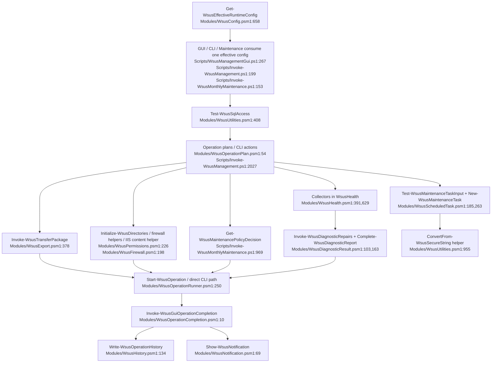

# Unified Proposal

Goal: collapse accidental duplication without adding abstraction for its own sake.

Rule used here:
- one concern → one owner
- preserve legitimate specialization only at the final projection / operator-message layer
- delete dead paths
- no dual paths, no feature flags, no registry/factory where a direct function call suffices

---

## 1. Unified transfer engine

### Problem
Transfer/copy logic is split between:
- GUI raw robocopy command: `Modules/WsusOperationPlan.psm1:161-172`
- shared transfer helpers: `Modules/WsusExport.psm1:26-147`, `Modules/WsusExport.psm1:378-428`
- CLI import/export copy orchestration: `Scripts/Invoke-WsusManagement.ps1:664-730`, `Scripts/Invoke-WsusManagement.ps1:1347-1540`
- monthly export inline robocopy: `Scripts/Invoke-WsusMonthlyMaintenance.ps1:1503-1590`

### Decision
Make `Modules/WsusExport.psm1` the single owner of package/content transfer.

Single entry point:
- `Invoke-WsusTransferPackage` in `Modules/WsusExport.psm1` near `378`

Shape:
- inputs: direction, source root, destination root, include backup, include content, generic vs wsus-content-aware mode, exclusions, log path
- internally call the existing `New-WsusTransferPlan` + `Invoke-WsusRobocopy`
- keep one robocopy exit-code mapping in one place

### Old call sites become
- `Modules/WsusOperationPlan.psm1:161-172`
  - stop building raw robocopy text
  - instead build a child command that imports `WsusExport.psm1` and calls `Invoke-WsusTransferPackage`
- `Scripts/Invoke-WsusManagement.ps1:664-730`, `1347-1540`
  - stop doing copy orchestration inline
  - call `Invoke-WsusTransferPackage`
- `Scripts/Invoke-WsusMonthlyMaintenance.ps1:1503-1590`
  - stop rebuilding robocopy args inline
  - call `Invoke-WsusTransferPackage`

### Lost capability
- None required.
- GUI generic folder transfer remains possible as a mode flag on the same function.

---

## 2. Unified SQL access gate

### Problem
SQL readiness/sysadmin/tool discovery repeats in:
- GUI preflight: `Scripts/WsusManagementGui.ps1:3004-3033`
- CLI checks: `Scripts/Invoke-WsusManagement.ps1:358-473`
- monthly preflight: `Scripts/Invoke-WsusMonthlyMaintenance.ps1:349-447`
- while shared SQL execution already exists: `Modules/WsusUtilities.psm1:408-555`

### Decision
Make `Modules/WsusUtilities.psm1` the single owner of SQL readiness and sysadmin probing.

Single entry point:
- `Test-WsusSqlAccess` in `Modules/WsusUtilities.psm1` near `408`

Shape:
- returns structured result: service found, tool used, connection ok, sysadmin ok, message, remediation hint
- uses one sqlcmd/Invoke-Sqlcmd discovery path
- callers keep their own UI/console wording only

### Old call sites become
- `Scripts/WsusManagementGui.ps1:3004-3033`
  - popup based on `Test-WsusSqlAccess` result
- `Scripts/Invoke-WsusManagement.ps1:358-473`
  - replace `Test-SqlSysadmin` / `Assert-SqlSysadmin` internals with `Test-WsusSqlAccess`
- `Scripts/Invoke-WsusMonthlyMaintenance.ps1:349-447`
  - replace duplicated SQL auth/service/sysadmin block with `Test-WsusSqlAccess`

### Lost capability
- None.
- Presentation remains specialized; capability detection is unified.

---

## 3. Unified install-time remediation primitives

### Problem
Installer still hardcodes firewall/ACL/IIS content-path logic already represented in repair helpers.

Evidence:
- install ACLs/directories: `Scripts/Install-WsusWithSqlExpress.ps1:621-649`, `1050-1053`
- install firewall rules: `Scripts/Install-WsusWithSqlExpress.ps1:792-829`, `951-971`
- shared permission helpers: `Modules/WsusPermissions.psm1:21-78`, `226-277`
- shared firewall helpers: `Modules/WsusFirewall.psm1:21-141`, `198-253`, `318-365`
- diagnostics repair path: `Modules/WsusRepairPlan.psm1:70-72`, `119-121`

### Decision
Installer should call the same primitives the repair flow already trusts.

Single entry points:
- `Initialize-WsusDirectories` in `Modules/WsusPermissions.psm1:226`
- `Initialize-WsusFirewallRules` in `Modules/WsusFirewall.psm1:198`
- `Initialize-SqlFirewallRules` in `Modules/WsusFirewall.psm1` existing export block near `373`
- one small IIS content-path helper added to `Modules/WsusPermissions.psm1` or `Modules/WsusProvisioning.psm1` near existing provisioning helpers

### Old call sites become
- `Scripts/Install-WsusWithSqlExpress.ps1:621-649`
  - call `Initialize-WsusDirectories -WSUSRoot ...`
- `Scripts/Install-WsusWithSqlExpress.ps1:792-829`
  - call `Initialize-WsusFirewallRules`
- `Scripts/Install-WsusWithSqlExpress.ps1:951-971`
  - call `Initialize-SqlFirewallRules`
- `Scripts/Install-WsusWithSqlExpress.ps1:1032-1053`
  - call shared helper for IIS content-path verification + final WsusPool ACL grant

### Lost capability
- None.
- Only required specialization: installer may need a `-IncludeWsusPool:$false` first, then a final post-IIS grant. That is acceptable as a parameter, not a second implementation.

---

## 4. Unified runtime-config merge contract

### Problem
Defaults, saved GUI settings, and runtime config all write the same fields.

Evidence:
- GUI defaults: `Scripts/WsusManagementGui.ps1:68-104`
- GUI settings overlay: `Scripts/WsusManagementGui.ps1:207-239`
- GUI runtime overwrite: `Scripts/WsusManagementGui.ps1:267-279`
- central config: `Modules/WsusConfig.psm1:26-78`, `658-694`
- CLI fallback config: `Scripts/Invoke-WsusManagement.ps1:199-241`
- monthly runtime reset: `Scripts/Invoke-WsusMonthlyMaintenance.ps1:153-170`

### Decision
`Modules/WsusConfig.psm1` owns effective runtime settings.

Single entry point:
- `Get-WsusEffectiveRuntimeConfig` in `Modules/WsusConfig.psm1` near `658`

Shape:
- merge order:
  1. built-in defaults
  2. optional `C:\WSUS\wsus-config.json`
  3. optional GUI user settings for GUI-owned overrideable fields
  4. explicit script parameters
- GUI should seed only true bootstrapping minimums before module import, then immediately replace with effective config

### Old call sites become
- `Scripts/WsusManagementGui.ps1:68-104`, `207-239`, `267-279`
  - trim duplicated default assignment/overwrite dance
  - one call after module load
- `Scripts/Invoke-WsusManagement.ps1:199-241`
  - use effective runtime config instead of local fallback copy
- `Scripts/Invoke-WsusMonthlyMaintenance.ps1:153-170`
  - use effective runtime config and then overlay explicit parameters

### Lost capability
- None.
- GUI-local preferences still exist; they stop competing with deployment defaults silently.

---

## 5. Unified diagnostics finalization

### Problem
Standard and deep diagnostics duplicate repair loops and report shaping.

Evidence:
- standard finalize path: `Modules/WsusHealth.psm1:550-615`
- deep finalize path: `Modules/WsusHealth.psm1:841-875`
- typed seam already exists: `Modules/WsusDiagnosticResult.psm1:25-185`

### Decision
Keep separate collectors. Unify only the finalization pipeline.

Single entry point:
- `Complete-WsusDiagnosticReport` in `Modules/WsusDiagnosticResult.psm1` near `103`

Supporting helper:
- `Invoke-WsusDiagnosticRepairs` in `Modules/WsusDiagnosticResult.psm1` near `163`

### Old call sites become
- `Modules/WsusHealth.psm1:550-615`
  - gather issues/checks/evidence, then call `Invoke-WsusDiagnosticRepairs` + `Complete-WsusDiagnosticReport`
- `Modules/WsusHealth.psm1:841-875`
  - same

### Lost capability
- None.
- Collector specialization stays where it belongs.

---

## 6. Unified schedule validation seam

### Problem
Schedule validation is split between GUI dialog logic and `WsusScheduledTask.psm1`, with different strictness.

Evidence:
- GUI validation: `Scripts/WsusManagementGui.ps1:2727-2791`
- module validation: `Modules/WsusScheduledTask.psm1:24-58`, `185-260`
- duplicate secret conversion helpers: `Modules/WsusOperationPlan.psm1:19-29`, `153-157`, `Modules/WsusScheduledTask.psm1:60-77`, `255-257`

### Decision
`Modules/WsusScheduledTask.psm1` should own validation rules and secure-string/plaintext bridging.

Single entry points:
- `Test-WsusMaintenanceTaskInput` in `Modules/WsusScheduledTask.psm1` near `185`
- `ConvertFrom-WsusSecureString` helper in `Modules/WsusUtilities.psm1` near `955`

### Old call sites become
- `Scripts/WsusManagementGui.ps1:2727-2791`
  - call `Test-WsusMaintenanceTaskInput` for pre-submit validation
- `Modules/WsusOperationPlan.psm1:19-29`, `153-157`
  - use shared secure-string bridge helper
- `Modules/WsusScheduledTask.psm1:60-77`, `255-257`
  - use same shared helper

### Lost capability
- None.
- GUI keeps early UX validation, but no longer drifts from the authoritative module.

---

## 7. Unified maintenance policy predicates

### Problem
Maintenance approval and decline paths repeat overlapping exclusion predicates.

Evidence:
- decline predicates: `Scripts/Invoke-WsusMonthlyMaintenance.ps1:984-997`
- approval exclusion predicates: `Scripts/Invoke-WsusMonthlyMaintenance.ps1:1100-1142`
- repeated decline loops: `Scripts/Invoke-WsusMonthlyMaintenance.ps1:1001-1094`

### Decision
Keep one script. Extract one local policy table and one predicate set.

Single entry point:
- `Get-WsusMaintenancePolicyDecision` in `Scripts/Invoke-WsusMonthlyMaintenance.ps1` near `969`

Shape:
- given one update, return:
  - `DeclineReason` or null
  - `ApprovalEligible` bool
  - `ApprovalBlockReason` or null
- one shared predicate set for Preview/Beta, ARM64, legacy builds, 25H2, Office legacy, Edge non-stable, WSL, x86, etc.

### Old call sites become
- `Scripts/Invoke-WsusMonthlyMaintenance.ps1:969-1094`
  - decline loop consumes `DeclineReason`
- `Scripts/Invoke-WsusMonthlyMaintenance.ps1:1096-1177`
  - approval loop consumes `ApprovalEligible`

### Lost capability
- None.
- Outcome specialization stays: some updates are declined, some are merely not approved.

---

## What not to unify

Do not collapse these into one generic abstraction:
- dashboard card projection, health score projection, and diagnostic issue projection
- generic GUI transfer vs WSUS-package-aware transfer mode semantics
- monthly XML task registration vs daily/weekly task registration
- GUI file-backed logging vs CLI host/transcript logging

These need a shared data source or helper, not a giant generic framework.

---

## Combined proposed Mermaid flowchart

