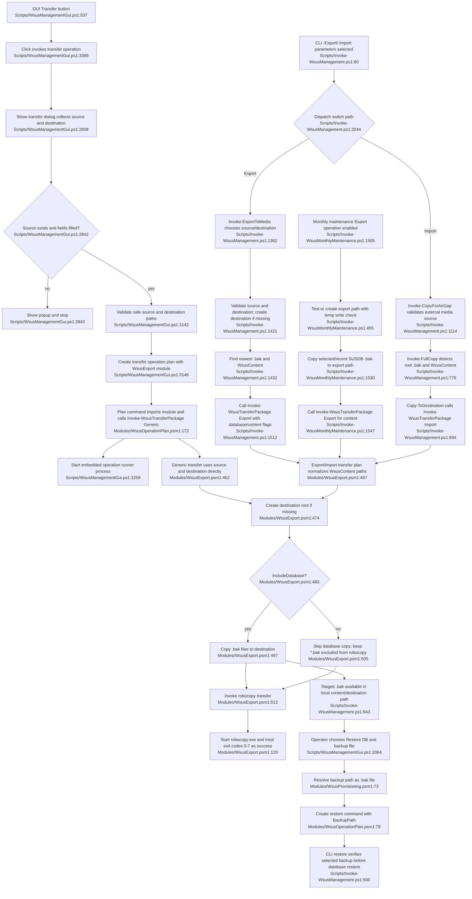

# Air-gap transfer, import/export & restore

## Sources consulted
- `Scripts/WsusManagementGui.ps1:520-540`, `Scripts/WsusManagementGui.ps1:331-342`, `Scripts/WsusManagementGui.ps1:2064-2166`, `Scripts/WsusManagementGui.ps1:2808-2860`, `Scripts/WsusManagementGui.ps1:3108-3154`, `Scripts/WsusManagementGui.ps1:3248-3261`, `Scripts/WsusManagementGui.ps1:3388-3390`
- `Scripts/Invoke-WsusManagement.ps1:76-129`, `Scripts/Invoke-WsusManagement.ps1:203-227`, `Scripts/Invoke-WsusManagement.ps1:293-335`, `Scripts/Invoke-WsusManagement.ps1:650-705`, `Scripts/Invoke-WsusManagement.ps1:771-845`, `Scripts/Invoke-WsusManagement.ps1:1073-1126`, `Scripts/Invoke-WsusManagement.ps1:1138-1169`, `Scripts/Invoke-WsusManagement.ps1:1359-1548`, `Scripts/Invoke-WsusManagement.ps1:2044-2065`
- `Scripts/Invoke-WsusMonthlyMaintenance.ps1:85-97`, `Scripts/Invoke-WsusMonthlyMaintenance.ps1:168-175`, `Scripts/Invoke-WsusMonthlyMaintenance.ps1:455-487`, `Scripts/Invoke-WsusMonthlyMaintenance.ps1:1411-1428`, `Scripts/Invoke-WsusMonthlyMaintenance.ps1:1504-1586`
- `Modules/WsusExport.psm1:26-147`, `Modules/WsusExport.psm1:154-260`, `Modules/WsusExport.psm1:381-428`, `Modules/WsusExport.psm1:430-539`, `Modules/WsusExport.psm1:548-554`
- `Modules/WsusOperationPlan.psm1:56-82`, `Modules/WsusOperationPlan.psm1:161-184`
- `Modules/WsusProvisioning.psm1:73-126`, `Modules/WsusProvisioning.psm1:147-150`

## Concrete findings
- GUI entry: the side-nav `BtnTransfer` is declared at `Scripts/WsusManagementGui.ps1:537` and wired at `Scripts/WsusManagementGui.ps1:3389` to `Invoke-LogOperation "transfer" "Transfer"`.
- GUI transfer dialog collects source/destination and validates source existence before returning paths (`Scripts/WsusManagementGui.ps1:2808-2860`); the operation layer then applies `Test-SafePath` to both paths (`Scripts/WsusManagementGui.ps1:331-339`, `Scripts/WsusManagementGui.ps1:3141-3145`).
- GUI transfer does not call the CLI export/import switches. It builds `New-WsusTransferOperationPlan` with `WsusExport.psm1` and forces embedded execution (`Scripts/WsusManagementGui.ps1:3146-3150`). That plan imports `WsusExport.psm1` and runs `Invoke-WsusTransferPackage -Direction Generic -IncludeContent` (`Modules/WsusOperationPlan.psm1:161-174`).
- In the shared engine, `Generic` transfer uses the exact source and destination as content source/destination (`Modules/WsusExport.psm1:462-470`), creates the destination root if needed (`Modules/WsusExport.psm1:474-479`), then calls `Invoke-WsusRobocopy` (`Modules/WsusExport.psm1:511-515`). Because `Invoke-WsusTransferPackage` ensures `*.bak` stays in exclude extensions (`Modules/WsusExport.psm1:505-509`) and GUI Generic transfer does not pass `IncludeDatabase`, GUI Robocopy is content/tree copy only, not database-backup staging.
- `Invoke-WsusRobocopy` validates the source path, builds robocopy arguments `/E /XO /MT /R:2 /W:5 /NP /NDL`, appends `/MAXAGE`, `/XF`, `/XD`, `/LOG`, `/TEE` when applicable, and spawns `robocopy.exe` with `Start-Process -Wait -PassThru -NoNewWindow`; exit codes `< 8` are treated as success (`Modules/WsusExport.psm1:79-147`).
- CLI import/export are selected by switches in `Scripts/Invoke-WsusManagement.ps1:80-124` and dispatched at `Scripts/Invoke-WsusManagement.ps1:2044-2065` after importing `WsusExport.psm1` and `WsusProvisioning.psm1` (`Scripts/Invoke-WsusManagement.ps1:203-227`).
- CLI export happy path: `Invoke-ExportToMedia` validates source with `Test-ValidPath -MustExist`, inspects newest `*.bak` plus `WsusContent`, validates/creates destination, then calls `Invoke-WsusTransferPackage -Direction Export`; when a backup exists it passes `-IncludeDatabase -DatabaseBackupPath` (`Scripts/Invoke-WsusManagement.ps1:1359-1518`).
- Monthly maintenance export happy path: backup is created under `$script:ContentPath` (`Scripts/Invoke-WsusMonthlyMaintenance.ps1:1411-1428`), `Test-ExportPathAccess` verifies or creates the export path with a temporary write test (`Scripts/Invoke-WsusMonthlyMaintenance.ps1:455-487`, `Scripts/Invoke-WsusMonthlyMaintenance.ps1:1504-1518`), the selected/recent `.bak` is copied with `Copy-Item` (`Scripts/Invoke-WsusMonthlyMaintenance.ps1:1518-1534`), then content is synced through `Invoke-WsusTransferPackage -Direction Export -IncludeContent` with a robocopy log path (`Scripts/Invoke-WsusMonthlyMaintenance.ps1:1537-1558`).
- Air-gap import staging: CLI `-Import` resolves source from `SourcePath` or `ExportRoot`, validates the external-media path with `Test-ValidPath`, then `Invoke-FullCopy` detects root-level newest `.bak` and `WsusContent`, falling back to recursive newest `.bak` archive search if root has neither (`Scripts/Invoke-WsusManagement.ps1:1073-1126`, `Scripts/Invoke-WsusManagement.ps1:771-803`). `Copy-ToDestination` then calls `Invoke-WsusTransferPackage -Direction Import -IncludeDatabase/-IncludeContent`, staging `.bak` and content into the local destination (`Scripts/Invoke-WsusManagement.ps1:650-705`).
- Restore linkage: GUI Restore selects recent `.bak` from `$script:ContentPath` or a browsed file (`Scripts/WsusManagementGui.ps1:2064-2166`), validates it with `Resolve-WsusRestoreBackup`, then creates a restore operation command (`Scripts/WsusManagementGui.ps1:3121-3137`; `Modules/WsusOperationPlan.psm1:78-81`). CLI restore validates/chooses the `.bak` through `Resolve-WsusRestoreBackup` and continues into backup verification/restore (`Scripts/Invoke-WsusManagement.ps1:500-590`; `Modules/WsusProvisioning.psm1:73-126`).

## Mermaid flowchart

## External dependencies
- `robocopy.exe` spawned via `Start-Process` for all shared transfer content copies (`Modules/WsusExport.psm1:120`).
- Windows filesystem / UNC / removable-media paths, including `Test-Path`, `New-Item`, `Copy-Item`, `Get-ChildItem`, and temp write/remove validation (`Scripts/Invoke-WsusManagement.ps1:1421-1476`; `Scripts/Invoke-WsusMonthlyMaintenance.ps1:455-487`; `Modules/WsusExport.psm1:474-497`).
- WPF/WinForms file/folder dialogs used for GUI operator selection (`Scripts/WsusManagementGui.ps1:1977-2017`, `Scripts/WsusManagementGui.ps1:2099-2101`, `Scripts/WsusManagementGui.ps1:2808-2860`).
- PowerShell module loading for transfer/provisioning helpers (`Scripts/Invoke-WsusManagement.ps1:203-227`; GUI transfer command imports `WsusExport.psm1` in `Modules/WsusOperationPlan.psm1:173`).
- Restore linkage calls `sqlcmd.exe` and SQL Server/SUSDB after backup selection (`Scripts/Invoke-WsusManagement.ps1:513-590`), plus service control later in restore (`Scripts/Invoke-WsusManagement.ps1:580-590`).

## Confidence and gaps
- Confidence: high for current-state happy path and material fallback branches because every branch in the chart is backed by scoped source reads and searches.
- Gaps: intentionally did not trace non-goal database cleanup internals, diagnostics report generation, or scheduled task creation. Restore database internals are included only to the point needed to show `.bak` handoff into restore.
