# Client deployment, GPO import & client check-in

## Sources consulted
- `Scripts/WsusManagementGui.ps1:500-560`, `Scripts/WsusManagementGui.ps1:3300-3395`, `Scripts/WsusManagementGui.ps1:3308-3385`
- `DomainController/Set-WsusGroupPolicy.ps1:40-80`, `DomainController/Set-WsusGroupPolicy.ps1:90-170`, `DomainController/Set-WsusGroupPolicy.ps1:160-216`, `DomainController/Set-WsusGroupPolicy.ps1:218-520`, `DomainController/Set-WsusGroupPolicy.ps1:543-636`
- `Scripts/Invoke-WsusClientCheckIn.ps1:1-223`, `Scripts/Invoke-WsusClientCheckIn.ps1:180-268`, `Scripts/Invoke-WsusClientCheckIn.ps1:24-183`
- `Modules/WsusUtilities.psm1:40-120`, `Modules/WsusUtilities.psm1:120-150`, `Modules/WsusUtilities.psm1:170-230`, `Modules/WsusUtilities.psm1:230-280`

## Concrete findings
- GUI staging starts from the sidebar `BtnCreateGpo` button (`Scripts/WsusManagementGui.ps1:531`) and its click handler (`Scripts/WsusManagementGui.ps1:3308`). It resolves a `DomainController` source folder from three candidate locations, aborts if none exists, then confirms with the user before writing anything (`Scripts/WsusManagementGui.ps1:3309-3327`).
- On confirmation, the GUI creates `C:\WSUS\WSUS GPO` if needed, recursively copies the chosen `DomainController\*` contents there, counts `WSUS GPOs` backup directories, checks for `Set-WsusGroupPolicy.ps1`, and prints manual next steps for copying to the Domain Controller and running the import script (`Scripts/WsusManagementGui.ps1:3329-3380`).
- The Domain Controller script accepts `-WsusServerUrl` and defaults `-BackupPath` to `WSUS GPOs` beside the script (`DomainController/Set-WsusGroupPolicy.ps1:57-60`). When executed directly, it calls `Invoke-WsusGroupPolicyImport` (`DomainController/Set-WsusGroupPolicy.ps1:635`).
- `Invoke-WsusGroupPolicyImport` ensures the GroupPolicy module/GPMC feature is available, imports GroupPolicy, validates prerequisites, detects the AD domain, verifies the backup path, parses backup folders via `bkupInfo.xml`, resolves/prompt-builds the WSUS URL, then loops over configured GPO definitions (`DomainController/Set-WsusGroupPolicy.ps1:543-617`).
- The configured GPO boundaries are three fixed definitions: `WSUS Update Policy` linked to the domain root with WSUS registry updates; `WSUS Inbound Allow` linked to `Member Servers/WSUS Server`; and `WSUS Outbound Allow` linked to `Member Servers`, `Workstations`, and Domain Controllers (`DomainController/Set-WsusGroupPolicy.ps1:218-250`). OU resolution can create missing nested OUs, except it will not auto-create a missing top-level `Member Servers`/`Member_Servers` legacy OU (`DomainController/Set-WsusGroupPolicy.ps1:171-216`).
- `Import-WsusGpo` is clean-cutover per GPO: remove existing links, remove existing GPO, create a fresh GPO, import the backup, update WSUS policy registry values for the update policy, remove stale ADMX-less registry values, then create missing GP links for each target (`DomainController/Set-WsusGroupPolicy.ps1:288-419`).
- After GPO import/linking, the script fans out policy refresh to enabled non-DC domain computers: `Get-ADComputer`, advisory ping, `schtasks.exe /create` as SYSTEM to run `gpupdate /force /wait:0`, `schtasks.exe /run`, then `schtasks.exe /delete`; failures are reported as machines that will fall back to normal 90-minute/reboot policy application (`DomainController/Set-WsusGroupPolicy.ps1:426-478`, `DomainController/Set-WsusGroupPolicy.ps1:624-625`).
- Client check-in is a separate script, not called by the GUI staging or DC import script in the scoped files. It resolves and imports `WsusUtilities.psm1`, uses `Test-AdminPrivileges -ExitOnFail $true`, then stops Windows Update related services (`Scripts/Invoke-WsusClientCheckIn.ps1:24-96`; utility admin check at `Modules/WsusUtilities.psm1:236-255`).
- Client-side side effects: optional `-ClearCache` removes an old `SoftwareDistribution.bak` and renames `C:\Windows\SoftwareDistribution`; it deletes `SusClientId` and `SusClientIDValidation`; restarts update services; triggers `wuauclt.exe`, optional `usoclient.exe`, and `Microsoft.Update.Session` COM search; reads applied WSUS policy registry keys; and prints service status (`Scripts/Invoke-WsusClientCheckIn.ps1:109-267`).

## Mermaid flowchart

```mermaid
flowchart TD
  A["User clicks Create GPO in GUI<br/>Scripts/WsusManagementGui.ps1:531"] --> B["BtnCreateGpo handler starts<br/>Scripts/WsusManagementGui.ps1:3308"]
  B --> C["Resolve DomainController source folder from candidate paths<br/>Scripts/WsusManagementGui.ps1:3309-3317"]
  C --> D{"Source folder found?<br/>Scripts/WsusManagementGui.ps1:3320"}
  D -- "No" --> E["Show missing DomainController error and return<br/>Scripts/WsusManagementGui.ps1:3321-3322"]
  D -- "Yes" --> F["Confirm copy to C:\\WSUS\\WSUS GPO<br/>Scripts/WsusManagementGui.ps1:3325-3327"]
  F --> G["Create destination folder if missing<br/>Scripts/WsusManagementGui.ps1:3334-3335"]
  G --> H["Copy DomainController assets recursively<br/>Scripts/WsusManagementGui.ps1:3339-3340"]
  H --> I["Verify staged GPO backups and import script<br/>Scripts/WsusManagementGui.ps1:3343-3347"]
  I --> J["Show DC run instructions and client gpupdate guidance<br/>Scripts/WsusManagementGui.ps1:3349-3380"]

  J --> K["Admin runs Set-WsusGroupPolicy.ps1 on DC<br/>DomainController/Set-WsusGroupPolicy.ps1:57-60"]
  K --> L["Direct execution invokes import workflow<br/>DomainController/Set-WsusGroupPolicy.ps1:635"]
  L --> M["Ensure/import GroupPolicy and GPMC prerequisites<br/>DomainController/Set-WsusGroupPolicy.ps1:543-562"]
  M --> N["Detect domain and validate backup path<br/>DomainController/Set-WsusGroupPolicy.ps1:566-576"]
  N --> O["Parse WSUS GPO backup metadata from bkupInfo.xml<br/>DomainController/Set-WsusGroupPolicy.ps1:578-600"]
  O --> P["Resolve WSUS URL and fixed GPO definitions<br/>DomainController/Set-WsusGroupPolicy.ps1:604-605"]
  P --> Q["For each WSUS GPO, match backup by display name<br/>DomainController/Set-WsusGroupPolicy.ps1:610-615"]
  Q --> R["Import-WsusGpo for matched backup<br/>DomainController/Set-WsusGroupPolicy.ps1:617-621"]
  R --> S["Resolve target OUs and create allowed missing OUs<br/>DomainController/Set-WsusGroupPolicy.ps1:253-285"]
  S --> T["Remove existing GPO links and GPO for clean import<br/>DomainController/Set-WsusGroupPolicy.ps1:317-335"]
  T --> U["New-GPO then Import-GPO from staged backup<br/>DomainController/Set-WsusGroupPolicy.ps1:340-341"]
  U --> V["Write WSUS registry policy values for Update Policy<br/>DomainController/Set-WsusGroupPolicy.ps1:347-373"]
  V --> W["Remove stale registry values from imported GPO<br/>DomainController/Set-WsusGroupPolicy.ps1:381-392"]
  W --> X["Link GPO to domain or target OUs<br/>DomainController/Set-WsusGroupPolicy.ps1:410-419"]
  X --> Y["Push GPUpdate to enabled non-DC computers<br/>DomainController/Set-WsusGroupPolicy.ps1:624"]
  Y --> Z["Create/run/delete remote SYSTEM schtasks for gpupdate<br/>DomainController/Set-WsusGroupPolicy.ps1:464-478"]
  Z --> AA["Show GPO import summary and next steps<br/>DomainController/Set-WsusGroupPolicy.ps1:625"]

  J --> AB["Optional separate client check-in script is run on client<br/>Scripts/Invoke-WsusClientCheckIn.ps1:24"]
  AB --> AC["Resolve/import WsusUtilities module<br/>Scripts/Invoke-WsusClientCheckIn.ps1:34-70"]
  AC --> AD["Require administrator privileges<br/>Scripts/Invoke-WsusClientCheckIn.ps1:83"]
  AD --> AE["Stop wuauserv/bits/cryptsvc/msiserver<br/>Scripts/Invoke-WsusClientCheckIn.ps1:88-96"]
  AE --> AF["Optionally rename SoftwareDistribution cache<br/>Scripts/Invoke-WsusClientCheckIn.ps1:109-131"]
  AF --> AG["Remove WSUS client identity registry values<br/>Scripts/Invoke-WsusClientCheckIn.ps1:137-154"]
  AG --> AH["Restart update services<br/>Scripts/Invoke-WsusClientCheckIn.ps1:165-172"]
  AH --> AI["Trigger wuauclt, USOClient, and WU COM search<br/>Scripts/Invoke-WsusClientCheckIn.ps1:188-207"]
  AI --> AJ["Read applied WSUS policy registry keys<br/>Scripts/Invoke-WsusClientCheckIn.ps1:218-238"]
  AJ --> AK["Print check-in summary and service status<br/>Scripts/Invoke-WsusClientCheckIn.ps1:248-267"]
```

## External dependencies
- WPF/.NET eventing and filesystem access for GUI staging into `C:\WSUS\WSUS GPO` (`New-Item`, `Copy-Item`, `Get-ChildItem`, `Test-Path`).
- Domain Controller with Administrator privileges, GroupPolicy PowerShell module, GPMC Windows feature (`Add-WindowsFeature GPMC`), and RSAT/GPMC cmdlets: `Get-GPO`, `Remove-GPLink`, `Remove-GPO`, `New-GPO`, `Import-GPO`, `Set-GPRegistryValue`, `Get-GPRegistryValue`, `Remove-GPRegistryValue`, `Get-GPInheritance`, `New-GPLink`.
- Active Directory module/cmdlets and domain data: `Get-ADDomain`, `Get-ADOrganizationalUnit`, `New-ADOrganizationalUnit`, `Get-ADComputer`; expected OUs include Domain root, Domain Controllers, Member Servers/WSUS Server, and Workstations.
- Staged Microsoft GPO backup artifacts under `WSUS GPOs\{GUID}\bkupInfo.xml` and related backup files.
- Remote policy fanout over RPC/SMB Task Scheduler using `schtasks.exe`; target machines must permit remote task creation/run/delete for immediate gpupdate.
- Client-side Windows services: `wuauserv`, `bits`, `cryptsvc`, `msiserver`; client registry hives under Windows Update policy and client identity keys.
- Client detection tools/APIs: `wuauclt.exe`, optional `C:\Windows\System32\usoclient.exe`, and `Microsoft.Update.Session` COM object.
- Shared module `WsusUtilities.psm1` for console output and administrator check.

## Confidence and gaps
- Confidence: high for control flow and side effects within the assigned files; all key entry points and side-effecting calls were traced read-only.
- Gap: no runtime validation was performed because the assignment explicitly required read-only investigation and forbade build/test/lint or state-changing commands.
- Gap: backup internals were treated as external staged assets; the flow uses their display names/metadata but does not trace every imported registry/firewall setting beyond the script-level post-import writes.
