# Configuration, shared utilities & operator support

## Sources consulted
- `memory://root/memory_summary.md`.
- `skill://pathfinder`.
- `Modules/WsusConfig.psm1:1-120,153-190,196-235,236-384,456-510,622-708,709-727`.
- `Modules/WsusUtilities.psm1:1-60,149-220,220-370,371-559,622-850,858-966,967-994`.
- `Modules/WsusServices.psm1:1-180`.
- `Modules/WsusFirewall.psm1:1-60,67-224,232-360,368-383`.
- `Modules/WsusPermissions.psm1:1-85,92-160,180-270,283-290`.
- `Modules/WsusHistory.psm1:1-100,134-200,215-287`.
- `Modules/WsusNotification.psm1:1-193`.
- `Modules/WsusOperationCompletion.psm1:1-73`.
- `Modules/WsusHostEnvironment.psm1:1-252,252-266`.

## Concrete findings
- Configuration is centralized in `$script:WsusConfig` with defaults for SQL, content/log/export paths, service names, ports, and timeouts (`Modules/WsusConfig.psm1:26-120`). On module import, `Initialize-WsusConfigFromFile` attempts to merge `C:\WSUS\wsus-config.json` into that hashtable and falls back to defaults on missing/invalid config (`Modules/WsusConfig.psm1:456-488,704-707`).
- `Get-WsusConfig` is the low-level lookup: no key returns the whole hashtable; dot notation walks nested hashtables and returns `$null` when a path is absent (`Modules/WsusConfig.psm1:153-190`). `Set-WsusConfig` mutates the same hashtable, including dot-path updates (`Modules/WsusConfig.psm1:196-235`).
- `Get-WsusRuntimeConfig` is the broader runtime interface. It returns a `Wsus.RuntimeConfig` object containing SQL/database, content/log/export paths, cloned service map, ports, tool paths, and SQL Express size limit (`Modules/WsusConfig.psm1:658-707`).
- Logging/operator output is centralized in `WsusUtilities`: `Start-WsusLogging` creates a log directory and starts a transcript, `Write-LogError`/`Write-LogWarning` pair timestamped log output with colored console output, and `Invoke-WithErrorHandling` wraps caller scriptblocks with those log paths (`Modules/WsusUtilities.psm1:149-220,220-370`).
- SQL execution is centralized through `Invoke-WsusSqlcmd`: it builds a splatted `Invoke-Sqlcmd` parameter set, adds credentials/variables/trust-server-certificate when applicable, lazily imports SQLPS/SqlServer, then falls back to `sqlcmd.exe` only for integrated auth; credentialed fallback is refused to avoid password exposure (`Modules/WsusUtilities.psm1:408-559`). `Invoke-SqlScalar` is a simpler direct `sqlcmd` scalar helper (`Modules/WsusUtilities.psm1:371-406`).
- SQL credential support stores a DPAPI-encrypted `sql_credential.xml`, lazily chooses its directory from `Get-WsusContentPath` or `C:\WSUS`, locks ACLs to Administrators/SYSTEM, loads credentials through `Import-Clixml`, and validates by calling `Invoke-WsusSqlcmd` (`Modules/WsusUtilities.psm1:622-850`).
- Secret environment support is object-oriented rather than mutating by itself: `New-WsusSecretEnvironment` returns a `Wsus.SecretEnvironment` object with an `Environment` hashtable and `CleanupKeys`; `Clear-WsusSecretEnvironment` removes those keys from `Env:` (`Modules/WsusUtilities.psm1:923-954`).
- Service support is centralized in generic helpers: `Get-WsusServiceDefinitions` provides canonical service names; `Start-WsusService`, `Stop-WsusService`, and `Restart-WsusService` call Windows service cmdlets and `Wait-ServiceState`; all-service helpers keep per-service wrappers private (`Modules/WsusServices.psm1:21-180`).
- Firewall support is centralized around module-local WSUS/SQL rule arrays. `Initialize-WsusFirewallRules` and `Initialize-SqlFirewallRules` loop definitions into `New-WsusFirewallRule`, which removes any existing matching display name before creating the rule; repair helpers test first and initialize only when missing (`Modules/WsusFirewall.psm1:21-60,67-224,232-360`).
- Permission support is centralized for WSUS content paths: `Set-WsusContentPermissions` applies required grants through `icacls`, `Test-WsusContentPermissions` verifies ACL entries, `Repair-WsusContentPermissions` tests then calls set, and `Initialize-WsusDirectories` creates the standard directories before applying permissions (`Modules/WsusPermissions.psm1:21-85,92-160,180-270`).
- Host environment support is a diagnostic/repair seam: `New-WsusHostEnvironment` normalizes expected paths/service names, read helpers return service/security/path/SQL networking/IIS/event state, SQL reads prefer `Invoke-WsusSqlcmd` if it is imported, and command/service/IIS setters are exposed at the same seam (`Modules/WsusHostEnvironment.psm1:11-250,252-266`).
- History persistence is per-user JSON at `%APPDATA%\WsusManager\history.json`. `Write-WsusOperationHistory` prepends a new ordered entry, caps the list at 100, retries on IO locks, and delegates file creation/JSON formatting to private helpers (`Modules/WsusHistory.psm1:19-100,134-200`). Reads and clears use the same private path helper (`Modules/WsusHistory.psm1:215-287`).
- Operation completion is callback-based: `New-WsusGuiOperationCompletion` creates a DTO with result, duration, report availability, notification text, history summary, and cleanup keys; `Invoke-WsusGuiOperationCompletion` invokes optional log, notification, history, and cleanup callbacks according to enable flags (`Modules/WsusOperationCompletion.psm1:10-73`).
- Notification emission is centralized in `Show-WsusNotification`: it appends duration/result, optionally beeps, attempts Windows toast, falls back to `System.Windows.Forms.NotifyIcon` balloon tip, then falls back to verbose/console output (`Modules/WsusNotification.psm1:69-193`).
- No static `Import-Module` dependency between these scoped modules was found. Coupling is mostly through exported commands being available in the caller session; the strongest direct in-scope dynamic dependency is `WsusHostEnvironment` preferring `Invoke-WsusSqlcmd` when the command exists (`Modules/WsusHostEnvironment.psm1:84-100`).

## Mermaid flowchart

```mermaid
flowchart TD
    Caller["Operation caller requests shared support services<br/>Modules/WsusConfig.psm1:153"]
    ImportConfig["Config module import loads optional JSON<br/>Modules/WsusConfig.psm1:704"]
    ConfigFile["Merge wsus-config.json into defaults<br/>Modules/WsusConfig.psm1:456"]
    GetConfig["Get-WsusConfig returns whole config or dot-path value<br/>Modules/WsusConfig.psm1:153"]
    RuntimeConfig["Get-WsusRuntimeConfig returns SQL/path/service/port/tool DTO<br/>Modules/WsusConfig.psm1:658"]
    LogPath["Get-WsusLogPath ensures log directory exists<br/>Modules/WsusConfig.psm1:294"]

    Logging["Start-WsusLogging starts transcript in shared/per-script log<br/>Modules/WsusUtilities.psm1:165"]
    ErrorWrap["Invoke-WithErrorHandling routes failures to log helpers<br/>Modules/WsusUtilities.psm1:325"]
    Sqlcmd["Invoke-WsusSqlcmd builds SQL command parameters<br/>Modules/WsusUtilities.psm1:408"]
    SqlModule["Use Invoke-Sqlcmd when SQLPS/SqlServer command is available<br/>Modules/WsusUtilities.psm1:500"]
    SqlExe["Fallback to sqlcmd.exe for integrated auth only<br/>Modules/WsusUtilities.psm1:521"]
    Credential["Get/Set/Test-WsusSqlCredential store DPAPI credential and test via SQL wrapper<br/>Modules/WsusUtilities.psm1:642"]
    SecretEnv["New-WsusSecretEnvironment returns Environment plus CleanupKeys<br/>Modules/WsusUtilities.psm1:923"]

    Services["Get-WsusServiceDefinitions exposes canonical service list<br/>Modules/WsusServices.psm1:110"]
    StartSvc["Start-WsusService calls Start-Service and waits for Running<br/>Modules/WsusServices.psm1:53"]
    WaitSvc["Wait-ServiceState polls Get-Service until target state<br/>Modules/WsusServices.psm1:21"]
    SvcStatus["Get-WsusServiceStatus batches Get-Service status reads<br/>Modules/WsusServices.psm1:119"]

    FirewallInit["Initialize-WsusFirewallRules loops standard WSUS rules<br/>Modules/WsusFirewall.psm1:198"]
    FirewallNew["New-WsusFirewallRule replaces existing rule then creates rule<br/>Modules/WsusFirewall.psm1:67"]
    FirewallRepair["Repair-WsusFirewallRules tests then initializes missing rules<br/>Modules/WsusFirewall.psm1:318"]

    PermInit["Initialize-WsusDirectories creates WSUS folders<br/>Modules/WsusPermissions.psm1:226"]
    PermSet["Set-WsusContentPermissions grants service/account ACLs<br/>Modules/WsusPermissions.psm1:21"]
    PermRepair["Repair-WsusContentPermissions tests then sets missing ACLs<br/>Modules/WsusPermissions.psm1:181"]

    HostEnv["New-WsusHostEnvironment normalizes host defaults<br/>Modules/WsusHostEnvironment.psm1:11"]
    HostReads["Host read helpers return service/security/path/SQL/IIS/event state<br/>Modules/WsusHostEnvironment.psm1:33"]
    HostSql["Invoke-WsusHostSqlQuery prefers Invoke-WsusSqlcmd then Invoke-Sqlcmd<br/>Modules/WsusHostEnvironment.psm1:84"]
    HostCommands["Host action helpers start/restart service, set IIS path, invoke command<br/>Modules/WsusHostEnvironment.psm1:185"]

    CompletionNew["New-WsusGuiOperationCompletion creates completion DTO<br/>Modules/WsusOperationCompletion.psm1:10"]
    CompletionInvoke["Invoke-WsusGuiOperationCompletion dispatches optional callbacks<br/>Modules/WsusOperationCompletion.psm1:41"]
    Notify["Show-WsusNotification emits toast, balloon, or console fallback<br/>Modules/WsusNotification.psm1:69"]
    History["Write-WsusOperationHistory prepends capped JSON history entry<br/>Modules/WsusHistory.psm1:134"]
    Cleanup["Clear-WsusSecretEnvironment removes secret Env keys<br/>Modules/WsusUtilities.psm1:944"]

    ExtRegistry["Windows registry for WSUS/SQL/IIS config<br/>Modules/WsusConfig.psm1:279"]
    ExtServices["Windows Service Control Manager<br/>Modules/WsusServices.psm1:59"]
    ExtFirewall["NetSecurity firewall cmdlets<br/>Modules/WsusFirewall.psm1:122"]
    ExtAcl["NTFS ACL/icacls subsystem<br/>Modules/WsusPermissions.psm1:53"]
    ExtSql["SQLPS/SqlServer module or sqlcmd.exe<br/>Modules/WsusUtilities.psm1:500"]
    ExtAppData["%APPDATA% WsusManager history store<br/>Modules/WsusHistory.psm1:19"]
    ExtToast["Windows toast / WinForms NotifyIcon APIs<br/>Modules/WsusNotification.psm1:152"]

    Caller --> ImportConfig --> ConfigFile --> GetConfig --> RuntimeConfig
    RuntimeConfig --> LogPath --> Logging
    Logging --> ErrorWrap
    RuntimeConfig --> Sqlcmd
    Sqlcmd -->|cmdlet available| SqlModule --> ExtSql
    Sqlcmd -->|cmdlet absent| SqlExe --> ExtSql
    Credential --> Sqlcmd
    RuntimeConfig --> SecretEnv

    RuntimeConfig --> Services
    Services --> StartSvc --> WaitSvc --> ExtServices
    Services --> SvcStatus --> ExtServices

    RuntimeConfig --> FirewallInit --> FirewallNew --> ExtFirewall
    FirewallRepair --> FirewallInit

    RuntimeConfig --> PermInit --> PermSet --> ExtAcl
    PermRepair --> PermSet

    RuntimeConfig --> HostEnv --> HostReads --> ExtRegistry
    HostEnv --> HostSql --> Sqlcmd
    HostEnv --> HostCommands --> ExtServices

    RuntimeConfig --> CompletionNew --> CompletionInvoke
    CompletionInvoke -->|log callback| Logging
    CompletionInvoke -->|notification callback| Notify --> ExtToast
    CompletionInvoke -->|history callback| History --> ExtAppData
    CompletionInvoke -->|cleanup callback| Cleanup
```

## External dependencies
- Windows filesystem and fixed/default paths: `C:\WSUS`, `C:\WSUS\Logs`, `C:\WSUS\Exports`, `%APPDATA%\WsusManager`, `metadata.json` (`Modules/WsusConfig.psm1:26-120,622-654`; `Modules/WsusUtilities.psm1:909-917`; `Modules/WsusHistory.psm1:19-100`).
- Windows registry: WSUS setup `ContentDir`, SQL SuperSocketNetLib keys, IIS provider paths (`Modules/WsusConfig.psm1:279-284`; `Modules/WsusUtilities.psm1:560-573`; `Modules/WsusHostEnvironment.psm1:102-180`).
- SQL tooling: SQLPS/SqlServer PowerShell modules, `Invoke-Sqlcmd`, and `sqlcmd.exe` client paths (`Modules/WsusUtilities.psm1:500-559`; `Modules/WsusHostEnvironment.psm1:84-100`).
- Windows service APIs/cmdlets: `Get-Service`, `Start-Service`, `Stop-Service`, `Restart-Service`, `Set-Service` (`Modules/WsusServices.psm1:21-180`; `Modules/WsusHostEnvironment.psm1:33-52,185-200`).
- Windows firewall NetSecurity cmdlets: `Get-NetFirewallRule`, `Remove-NetFirewallRule`, `New-NetFirewallRule` (`Modules/WsusFirewall.psm1:67-185`).
- NTFS ACL and permissions tooling: `icacls`, `Get-Acl`, `Set-Acl`, file system access rules (`Modules/WsusPermissions.psm1:21-160`; `Modules/WsusUtilities.psm1:741-750`).
- IIS/WebAdministration provider: `IIS:\Sites\WSUS Administration\Content`, `IIS:\AppPools\WsusPool`, `Import-Module WebAdministration` (`Modules/WsusPermissions.psm1:67-80`; `Modules/WsusHostEnvironment.psm1:146-231`).
- Windows notification APIs: Windows Runtime toast notifications, `System.Windows.Forms.NotifyIcon`, `System.Media.SystemSounds` (`Modules/WsusNotification.psm1:5-193`).
- PowerShell serialization and DPAPI-backed `Export-Clixml`/`Import-Clixml` for credentials (`Modules/WsusUtilities.psm1:734-801`).
- Windows Event Log and process execution surfaces: `Get-WinEvent`, call operator invocation of external commands (`Modules/WsusHostEnvironment.psm1:201-250`).

## Confidence and gaps
- Confidence: high for the assigned module boundary. Findings are from direct reads of every scoped file and targeted searches for functions, imports, exports, and cross-module support calls.
- Gap: caller-specific ordering outside these modules was intentionally not traced because the assignment constrained scope to the assigned feature files and excluded feature-specific GUI/maintenance/transfer flows.
- Gap: no build/test/lint or runtime commands were run because this assignment is read-only and asks for current-state tracing, not behavioral verification.
