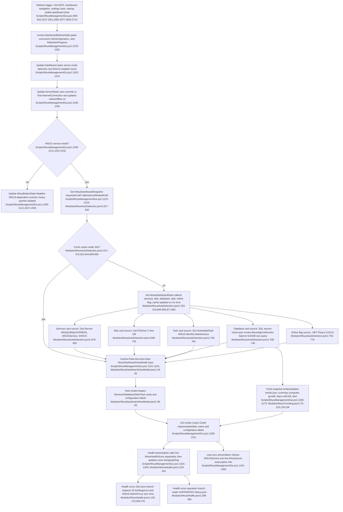

# Dashboard, auto-detection & health presentation

## Sources consulted
- `memory://root/memory_summary.md` for project operating context.
- `Scripts/WsusManagementGui.ps1:575-619`, `894-916`, `1109-1161`, `1159-1298`, `1298-1394`, `1524-1559`, `1637-1651`, `2964-2977`, `3567-3577`, `3634-3714`.
- `Modules/WsusAutoDetection.psm1:22-49`, `48-118`, `123-190`, `198-264`, `268-408`, `670-679`, `677-829`, `820-900`.
- `Modules/WsusDashboardViewModel.psm1:18-91`.
- `Modules/WsusHealth.psm1:22-44`, `129-179`, `222-319`.
- `Modules/WsusTrending.psm1:7-125`, `129-236`, `220-256`.
- `Modules/WsusScheduledTask.psm1:416-462`.

## Concrete findings
- Dashboard refresh can be triggered by Ctrl+R/F5, navigating back to Dashboard, saving Settings, startup, and the dashboard-visible dispatcher timer; all flow through `Invoke-DashboardRefreshSafe`, which suppresses refresh while another refresh or operation is running (`Scripts/WsusManagementGui.ps1:894-916`, `1375-1391`, `1637-1651`, `2964-2977`, `3634-3714`).
- `Update-Dashboard` first updates online/offline mode, then checks whether `WSUSService` exists. If WSUS is not installed, it updates button state and returns before snapshot/database/task/disk queries (`Scripts/WsusManagementGui.ps1:1202-1212`, `1525-1559`).
- The current GUI happy path calls `Get-WsusDashboardSnapshot`, not `Get-DetailedServiceStatus` or `Get-WsusOverallHealth`. The snapshot path uses a module cache with a 30-second TTL and failure counter (`Modules/WsusAutoDetection.psm1:670-676`, `817-890`).
- Snapshot collection gathers lightweight card data: three service states (`MSSQL$SQLEXPRESS`, `WSUSService`, `W3SVC`), C: free space, SUSDB size through `Invoke-WsusSqlcmd`/`Invoke-Sqlcmd`, scheduled task state, and ping-based online status (`Modules/WsusAutoDetection.psm1:678-816`).
- The cache lookup accepts `SqlInstance` but does not key or compare it; a Settings save can request a new SQL instance while still receiving a fresh cached snapshot collected for the previous instance within the 30-second TTL (`Scripts/WsusManagementGui.ps1:2965-2974`; `Modules/WsusAutoDetection.psm1:833-869`).
- `New-WsusDashboardViewModel` maps raw snapshot data into four card objects and configuration fields. Its `Health` parameter exists, but the GUI does not pass health into the view model; health presentation is updated separately later in `Update-Dashboard` (`Scripts/WsusManagementGui.ps1:1221-1224`, `1315-1335`; `Modules/WsusDashboardViewModel.psm1:18-83`).
- Database trend presentation is a write side effect during refresh: `Add-WsusTrendSnapshot` reads/writes `%APPDATA%\WsusManager\trends.json`, then `Get-WsusTrendSummary` rereads it to compute monthly growth, days until SQL Express limit, and warning/critical status (`Scripts/WsusManagementGui.ps1:1258-1273`; `Modules/WsusTrending.psm1:7-125`, `129-236`).
- Health score display separately calls `Get-WsusHealthScore`, which scores services, database size, sync recency, disk, and last operation history; this adds IIS/certificate inspection via `Get-WsusSSLStatus`, WSUS AdminProxy sync lookup, content-drive inspection, and `%APPDATA%\WsusManager\history.json` reads (`Scripts/WsusManagementGui.ps1:1315-1335`; `Modules/WsusHealth.psm1:130-176`, `223-316`).
- Last successful sync text is another GUI-side side effect after cards/health: it checks `WSUSService`, calls `Get-WsusServer`, reads subscription sync state, and updates `LastSyncText` (`Scripts/WsusManagementGui.ps1:1341-1368`).
- `Modules/WsusScheduledTask.psm1:Get-WsusMaintenanceTask` is in scope and performs richer `Get-ScheduledTask`/`Get-ScheduledTaskInfo` inspection, but the dashboard happy path does not call it; it uses `Get-WsusDashboardTaskStatus` in `WsusAutoDetection` instead (`Modules/WsusScheduledTask.psm1:417-459`; `Modules/WsusAutoDetection.psm1:749-760`).
- `Get-DetailedServiceStatus`/`Get-WsusOverallHealth` remain feature-boundary auto-detection APIs: they batch service queries and aggregate DB/cert/disk/task health, including `sqlcmd.exe`, WebAdministration/IIS bindings, cert store, and content-path disk checks, but they are not on the observed GUI dashboard refresh path (`Modules/WsusAutoDetection.psm1:48-118`, `123-190`, `198-264`, `268-408`).

## Mermaid flowchart

## External dependencies
- Windows Service Control Manager via `Get-Service`: `WSUSService`, `MSSQL$SQLEXPRESS`, `W3SVC`, and health-score service abstractions (`Scripts/WsusManagementGui.ps1:1525-1532`; `Modules/WsusAutoDetection.psm1:678-693`; `Modules/WsusHealth.psm1:243-257`).
- Windows Task Scheduler via `Get-ScheduledTask` / `Get-ScheduledTaskInfo` for `WSUS Monthly Maintenance` (`Modules/WsusAutoDetection.psm1:749-760`; related richer helper in `Modules/WsusScheduledTask.psm1:417-459`).
- SQL tooling and database access: `WsusDatabase.psm1`, `Invoke-WsusSqlcmd`, fallback `Invoke-Sqlcmd`; heavier auto-detection also searches/calls `sqlcmd.exe` (`Modules/WsusAutoDetection.psm1:708-746`, `123-190`; `Modules/WsusHealth.psm1:260-267`).
- Filesystem/disk reads and writes: `Get-PSDrive C`, content-path drive inspection, `%APPDATA%\WsusManager\trends.json`, `%APPDATA%\WsusManager\history.json` (`Modules/WsusAutoDetection.psm1:696-705`; `Modules/WsusTrending.psm1:7-125`; `Modules/WsusHealth.psm1:280-298`).
- Network/WSUS APIs: .NET `Ping` to `8.8.8.8`, `Get-WsusServer`, and `[Microsoft.UpdateServices.Administration.AdminProxy]::GetUpdateServer` (`Modules/WsusAutoDetection.psm1:762-779`; `Scripts/WsusManagementGui.ps1:1341-1368`; `Modules/WsusHealth.psm1:269-278`).
- IIS/certificate inspection: `WebAdministration`, `Get-Website`, `Get-WebBinding`, `Cert:\LocalMachine\My` (`Modules/WsusHealth.psm1:130-176`; heavier auto-detection path in `Modules/WsusAutoDetection.psm1:198-264`).
- WPF/WinForms surface: named dashboard card controls, health score controls, status label, and tray icon (`Scripts/WsusManagementGui.ps1:575-619`, `1228-1335`).

## Confidence and gaps
- Confidence: high for the current read-only static trace across assigned files and exact cited ranges.
- Gap: no runtime verification was performed because the assignment required read-only investigation and explicitly prohibited build/test/lint execution.
- Gap: external helper implementations from `WsusServices`, `WsusDatabase`, and WSUS admin assemblies were identified only as dependencies, not traced, because they are outside the assigned feature-file scope.
- Notable current-state risk: dashboard cache is global and TTL-based, not keyed by SQL instance or content path, so setting changes can briefly render stale database/task data.
