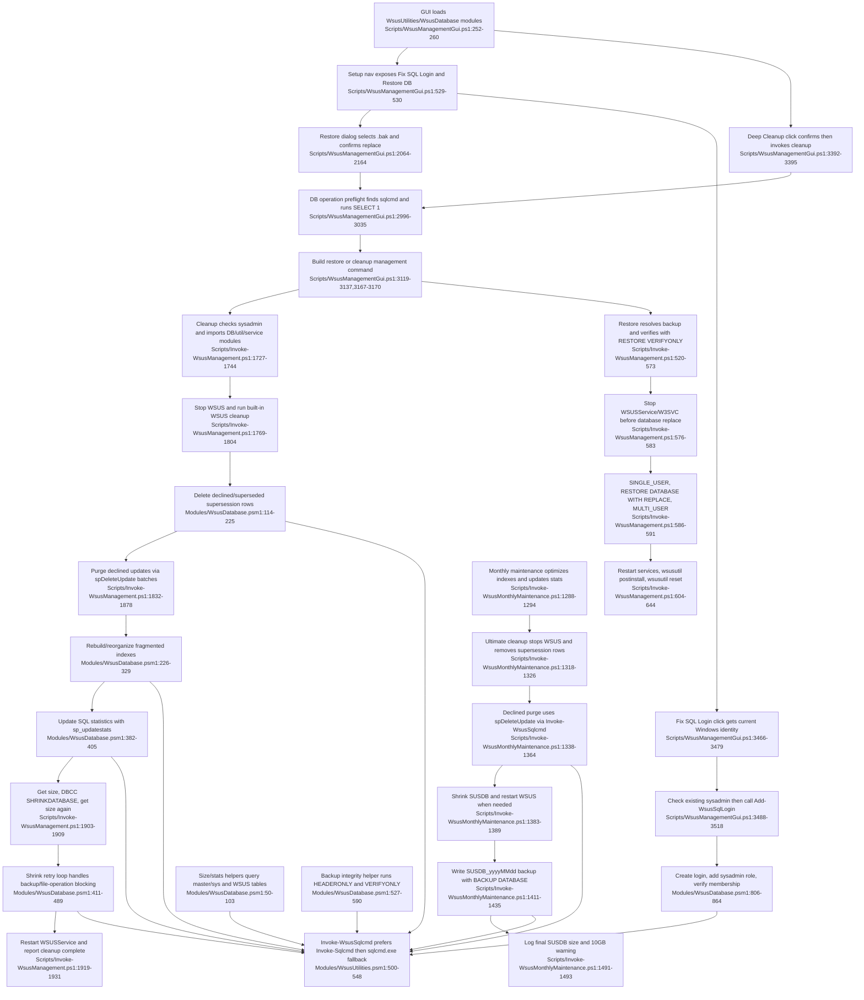

# Database maintenance utilities

## Sources consulted
- `memory://root/memory_summary.md`; `skill://smart-explore`.
- `Scripts/WsusManagementGui.ps1:245-260`, `315-330`, `520-540`, `2049-2173`, `2960-3065`, `3070-3180`, `3208-3240`, `3298-3310`, `3380-3410`, `3464-3535`.
- `Scripts/Invoke-WsusManagement.ps1:474-623`, `620-650`, `1723-1768`, `1754-1918`, `1914-1938`, `2038-2048`.
- `Scripts/Invoke-WsusMonthlyMaintenance.ps1:399-441`, `1278-1390`, `1406-1478`, `1487-1499`.
- `Modules/WsusDatabase.psm1:29-51`, `49-115`, `120-230`, `260-405`, `411-650`, `689-788`, `785-890`.
- `Modules/WsusUtilities.psm1:375-410`, `407-561`.

## Concrete findings
- GUI startup loads `WsusUtilities` and `WsusDatabase`, then re-loads utility exports after module imports (`Scripts/WsusManagementGui.ps1:245-260`). Database-affecting GUI operations perform a `sqlcmd.exe` discovery and `SELECT 1` Windows-auth connectivity preflight before dispatch (`Scripts/WsusManagementGui.ps1:315-330`, `2960-3035`).
- Deep Cleanup GUI path confirms the destructive maintenance, then dispatches `cleanup` to `Invoke-WsusManagement.ps1` (`Scripts/WsusManagementGui.ps1:3392-3395`, `3070-3180`). CLI cleanup checks SQL sysadmin, imports DB/util/service modules, stops `WSUSService`, runs WSUS cleanup, removes supersession records, purges declined updates with `spDeleteUpdate`, optimizes indexes, updates stats, shrinks SUSDB, and restarts `WSUSService` (`Scripts/Invoke-WsusManagement.ps1:1723-1938`).
- Database utility SQL is centralized in `Modules/WsusDatabase.psm1`, which imports `Invoke-WsusSqlcmd` from `WsusUtilities` if needed (`Modules/WsusDatabase.psm1:29-48`). `Invoke-WsusSqlcmd` tries `Invoke-Sqlcmd` via SQLPS/SqlServer first, then falls back to `sqlcmd.exe`; it refuses sqlcmd fallback when SQL credentials are supplied (`Modules/WsusUtilities.psm1:407-561`).
- Size/stats helpers query SUSDB metadata: `Get-WsusDatabaseSize` reads `sys.master_files`; `Get-WsusDatabaseStats` counts supersession/revision/file queue tables plus size (`Modules/WsusDatabase.psm1:49-115`). Scoped callers found use `Get-WsusDatabaseSize` during cleanup shrink before/after and monthly backup/final reporting (`Scripts/Invoke-WsusManagement.ps1:1903-1909`; `Scripts/Invoke-WsusMonthlyMaintenance.ps1:1423-1426`, `1487-1496`). No scoped caller of `Get-WsusDatabaseStats` was found.
- Monthly maintenance has two DB paths: regular DB maintenance calls `Optimize-WsusIndexes` then `Update-WsusStatistics`; ultimate cleanup stops WSUS, removes supersession rows, purges declined updates through `spDeleteUpdate`, shrinks SUSDB, then restarts WSUS (`Scripts/Invoke-WsusMonthlyMaintenance.ps1:1278-1390`). Backup writes a unique `SUSDB_yyyyMMdd[_n].bak` under `$script:ContentPath` with `BACKUP DATABASE SUSDB ... WITH INIT, STATS=10` (`Scripts/Invoke-WsusMonthlyMaintenance.ps1:1406-1478`).
- Backup verification exists in two places. The module helper `Test-WsusBackupIntegrity` validates `.bak` path/file, reads `RESTORE HEADERONLY`, then runs `RESTORE VERIFYONLY ... WITH CHECKSUM` (`Modules/WsusDatabase.psm1:527-650`). The restore happy path uses its own `Invoke-CheckedSqlcmd` wrapper and performs `RESTORE VERIFYONLY ... WITH CHECKSUM` before stopping services (`Scripts/Invoke-WsusManagement.ps1:474-623`).
- Restore GUI path selects a `.bak`, validates/safe-resolves it, then dispatches the management restore command (`Scripts/WsusManagementGui.ps1:2049-2173`, `3070-3180`). CLI restore checks sysadmin, verifies backup, stops `WSUSService` and `W3SVC`, sets SUSDB single-user, restores with replace, returns multi-user, restarts services, runs `wsusutil postinstall`, then `wsusutil reset` to flag content re-verification (`Scripts/Invoke-WsusManagement.ps1:474-650`, `2038-2048`).
- Fix SQL Login GUI path uses the current Windows identity, confirms `sqlcmd.exe` exists, checks whether the login is already sysadmin, then calls `Add-WsusSqlLogin` (`Scripts/WsusManagementGui.ps1:3464-3535`). The module creates the Windows login if missing, adds it to `sysadmin`, and verifies role membership; test helpers check login existence/sysadmin membership (`Modules/WsusDatabase.psm1:806-864`).

## Mermaid flowchart

## External dependencies
- SQL Server/SQLEXPRESS hosting `SUSDB`; queried and mutated through `Invoke-Sqlcmd` or `sqlcmd.exe` (`Modules/WsusUtilities.psm1:407-561`; `Modules/WsusDatabase.psm1:49-115`, `411-489`, `806-864`).
- SQL Server command-line tools: GUI and CLI require `sqlcmd.exe` for preflight/restore and fallback SQL execution (`Scripts/WsusManagementGui.ps1:315-330`, `2960-3035`; `Scripts/Invoke-WsusManagement.ps1:474-497`).
- PowerShell SQL modules `SQLPS`/`SqlServer` for preferred `Invoke-Sqlcmd` execution and credential-safe SQL auth (`Modules/WsusUtilities.psm1:500-527`).
- Windows services `WSUSService` and `W3SVC` are stopped/restarted during cleanup/restore (`Scripts/Invoke-WsusManagement.ps1:1769-1773`, `576-583`, `604-644`, `1919-1929`).
- WSUS PowerShell/API surface: `UpdateServices`, `Invoke-WsusServerCleanup`, `Get-WsusServer`, and update enumeration/deletion inputs (`Scripts/Invoke-WsusManagement.ps1:1797-1804`, `1832-1878`; `Scripts/Invoke-WsusMonthlyMaintenance.ps1:1318-1364`).
- `wsusutil.exe` for restore postinstall and content reset (`Scripts/Invoke-WsusManagement.ps1:620-644`).
- File system under `$ContentPath` for `.bak` backup read/write and backup retention cleanup (`Scripts/Invoke-WsusMonthlyMaintenance.ps1:1411-1435`, `1478-1496`; `Scripts/WsusManagementGui.ps1:2064-2164`).

## Confidence and gaps
- Confidence: high for the scoped files and main happy paths; all claims above are grounded in the cited reads.
- Gap: `New-WsusManagementOperationPlan` and `Resolve-WsusRestoreBackup` implementations are outside the assigned file set, so this report treats them as external helpers and only cites their in-scope GUI callsites.
- Gap: `Get-WsusDatabaseStats` is implemented/exported, but no caller was found within the scoped files; the active scoped size happy path uses `Get-WsusDatabaseSize`.
