# Diagnostics, health checks & repair actions

Sources consulted
- Scripts/WsusManagementGui.ps1:245-259, 535-545, 641-645, 894-915, 2994-3228, 3228-3311, 3394-3398, 3538-3541.
- Scripts/Invoke-WsusManagement.ps1:74-103, 1561-1721, 2017-2075.
- Modules/WsusHealth.psm1:27-41, 112-125, 322-370, 390-617, 628-878.
- Modules/WsusDiagnosticResult.psm1:60-140, 144-183.
- Modules/WsusRepairPlan.psm1:9-138.
- Modules/WsusRepairHarness.psm1:1-22.
- Modules/WsusHostEnvironment.psm1:11-248.
- Modules/WsusPermissions.psm1:20-90, 92-154, 181-223.
- Modules/WsusFirewall.psm1:21-51, 67-133, 142-160, 198-220, 231-263, 265-310, 318-354.
- Modules/WsusServices.psm1:53-63, 110-128.

Concrete findings
- GUI diagnostics starts from the nav/quick buttons and Ctrl+D: BtnDiagnostics is defined at Scripts/WsusManagementGui.ps1:540, QBtnDiagnostics at Scripts/WsusManagementGui.ps1:644, Ctrl+D raises BtnDiagnostics at Scripts/WsusManagementGui.ps1:897-899, and both click handlers call Invoke-LogOperation "diagnostics" at Scripts/WsusManagementGui.ps1:3397 and Scripts/WsusManagementGui.ps1:3540.
- Invoke-LogOperation treats diagnostics as a DB operation, performs a sqlcmd SELECT 1 preflight, finds Invoke-WsusManagement.ps1, builds a diagnostics operation plan, sets WSUS_REPORT_PATH to a temp JSON file, then starts the operation runner with that environment and completion callback at Scripts/WsusManagementGui.ps1:2996-3176 and Scripts/WsusManagementGui.ps1:3229-3260.
- CLI diagnostics can also enter directly through -Diagnostics or -DeepDiagnostics at Scripts/Invoke-WsusManagement.ps1:92-96; main dispatch sends either switch to Invoke-WsusDiagnosticsOperation at Scripts/Invoke-WsusManagement.ps1:2070-2071. The interactive menu option 7 also calls the same operation at Scripts/Invoke-WsusManagement.ps1:2028-2029.
- Invoke-WsusDiagnosticsOperation imports the support modules, then runs standard diagnostics followed by deep diagnostics, both with -AutoFix: Scripts/Invoke-WsusManagement.ps1:1645-1662. It merges the two DiagnosticReport objects when merge helpers are available, optionally converts to the legacy hashtable shape, writes JSON to WSUS_REPORT_PATH, and prints healthy/fixed/manual-intervention summary at Scripts/Invoke-WsusManagement.ps1:1664-1715.
- Standard diagnostics checks service state for SQL, SQL Browser, WSUSService, and W3SVC, SQL/WSUS firewall rules, IIS /Content path, WsusPool state, SUSDB existence, NETWORK SERVICE SQL login, WSUS content permissions, and SSL status at Modules/WsusHealth.psm1:413-603. Note: standard SQL protocol checks are gated behind -IncludeSqlProtocols at Modules/WsusHealth.psm1:430-449, and the comprehensive operation does not pass that switch; SQL networking is covered by the deep path instead.
- Deep diagnostics checks current security context, content path and WsusContent presence, content ACLs, WSUS registry ContentDir/SQL server, SQL TCP/Named Pipes registry state, IIS /Content, WsusPool state/capacity/recycle settings, BITS service/policy, SUSDB download queue/content file state, wsusutil checkhealth, WSUS API download/sync progress, and recent WSUS/IIS/SQL event logs at Modules/WsusHealth.psm1:663-840.
- Repair-plan mapping is issue-driven: New-WsusHealthDiagnosticIssue normalizes issues into New-WsusDiagnosticIssue with RepairAction at Modules/WsusHealth.psm1:112-125; New-WsusDiagnosticIssue marks Repairable when RepairAction is non-empty at Modules/WsusDiagnosticResult.psm1:60-80; New-WsusDiagnosticReport projects all repairable issues into RepairPlan entries at Modules/WsusDiagnosticResult.psm1:103-140.
- Repair execution happens before final report return, not as a separate queued plan: standard and deep auto-fix loops call Invoke-WsusRepairAction for each Repairable issue at Modules/WsusHealth.psm1:554-568 and Modules/WsusHealth.psm1:841-853. The current WsusRepairHarness.psm1 is not the runtime harness; its header states runtime harness logic was inlined into WsusHealth and only New-WsusRepairIssueFixture remains at Modules/WsusRepairHarness.psm1:1-22.
- Invoke-WsusRepairAction maps repair action names to concrete side effects at Modules/WsusRepairPlan.psm1:18-135: SQL registry edits plus SQL service restart, content ACL repair, IIS content path repair, BITS/SQL/SQLBrowser/WSUS/W3SVC starts, wsusutil reset, WsusPool start/tuning, firewall repair, and NETWORK SERVICE login/dbcreator grants.

Mermaid flowchart

```mermaid
flowchart TD
  A["GUI diagnostics buttons / Ctrl+D<br/>Scripts/WsusManagementGui.ps1:540,644,897-899"] --> B["Click handlers call Invoke-LogOperation('diagnostics')<br/>Scripts/WsusManagementGui.ps1:3397,3540"]
  B --> C["SQL preflight and management script lookup<br/>Scripts/WsusManagementGui.ps1:2996-3043"]
  C --> D["Create diagnostics operation and WSUS_REPORT_PATH<br/>Scripts/WsusManagementGui.ps1:3172-3176"]
  D --> E["Start-WsusOperation with environment and completion callback<br/>Scripts/WsusManagementGui.ps1:3229-3260"]
  F["CLI -Diagnostics / -DeepDiagnostics switches<br/>Scripts/Invoke-WsusManagement.ps1:92-96"] --> G["CLI dispatch invokes diagnostics operation<br/>Scripts/Invoke-WsusManagement.ps1:2070-2071"]
  E --> H["Invoke-WsusDiagnosticsOperation imports modules<br/>Scripts/Invoke-WsusManagement.ps1:1645-1656"]
  G --> H
  H --> I["Run standard diagnostics with -AutoFix<br/>Scripts/Invoke-WsusManagement.ps1:1661<br/>Modules/WsusHealth.psm1:391"]
  I --> J["Standard checks: services, firewall, IIS, SUSDB, login, ACL, SSL<br/>Modules/WsusHealth.psm1:413-603"]
  J --> K{"Repairable standard issues?<br/>Modules/WsusHealth.psm1:554-558"}
  K -- "yes" --> L["Invoke repair action for each issue<br/>Modules/WsusHealth.psm1:562-568<br/>Modules/WsusRepairPlan.psm1:18"]
  K -- "no" --> M["Create standard DiagnosticReport / RepairPlan<br/>Modules/WsusHealth.psm1:602-614<br/>Modules/WsusDiagnosticResult.psm1:103-140"]
  L --> M
  M --> N["Run deep diagnostics with -AutoFix<br/>Scripts/Invoke-WsusManagement.ps1:1662<br/>Modules/WsusHealth.psm1:629"]
  N --> O["Deep checks: security, content, registry, SQL, IIS, BITS, SUSDB, wsusutil, API, events<br/>Modules/WsusHealth.psm1:663-840"]
  O --> P{"Repairable deep issues?<br/>Modules/WsusHealth.psm1:841-847"}
  P -- "yes" --> Q["Invoke same repair action dispatcher<br/>Modules/WsusHealth.psm1:850-853<br/>Modules/WsusRepairPlan.psm1:18"]
  P -- "no" --> R["Create deep DiagnosticReport / RepairPlan<br/>Modules/WsusHealth.psm1:858-875<br/>Modules/WsusDiagnosticResult.psm1:120-137"]
  Q --> R
  R --> S["Merge standard + deep reports, legacy shape if available<br/>Scripts/Invoke-WsusManagement.ps1:1664-1687<br/>Modules/WsusDiagnosticResult.psm1:145-180"]
  S --> T["Write JSON report when WSUS_REPORT_PATH is set<br/>Scripts/Invoke-WsusManagement.ps1:1693-1703"]
  T --> U["Print healthy / fixed / manual intervention result<br/>Scripts/Invoke-WsusManagement.ps1:1708-1715"]
  U --> V["GUI completion logs report path, notifications, history<br/>Scripts/WsusManagementGui.ps1:3229-3243"]
  V --> W["External dependency boundary reached<br/>Modules/WsusHostEnvironment.psm1:33,84,146,201,234"]
```

External dependencies
- PowerShell/module/runtime: Import-Module for WsusUtilities, WsusPermissions, WsusFirewall, WsusServices, WsusHostEnvironment, WsusRepairPlan, WsusHealth, WebAdministration, and optional diagnostic-result helpers (Scripts/Invoke-WsusManagement.ps1:1645-1656; Modules/WsusHealth.psm1:27-41).
- GUI runner/helper boundary: Find-WsusScript, New-WsusManagementOperationPlan, Start-WsusOperation, New-WsusGuiOperationCompletion, Invoke-WsusGuiOperationCompletion, notification/history/secret-cleanup helpers are called from Scripts/WsusManagementGui.ps1:3042-3176 and Scripts/WsusManagementGui.ps1:3229-3260.
- SQL tooling: GUI sqlcmd.exe preflight runs SELECT 1 (Scripts/WsusManagementGui.ps1:3004-3037); host SQL reads/writes use Invoke-WsusSqlcmd or Invoke-Sqlcmd (Modules/WsusHostEnvironment.psm1:84-99); repair grants NETWORK SERVICE login/dbcreator via SQL queries (Modules/WsusRepairPlan.psm1:129-133).
- Windows services: Get-Service reads service state (Modules/WsusHostEnvironment.psm1:33-50); Start-Service/Restart-Service are used by host service helpers and repair actions (Modules/WsusHostEnvironment.psm1:184-198; Modules/WsusRepairPlan.psm1:79-118).
- IIS/WebAdministration: reads and mutates IIS:\Sites\WSUS Administration\Content and IIS:\AppPools\WsusPool, including Get-WebAppPoolState, Start-WebAppPool, and Set-ItemProperty (Modules/WsusHostEnvironment.psm1:146-181, 218-230; Modules/WsusRepairPlan.psm1:91-104).
- Registry: WSUS setup registry is read for ContentDir/SQL values (Modules/WsusHealth.psm1:704-721); SQL networking registry is read in Modules/WsusHostEnvironment.psm1:102-144 and modified for TCP/Named Pipes in Modules/WsusRepairPlan.psm1:52-68; BITS policy registry is read at Modules/WsusHealth.psm1:779-783.
- File system and ACLs: Test-Path/Resolve-Path/Get-Acl inspect content paths and ACLs (Modules/WsusHostEnvironment.psm1:70-81; Modules/WsusPermissions.psm1:92-154); icacls applies content ACL repairs (Modules/WsusPermissions.psm1:21-87).
- Firewall: Get-NetFirewallRule checks WSUS/SQL firewall rules; New-NetFirewallRule and Remove-NetFirewallRule recreate missing rules during repair (Modules/WsusFirewall.psm1:142-160, 67-133, 198-220, 231-263, 265-354).
- WSUS tools/API/events: wsusutil.exe checkhealth/reset (Modules/WsusHealth.psm1:805-811; Modules/WsusRepairPlan.psm1:83-90), Microsoft.UpdateServices.Administration.AdminProxy for live download/sync state (Modules/WsusHealth.psm1:813-835), and Get-WinEvent for recent WSUS/IIS/SQL warnings/errors (Modules/WsusHealth.psm1:837-840; Modules/WsusHostEnvironment.psm1:201-215).
- Report output: temp directory creation and Set-Content JSON report write when WSUS_REPORT_PATH exists (Scripts/Invoke-WsusManagement.ps1:1693-1703); GUI completion consumes the report path (Scripts/WsusManagementGui.ps1:3229-3243).

Confidence and gaps
- Confidence: High for static control flow inside the assigned files; all claims above are grounded in the cited line ranges.
- Gap: Read-only static trace only; no build, lint, test, or live WSUS execution was run by instruction.
- Gap: The GUI command string expansion and operation runner implementations are outside the assigned feature files; this report treats them as external dependencies and follows the assigned files up to the helper boundary.
- Gap: Runtime behavior can vary with optional modules/cmdlets availability, especially WebAdministration, Invoke-WsusSqlcmd/Invoke-Sqlcmd, WSUS Administration API, NetSecurity cmdlets, and installed WSUS tools.
