# GUI shell & operation orchestration

## Sources consulted
- `memory://root/memory_summary.md`
- `skill://smart-explore`
- `Scripts/WsusManagementGui.ps1:15-270`, `300-310`, `525-541`, `868-880`, `920-945`, `1058-1072`, `1392-1430`, `1480-1530`, `1564-1636`, `1637-1665`, `2996-3270`, `3266-3560`, `3748-3840`, `3800-3842`
- `Modules/WsusOperationPlan.psm1:1-183`
- `Modules/WsusOperationRunner.psm1:1-80`, `80-125`, `129-214`, `216-248`, `250-560`, `440-625`
- `Modules/WsusGuiShell.psm1:1-70`, `80-125`, `140-205`, `260-305`
- `Modules/WsusOperationCompletion.psm1:1-90`
- `Modules/WsusStartupProbe.psm1:1-80`
- `Modules/WsusDialogs.psm1:1-80`, `200-245`
- `Modules/AsyncHelpers.psm1:1-80`, `124-200`, `218-254`, `341-395`

## Concrete findings
- GUI launch is a single PowerShell/WPF script entrypoint. It accepts E2E startup-probe parameters, initializes WPF assemblies and script state, configures daily file logging under `C:\WSUS\Logs`, loads settings from `%APPDATA%\WsusManager\settings.json`, imports feature modules, writes lifecycle log entries, loads XAML, maps named controls, registers event handlers, then blocks on `ShowDialog()` (`Scripts/WsusManagementGui.ps1:15-270`, `300-310`, `868-880`, `3748-3840`).
- Navigation controls are declared in the XAML sidebar. Direct operation buttons include Online Sync, Schedule Task, Deep Cleanup, Diagnostics, Reset, Restore, Transfer; Install has a navigation panel plus a separate Run Install button (`Scripts/WsusManagementGui.ps1:525-541`, `3266-3560`).
- `Show-Panel` is the shell navigation switch: it updates `PageTitle`, toggles panel visibility, sets the active nav button, and refreshes the dashboard only for Dashboard navigation (`Scripts/WsusManagementGui.ps1:1637-1665`).
- Operation handlers converge on `Invoke-LogOperation`. Direct buttons call it immediately; guarded operations show confirmation first; Install navigates to the install panel and `BtnRunInstall` calls it after password/path validation (`Scripts/WsusManagementGui.ps1:3266-3560`).
- `Invoke-LogOperation` enforces one operation at a time, runs SQL preflight for restore/cleanup/diagnostics/maintenance via `sqlcmd -Q "SELECT 1"`, blocks Online Sync/Schedule in Air-Gap mode, logs `Run-LogOp`, resolves required scripts/modules, then switches on operation ID to build an operation plan (`Scripts/WsusManagementGui.ps1:2996-3193`).
- Operation plans are plain objects with `Id`, `Title`, `Command`, `Mode`, `TimeoutMinutes`, `Environment`, and `Metadata`. Plan builders translate GUI selections into child PowerShell command strings. Install and Schedule convert SecureString values to plaintext only long enough to place them into environment variables (`WSUS_INSTALL_SA_PASSWORD`, `WSUS_TASK_PASSWORD`) for the child process (`Modules/WsusOperationPlan.psm1:19-52`, `54-181`).
- Mode selection prefers Live Terminal mode when enabled unless `ForceEmbeddedMode` is set; otherwise it uses the plan’s mode or Embedded. Transfer forces Embedded; the default script state has Live Terminal mode enabled (`Scripts/WsusManagementGui.ps1:96-103`, `3188-3199`).
- Before process launch, GUI output is prepared: Terminal mode writes an explanatory message into the log textbox; Embedded mode clears the textbox and appends a “Starting ...” line via `Write-WsusGuiLogOutput` (`Scripts/WsusManagementGui.ps1:3188-3199`; `Modules/WsusGuiShell.psm1:89-125`).
- `Start-WsusOperation` owns child process lifecycle. It sets the UI to Running, flips `OperationRunning`, builds `System.Diagnostics.ProcessStartInfo` for `powershell.exe`, applies plan environment variables, starts the process, registers an Exited event, then wires Terminal or Embedded mode-specific plumbing (`Modules/WsusOperationRunner.psm1:250-440`).
- Embedded mode redirects stdout/stderr/stdin, wraps the command so PowerShell streams flow to stdout, registers `OutputDataReceived` and `ErrorDataReceived`, deduplicates recent lines, formats each line, and dispatches appends to the GUI log textbox. It also starts a stdin flush timer (`Modules/WsusOperationRunner.psm1:366-484`).
- Terminal mode uses ShellExecute and opens a visible console window; it registers a best-effort keystroke timer intended to flush output, but does not capture stdout/stderr into the GUI log panel (`Modules/WsusOperationRunner.psm1:366-436`).
- Completion is driven by the Exited event or timeout watchdog. Exit code `0` is success. `Complete-WsusOperation` guards against duplicate completion, stops runner timers, unregisters event jobs, updates UI state to Completed/Failed, clears `OperationRunning`, nulls the current process, then invokes the GUI-supplied `OnComplete` callback (`Modules/WsusOperationRunner.psm1:129-214`, `406-440`, `486-560`).
- `Set-WsusGuiOperationUiState` is the main UI reset: status text changes, cancel button collapses after completion, operation buttons/inputs are re-enabled, and `UpdateButtonState` is called after leaving Running (`Modules/WsusGuiShell.psm1:140-205`).
- The GUI completion callback builds a `Wsus.GuiOperationCompletion`, then hands off to `Invoke-WsusGuiOperationCompletion` for optional report logging, toast notification, history write, and environment cleanup (`Scripts/WsusManagementGui.ps1:3224-3239`; `Modules/WsusOperationCompletion.psm1:10-67`).
- History handoff writes through `Write-WsusOperationHistory` when available. The History view later reads `Get-WsusOperationHistory -Count 50` and falls back to parsing log files if the module has no entries (`Scripts/WsusManagementGui.ps1:1392-1430`, `3234-3239`).
- Notification handoff calls `Show-WsusNotification` only when the notification module is present and notifications are enabled (`Scripts/WsusManagementGui.ps1:921-923`, `3231-3239`).
- Secret cleanup is requested with every environment key in the operation plan. `Invoke-WsusGuiOperationCompletion` invokes the supplied cleanup action when cleanup keys exist. In scoped files, `Clear-WsusSecretEnvironment` is called but not defined, making it an external/support-module dependency for reliable cleanup (`Scripts/WsusManagementGui.ps1:3224-3239`, `3261-3268`; `Modules/WsusOperationCompletion.psm1:64-66`).
- Cancel/shutdown cleanup kills child process trees where possible, stops timers, unregisters event jobs, disposes the process object, clears recent-line dedupe cache, and resets `OperationRunning` (`Scripts/WsusManagementGui.ps1:1564-1636`, `3524-3531`, `3748-3840`; `Modules/WsusOperationRunner.psm1:216-248`).
- Startup probe support is outside the normal happy path unless enabled by launch parameters; it records popup counts and writes a JSON result file (`Scripts/WsusManagementGui.ps1:15-19`, `174-204`, `3800-3842`; `Modules/WsusStartupProbe.psm1:10-55`).
- `AsyncHelpers.psm1` is imported infrastructure but not part of the main operation runner path; the happy path uses child `powershell.exe` plus .NET process events rather than runspace-pool `Invoke-Async` (`AsyncHelpers.psm1:33-80`, `124-200`, `341-395`; `Modules/WsusOperationRunner.psm1:250-560`).

## Mermaid flowchart

```mermaid
flowchart TD
  A["Launch WsusManagementGui parameters and script state\nScripts/WsusManagementGui.ps1:15"] --> B["Load settings, modules, lifecycle log\nScripts/WsusManagementGui.ps1:212"]
  B --> C["Load XAML and map named controls\nScripts/WsusManagementGui.ps1:872"]
  C --> D["Sidebar operation buttons exist\nScripts/WsusManagementGui.ps1:525"]
  D --> E["Register nav and operation click handlers\nScripts/WsusManagementGui.ps1:3278"]
  E --> F["Show WPF window modal loop\nScripts/WsusManagementGui.ps1:3818"]
  F --> G["User clicks nav/operation button\nScripts/WsusManagementGui.ps1:3368"]
  G --> H["Optional panel navigation via Show-Panel\nScripts/WsusManagementGui.ps1:1637"]
  H --> I["Invoke-LogOperation starts orchestration\nScripts/WsusManagementGui.ps1:2996"]
  I --> J{"Preflight allows operation?\nScripts/WsusManagementGui.ps1:2999"}
  J -->|No| K["Show popup and log preflight failure\nScripts/WsusManagementGui.ps1:3001"]
  J -->|Yes| L["Resolve operation scripts/modules\nScripts/WsusManagementGui.ps1:3037"]
  L --> M["Select operation plan by operation ID\nScripts/WsusManagementGui.ps1:3078"]
  M --> N["Build Wsus.OperationPlan command/timeout/env\nModules/WsusOperationPlan.psm1:30"]
  N --> O["Choose Terminal or Embedded mode and prepare log panel\nScripts/WsusManagementGui.ps1:3188"]
  O --> P["Build runner context and completion callback\nScripts/WsusManagementGui.ps1:3200"]
  P --> Q["Start-WsusOperation invoked\nModules/WsusOperationRunner.psm1:250"]
  Q --> R["Set GUI Running state and disable controls\nModules/WsusGuiShell.psm1:154"]
  R --> S["Create powershell.exe ProcessStartInfo and environment\nModules/WsusOperationRunner.psm1:351"]
  S --> T["Start child process\nModules/WsusOperationRunner.psm1:387"]
  T --> U["Register process Exited event\nModules/WsusOperationRunner.psm1:417"]
  U --> V{"Output mode\nModules/WsusOperationRunner.psm1:429"}
  V -->|Embedded| W["Register stdout/stderr handlers and BeginReadLine\nModules/WsusOperationRunner.psm1:463"]
  V -->|Terminal| X["Visible PowerShell console with keystroke timer\nModules/WsusOperationRunner.psm1:431"]
  W --> Y["Captured lines format and append to GUI log\nModules/WsusOperationRunner.psm1:450"]
  X --> Z["User watches external console output\nModules/WsusOperationRunner.psm1:370"]
  Y --> AA["Exited event calculates success from exit code\nModules/WsusOperationRunner.psm1:410"]
  Z --> AA
  AA --> AB["Complete-WsusOperation guard, timers/events cleanup\nModules/WsusOperationRunner.psm1:163"]
  AB --> AC["Set Completed/Failed UI and re-enable controls\nModules/WsusGuiShell.psm1:172"]
  AC --> AD["Invoke GUI OnComplete callback\nModules/WsusOperationRunner.psm1:211"]
  AD --> AE["Build completion record\nModules/WsusOperationCompletion.psm1:10"]
  AE --> AF["Log report, notify, write history, cleanup env keys\nModules/WsusOperationCompletion.psm1:53"]
  AF --> AG["History panel can later read operation history\nScripts/WsusManagementGui.ps1:1393"]
  U --> AH["Timeout watchdog may kill process and complete failed\nModules/WsusOperationRunner.psm1:486"]
  AH --> AB
  T --> AI["Start failure resets UI and clears secret env keys\nScripts/WsusManagementGui.ps1:3260"]
```

## External dependencies
- Windows WPF/WinForms assemblies: `PresentationFramework`, `PresentationCore`, `WindowsBase`, `System.Windows.Forms` (`Scripts/WsusManagementGui.ps1:20`; `Modules/WsusDialogs.psm1:24-27`).
- Child process executable: `powershell.exe` with `-NoProfile -ExecutionPolicy Bypass -Command` (`Modules/WsusOperationRunner.psm1:351-381`).
- Operation scripts/modules resolved at runtime: `Invoke-WsusManagement.ps1`, `Invoke-WsusMonthlyMaintenance.ps1`, `Install-WsusWithSqlExpress.ps1`, `WsusScheduledTask.psm1`, and `WsusExport.psm1` (`Scripts/WsusManagementGui.ps1:3037-3186`; `Modules/WsusOperationRunner.psm1:89-125`).
- SQL preflight dependency: `sqlcmd.exe` and a reachable SQL instance for restore/cleanup/diagnostics/maintenance (`Scripts/WsusManagementGui.ps1:3006-3031`).
- Optional support commands/modules: `Show-WsusNotification`, `Write-WsusOperationHistory`, `Get-WsusOperationHistory`, `Clear-WsusOperationHistory`, and `Clear-WsusSecretEnvironment` (`Scripts/WsusManagementGui.ps1:921-923`, `1392-1430`, `3231-3239`, `3419-3423`).
- Windows process/event/timer APIs: `System.Diagnostics.Process`, `Register-ObjectEvent`, dispatcher timers, CIM/Stop-Process for child cleanup (`Modules/WsusOperationRunner.psm1:386-560`, `216-248`).
- File-system side effects: daily operation log at `C:\WSUS\Logs\WsusOperations_yyyy-MM-dd.log`, settings file under `%APPDATA%\WsusManager\settings.json`, optional diagnostic report path in `%TEMP%`, optional E2E startup probe JSON (`Scripts/WsusManagementGui.ps1:68-75`, `231-235`, `300-308`, `3173-3174`, `3800-3842`).

## Confidence and gaps
- Confidence: high for the primary happy path and side effects listed above; all major control-flow claims are grounded in the scoped files and line ranges listed.
- Gap: `Clear-WsusSecretEnvironment` is invoked but not defined in the scoped files; cleanup depends on an external imported support module. The scoped code passes cleanup keys correctly, but this report did not inspect the out-of-scope implementation.
- Gap: operation-specific business behavior inside the invoked child scripts is intentionally excluded per non-goals; this trace stops at command construction/process execution/completion handoff.
- Gap: Terminal mode does not capture output into the GUI log; captured output findings apply to Embedded mode only.
