# Install & provisioning

Sources consulted
- `memory://root/memory_summary.md` for project/process context.
- `skill://smart-explore` for exploration mode.
- `Scripts/WsusManagementGui.ps1:240-260`, `:528`, `:686-705`, `:2996-3050`, `:3050-3205`, `:3209-3265`, `:3275-3305`, `:3448-3470`, plus search hits around `:3075-3117` and `:3463`.
- `Scripts/Install-WsusWithSqlExpress.ps1:25-47`, `:52-154`, `:168-216`, `:255-351`, `:370-465`, `:475-640`, `:644-719`, `:720-779`, `:780-880`, `:881-1090`.
- `Scripts/Set-WsusHttps.ps1:1-120`, `:124-230`, `:216-280`, `:230-354`, `:358-454`.
- `Modules/WsusProvisioning.psm1:1-160`.
- `Modules/WsusOperationPlan.psm1:1-115`.
- `Modules/WsusFirewall.psm1:21-140`, `:198-270`.
- `Modules/WsusPermissions.psm1:21-92`, `:200-250`.
- `Modules/WsusServices.psm1:21-105`, `:111-160`.
- `Modules/WsusDatabase.psm1:806-871`.

Concrete findings
- GUI loads the scoped support modules, including `WsusDatabase`, `WsusServices`, `WsusFirewall`, `WsusPermissions`, `WsusOperationPlan`, `WsusProvisioning`, and `WsusOperationRunner`, from the resolved Modules directory (`Scripts/WsusManagementGui.ps1:240-260`).
- The install UI exposes installer folder, SA password, confirmation, and run button (`Scripts/WsusManagementGui.ps1:686-705`). The sidebar setup button opens the install panel and resets password fields (`Scripts/WsusManagementGui.ps1:528`, `Scripts/WsusManagementGui.ps1:3275-3305`). The actual run button calls `Invoke-LogOperation "install" "Install WSUS"` (`Scripts/WsusManagementGui.ps1:3448-3470`).
- Main GUI happy path: `Invoke-LogOperation` rejects concurrent operations, resolves script paths, validates installer path with `Resolve-WsusInstallerPath`, validates SA password/confirmation, then calls `New-WsusInstallOperationPlan` and hands the resulting command/environment to `Start-WsusOperation` (`Scripts/WsusManagementGui.ps1:2996-3050`, `Scripts/WsusManagementGui.ps1:3050-3205`, `Scripts/WsusManagementGui.ps1:3209-3265`). Actual process execution implementation is in `WsusOperationRunner`, which is imported but outside this assignment’s file scope.
- `New-WsusInstallOperationPlan` creates the command `& <Install-WsusWithSqlExpress.ps1> -InstallerPath <path> -SaUsername <user> -SaPasswordEnvVar WSUS_INSTALL_SA_PASSWORD -NonInteractive`, sets a 180-minute timeout, and passes the decrypted password only through the environment variable map (`Modules/WsusOperationPlan.psm1:86-103`).
- Direct CLI entry is the install script parameter block. It supports installer path, SA username/password/env var, non-interactive mode, optional HTTPS/certificate thumbprint, and optional upstream/replica WSUS configuration (`Scripts/Install-WsusWithSqlExpress.ps1:25-47`).
- SQL media resolution first imports `WsusProvisioning`, uses candidate names `SQL2025-SSEI-Expr.exe`, `SQLEXPRADV_x64_ENU.exe`, `SQLEXPR_x64_ENU.exe`, and resolves/fails installer path before deriving `SQLExpressMedia`, `SSMS-Setup-ENU.exe`, config, log, and password file paths (`Scripts/Install-WsusWithSqlExpress.ps1:52-154`; `Modules/WsusProvisioning.psm1:1-65`).
- SQL installer side effects: creates `C:\WSUS\Logs`, starts transcript, stores/retrieves encrypted SA password, extracts/downloads SQL media to `SQLExpressMedia`, writes `ConfigurationFile.ini`, starts SQL setup with `/CONFIGURATIONFILE`, then scrubs `SAPWD` from the config file (`Scripts/Install-WsusWithSqlExpress.ps1:168-216`, `Scripts/Install-WsusWithSqlExpress.ps1:255-351`, `Scripts/Install-WsusWithSqlExpress.ps1:370-465`).
- Post-SQL setup side effects: optional SSMS installer execution, `secedit` user-rights update for Instant File Initialization, SQL registry writes enabling TCP/IP + Named Pipes and static TCP 1433, `MSSQL$SQLEXPRESS` restart, and SQL Browser startup (`Scripts/Install-WsusWithSqlExpress.ps1:475-559`).
- WSUS setup side effects: if WID role is installed, stops WSUS/IIS, uninstalls `UpdateServices`, removes WID SUSDB files, and restarts IIS; happy path installs `UpdateServices-Services`, `UpdateServices-DB`, and `UpdateServices-UI`; creates `C:\WSUS`, `C:\WSUS\WsusContent`, and packages directory; applies `icacls`; and grants SQL logins/roles through `sqlcmd.exe` (`Scripts/Install-WsusWithSqlExpress.ps1:567-719`).
- WSUS postinstall and downstream config: pre-sets WSUS OOBE registry keys, runs `wsusutil.exe postinstall SQL_INSTANCE_NAME=".\SQLEXPRESS" CONTENT_DIR="C:\WSUS"`, optionally invokes HTTPS, configures WSUS/SQL firewall rules, writes WSUS setup registry values, sets English-only/default classifications through `Microsoft.UpdateServices.Administration`, and if `-UpstreamServerHostname` is provided, sets downstream/replica configuration and `SyncFromMicrosoftUpdate=0` (`Scripts/Install-WsusWithSqlExpress.ps1:720-973`).
- Post-install validation/config: installer starts/verifies SQL Server, SQL Browser, IIS, WSUS service, and WsusPool; verifies/updates IIS `/Content` virtual directory physical path; reapplies WsusPool permissions; deletes `sa.encrypted`; prints final SQL/WSUS/service summary (`Scripts/Install-WsusWithSqlExpress.ps1:975-1090`).
- Optional HTTPS flow is a child PowerShell invocation from the installer (`Scripts/Install-WsusWithSqlExpress.ps1:307-342`, `Scripts/Install-WsusWithSqlExpress.ps1:764-776`). `Set-WsusHttps.ps1` validates WSUS installation, selects a thumbprint or interactive/self-signed certificate, binds IIS HTTPS on 8531, runs `wsusutil configuressl <hostname>`, and for self-signed certs adds LocalMachine Root trust and exports `C:\WSUS\WSUS-SSL-Certificate.cer` (`Scripts/Set-WsusHttps.ps1:124-280`, `Scripts/Set-WsusHttps.ps1:358-454`).
- Boundary note: `WsusFirewall`, `WsusPermissions`, and `WsusServices` define reusable equivalents for firewall rules, content permissions, and service state (`Modules/WsusFirewall.psm1:21-140`, `Modules/WsusFirewall.psm1:198-270`; `Modules/WsusPermissions.psm1:21-92`, `Modules/WsusPermissions.psm1:226-274`; `Modules/WsusServices.psm1:21-160`), but the current install script performs those side effects inline. `WsusDatabase` provides GUI Fix SQL Login helpers adjacent to provisioning (`Modules/WsusDatabase.psm1:806-871`; GUI callsite `Scripts/WsusManagementGui.ps1:3488-3510`) and is not part of the main install click path.

Mermaid flowchart

```mermaid
flowchart TD
  A["Install nav opens Install panel<br/>Scripts/WsusManagementGui.ps1:528,3276"] --> B["Installer path and SA password fields filled<br/>Scripts/WsusManagementGui.ps1:686"]
  B --> C["Password strength/confirmation enables run<br/>Scripts/WsusManagementGui.ps1:3283"]
  C --> D["Run button invokes install operation<br/>Scripts/WsusManagementGui.ps1:3463"]
  D --> E["Invoke-LogOperation checks busy state and resolves scripts<br/>Scripts/WsusManagementGui.ps1:2996"]
  E --> F{"Installer path resolves?<br/>Scripts/WsusManagementGui.ps1:3091"}
  F -->|no| F1["Show path error and stop<br/>Scripts/WsusManagementGui.ps1:3098"]
  F -->|yes| G{"SA password present and matches?<br/>Scripts/WsusManagementGui.ps1:3103"}
  G -->|no| G1["Show password error and stop<br/>Scripts/WsusManagementGui.ps1:3105"]
  G -->|yes| H["Build install plan with env secret<br/>Scripts/WsusManagementGui.ps1:3114<br/>Modules/WsusOperationPlan.psm1:86"]
  H --> I["Start-WsusOperation receives command and environment<br/>Scripts/WsusManagementGui.ps1:3254"]
  I --> J["Install script param entry: installer, SA env, HTTPS/upstream flags<br/>Scripts/Install-WsusWithSqlExpress.ps1:25"]
  J --> K["Import provisioning and resolve SQL installer candidates<br/>Scripts/Install-WsusWithSqlExpress.ps1:53<br/>Modules/WsusProvisioning.psm1:9"]
  K --> L{"Installer path valid?<br/>Scripts/Install-WsusWithSqlExpress.ps1:78"}
  L -->|no| L1["Abort install: SQL installer files not found<br/>Scripts/Install-WsusWithSqlExpress.ps1:126"]
  L -->|yes| M["Prepare paths and detect existing SQL/SSMS<br/>Scripts/Install-WsusWithSqlExpress.ps1:136"]
  M --> N["Validate/load SA password and create log transcript<br/>Scripts/Install-WsusWithSqlExpress.ps1:168"]
  N --> O{"SQL already installed?<br/>Scripts/Install-WsusWithSqlExpress.ps1:386"}
  O -->|no| P["Download/extract SQL media to SQLExpressMedia<br/>Scripts/Install-WsusWithSqlExpress.ps1:255"]
  P --> Q["Resolve setup.exe from extracted media<br/>Scripts/Install-WsusWithSqlExpress.ps1:289"]
  Q --> R["Write SQL ConfigurationFile.ini<br/>Scripts/Install-WsusWithSqlExpress.ps1:399"]
  R --> S["Start setup.exe and scrub SAPWD after exit<br/>Scripts/Install-WsusWithSqlExpress.ps1:447"]
  O -->|yes| S0["Skip extraction/config/setup<br/>Scripts/Install-WsusWithSqlExpress.ps1:386"]
  S0 --> T["Optional SSMS installer<br/>Scripts/Install-WsusWithSqlExpress.ps1:475"]
  S --> T
  T --> U["Enable IFI using secedit<br/>Scripts/Install-WsusWithSqlExpress.ps1:487"]
  U --> V["Enable SQL TCP/NP, static 1433, restart SQL/Browser<br/>Scripts/Install-WsusWithSqlExpress.ps1:511"]
  V --> W{"WID WSUS role present?<br/>Scripts/Install-WsusWithSqlExpress.ps1:570"}
  W -->|yes| W1["Stop WSUS/IIS, uninstall WSUS, remove WID SUSDB files<br/>Scripts/Install-WsusWithSqlExpress.ps1:574"]
  W -->|no| X["Install WSUS role with UpdateServices-DB<br/>Scripts/Install-WsusWithSqlExpress.ps1:606"]
  W1 --> X
  X --> Y["Create WSUS folders and apply icacls permissions<br/>Scripts/Install-WsusWithSqlExpress.ps1:621"]
  Y --> Z["Grant SQL sysadmin/dbcreator logins via sqlcmd<br/>Scripts/Install-WsusWithSqlExpress.ps1:655"]
  Z --> AA["Pre-set WSUS OOBE registry keys<br/>Scripts/Install-WsusWithSqlExpress.ps1:721"]
  AA --> AB["Run wsusutil postinstall with SQL_INSTANCE_NAME and CONTENT_DIR<br/>Scripts/Install-WsusWithSqlExpress.ps1:745"]
  AB --> AC{"EnableHttps set?<br/>Scripts/Install-WsusWithSqlExpress.ps1:764"}
  AC -->|yes| AD["Invoke child powershell Set-WsusHttps.ps1<br/>Scripts/Install-WsusWithSqlExpress.ps1:307"]
  AD --> AE["Select/create cert, bind IIS 8531, run wsusutil configuressl<br/>Scripts/Set-WsusHttps.ps1:358"]
  AC -->|no| AF["Keep HTTP 8530<br/>Scripts/Install-WsusWithSqlExpress.ps1:776"]
  AE --> AG["Configure WSUS firewall rules 8530/8531<br/>Scripts/Install-WsusWithSqlExpress.ps1:780"]
  AF --> AG
  AG --> AH["Write WSUS setup registry flags and restart WsusService<br/>Scripts/Install-WsusWithSqlExpress.ps1:834"]
  AH --> AI["Set language/classifications via WSUS Admin API<br/>Scripts/Install-WsusWithSqlExpress.ps1:882"]
  AI --> AJ{"Upstream hostname provided?<br/>Scripts/Install-WsusWithSqlExpress.ps1:916"}
  AJ -->|yes| AK["Configure downstream/replica WSUS and registry<br/>Scripts/Install-WsusWithSqlExpress.ps1:921"]
  AJ -->|no| AL["Remain upstream from Microsoft Update<br/>Scripts/Install-WsusWithSqlExpress.ps1:942"]
  AK --> AM["Configure SQL firewall 1433/1434<br/>Scripts/Install-WsusWithSqlExpress.ps1:947"]
  AL --> AM
  AM --> AN["Verify/start SQL, Browser, IIS, WSUS, WsusPool<br/>Scripts/Install-WsusWithSqlExpress.ps1:975"]
  AN --> AO["Verify IIS /Content virtual directory<br/>Scripts/Install-WsusWithSqlExpress.ps1:1028"]
  AO --> AP["Apply final WsusPool permissions and remove password file<br/>Scripts/Install-WsusWithSqlExpress.ps1:1051"]
  AP --> AQ["Print install completion summary<br/>Scripts/Install-WsusWithSqlExpress.ps1:1062"]
```

External dependencies
- Windows PowerShell 5.1/process execution: GUI operation runner calls a planned PowerShell command; install script optionally invokes a child `powershell.exe` for HTTPS (`Scripts/WsusManagementGui.ps1:3254`; `Modules/WsusOperationPlan.psm1:99-103`; `Scripts/Install-WsusWithSqlExpress.ps1:326-342`).
- SQL Express installer media: `SQL2025-SSEI-Expr.exe`, `SQLEXPRADV_x64_ENU.exe`, or `SQLEXPR_x64_ENU.exe`; optional `SSMS-Setup-ENU.exe` (`Modules/WsusProvisioning.psm1:9-13`; `Scripts/Install-WsusWithSqlExpress.ps1:136-143`, `:475-479`).
- Windows filesystem and logs: `C:\WSUS`, `C:\WSUS\Logs\install.log`, `C:\WSUS\WsusContent`, installer `SQLExpressMedia`, `ConfigurationFile.ini`, and temporary `sa.encrypted` (`Scripts/Install-WsusWithSqlExpress.ps1:136-143`, `:168-169`, `:621-622`, `:1051-1058`).
- SQL Server setup/processes/services: `setup.exe`, `MSSQL$SQLEXPRESS`, `SQLBrowser`, SQL registry under `HKLM:\SOFTWARE\Microsoft\Microsoft SQL Server`, port 1433 (`Scripts/Install-WsusWithSqlExpress.ps1:447-463`, `:511-559`).
- Windows Server roles/features and services: `Get-WindowsFeature`, `Install-WindowsFeature`, `Uninstall-WindowsFeature`, `UpdateServices-Services`, `UpdateServices-DB`, `UpdateServices-UI`, `WSUSService`, `W3SVC` (`Scripts/Install-WsusWithSqlExpress.ps1:570-610`, `:975-1012`).
- Security/permissions tools: `secedit`, `icacls`, Windows identity APIs, and `sqlcmd.exe` for SQL login/role grants (`Scripts/Install-WsusWithSqlExpress.ps1:487-503`, `:621-719`).
- WSUS tools/API: `C:\Program Files\Update Services\Tools\wsusutil.exe`, `Microsoft.UpdateServices.Administration.dll`, `AdminProxy`, subscription/configuration APIs (`Scripts/Install-WsusWithSqlExpress.ps1:745-756`, `:882-939`; `Scripts/Set-WsusHttps.ps1:226-239`).
- Windows Firewall cmdlets: `Get-NetFirewallRule`, `Remove-NetFirewallRule`, `New-NetFirewallRule` for WSUS 8530/8531 and SQL 1433/1434 (`Scripts/Install-WsusWithSqlExpress.ps1:780-831`, `:947-973`; standard module boundary in `Modules/WsusFirewall.psm1:21-140`).
- IIS/WebAdministration: `Import-Module WebAdministration`, website/binding/app-pool/virtual-directory cmdlets, WSUS Administration site, WsusPool (`Scripts/Install-WsusWithSqlExpress.ps1:1014-1047`; `Scripts/Set-WsusHttps.ps1:180-215`).
- Certificate store/cert APIs: `Cert:\LocalMachine\My`, `Cert:\LocalMachine\Root`, `New-SelfSignedCertificate`, `X509Store`, export to `C:\WSUS\WSUS-SSL-Certificate.cer` (`Scripts/Set-WsusHttps.ps1:62-91`, `:124-170`, `:245-283`).

Confidence and gaps
- Confidence: high for the scoped happy path and side effects; all claims above are tied to read source ranges.
- Gap: `Start-WsusOperation` execution internals live in `WsusOperationRunner`, which the GUI imports but was outside the assigned file scope, so the flowchart stops at the scoped GUI handoff instead of detailing process-spawn internals.
- Gap: no build/test/lint/runtime validation was run because the assignment is explicitly read-only and requested current-state tracing only.
