# Online sync, product policy, maintenance, backup & export

## Sources consulted
- `Scripts/WsusManagementGui.ps1:103-146`, `Scripts/WsusManagementGui.ps1:207-236`, `Scripts/WsusManagementGui.ps1:529-539`, `Scripts/WsusManagementGui.ps1:2178-2488`, `Scripts/WsusManagementGui.ps1:2994-3341`, `Scripts/WsusManagementGui.ps1:3359-3448`
- `Scripts/Invoke-WsusMonthlyMaintenance.ps1:75-177`, `Scripts/Invoke-WsusMonthlyMaintenance.ps1:218-248`, `Scripts/Invoke-WsusMonthlyMaintenance.ps1:503-727`, `Scripts/Invoke-WsusMonthlyMaintenance.ps1:723-905`, `Scripts/Invoke-WsusMonthlyMaintenance.ps1:901-1190`, `Scripts/Invoke-WsusMonthlyMaintenance.ps1:1186-1307`, `Scripts/Invoke-WsusMonthlyMaintenance.ps1:1303-1507`, `Scripts/Invoke-WsusMonthlyMaintenance.ps1:1504-1640`
- `Modules/WsusOperationPlan.psm1:105-133`
- `Modules/WsusServices.psm1:20-71`
- `Modules/WsusConfig.psm1:20-75`, `Modules/WsusConfig.psm1:657-690`
- `Modules/WsusDatabase.psm1:49-77`, `Modules/WsusDatabase.psm1:114-215`, `Modules/WsusDatabase.psm1:226-315`, `Modules/WsusDatabase.psm1:382-470`
- `Modules/WsusExport.psm1:25-150`, `Modules/WsusExport.psm1:377-550`

## Concrete findings
- GUI entry: the Online Sync nav button is `BtnMaintenance`; its click handler calls `Invoke-LogOperation "maintenance" "Online Sync"` (`Scripts/WsusManagementGui.ps1:529-539`, `Scripts/WsusManagementGui.ps1:3389-3390`).
- GUI preflight: `Invoke-LogOperation` blocks if another operation is running, verifies SQL with `sqlcmd -S <instance> -E -C -Q "SELECT 1"`, and blocks maintenance/schedule when server mode is Air-Gap (`Scripts/WsusManagementGui.ps1:2995-3038`).
- Sync profile/product resolution starts in `Show-MaintenanceDialog`: Full = `Sync > Cleanup > Ultimate Cleanup > Backup > Export`, Quick = `Sync > Cleanup > Backup`, SyncOnly = sync/approve only; product choices are pulled from WSUS subscription categories when available, otherwise from saved/default products; selected products are saved back to settings (`Scripts/WsusManagementGui.ps1:2179-2450`).
- Operation plan handoff: GUI builds `New-WsusMaintenanceOperationPlan`, which emits `& <script> -Unattended -MaintenanceProfile '<Profile>' -NoTranscript -UseWindowsAuth`, appends either `-ExportPath <path>` or `-SkipExport`, and appends `-SelectedProducts ...` when products are selected (`Scripts/WsusManagementGui.ps1:3152-3158`, `Modules/WsusOperationPlan.psm1:106-126`).
- Runtime script setup: the maintenance script imports `WsusConfig`, `WsusDatabase`, `WsusServices`, and `WsusExport`, then pulls runtime `SqlInstance`, `ContentPath`, `WsusContentPath`, `WsusPort`, and `LogPath` from `Get-WsusRuntimeConfig` (`Scripts/Invoke-WsusMonthlyMaintenance.ps1:112-174`, `Modules/WsusConfig.psm1:657-690`).
- CLI/profile resolution: Full keeps all operations; Quick sets `SkipUltimateCleanup`; SyncOnly changes operations to `Sync` and `SkipExport`; `Show-OperationSummary` renders the effective sequence (`Scripts/Invoke-WsusMonthlyMaintenance.ps1:504-564`, `Scripts/Invoke-WsusMonthlyMaintenance.ps1:632-663`).
- WSUS connect: maintenance starts `MSSQL$SQLEXPRESS` and `WSUSService`, loads `Microsoft.UpdateServices.Administration.dll`, calls `AdminProxy::GetUpdateServer("localhost", false, $WsusPort)`, and retrieves `$wsus.GetSubscription()` (`Scripts/Invoke-WsusMonthlyMaintenance.ps1:686-721`, `Modules/WsusServices.psm1:21-68`).
- Product/category policy before sync: the code checks DNS for `windowsupdate.microsoft.com`, stops any in-progress sync if possible, then adds selected top-level product categories to the existing subscription and saves it (`Scripts/Invoke-WsusMonthlyMaintenance.ps1:733-791`). Important current-state detail: the parameter comment says selected products “enables only these...disables others,” but implementation is additive and explicitly does not replace existing categories (`Scripts/Invoke-WsusMonthlyMaintenance.ps1:108-109`, `Scripts/Invoke-WsusMonthlyMaintenance.ps1:764-791`).
- Microsoft Update sync: the script calls `$subscription.StartSynchronization()`, polls `$subscription.GetSynchronizationStatus()` and `$subscription.GetSynchronizationProgress()` up to 180 minutes, then reads `$subscription.GetLastSynchronizationInfo()` (`Scripts/Invoke-WsusMonthlyMaintenance.ps1:796-888`).
- Post-sync product policy: after download monitoring, the script fetches all updates, declines expired, superseded, older than 6 months when not approved, ARM64, legacy 23H2-or-lower, preview/beta, Edge non-stable/extended stable, Office 365/2019/LTSC 2021 except 2024, and WSL updates (`Scripts/Invoke-WsusMonthlyMaintenance.ps1:914-1095`).
- Approval policy: it approves only non-declined, non-superseded, non-expired, recent updates in Critical/Security/Update Rollups/Service Packs/Updates/Definition classifications, excludes Upgrades, ARM64, x86/32-bit, 25H2, 23H2-or-lower, Preview/Beta, filters to selected products, and refuses to auto-approve when more than 200 candidates are found (`Scripts/Invoke-WsusMonthlyMaintenance.ps1:1097-1167`).
- Cleanup: built-in WSUS cleanup runs through `Invoke-WsusServerCleanup`, then a SQL query deletes old declined update status rows; index optimization and statistics update follow via `Optimize-WsusIndexes` and `Update-WsusStatistics` (`Scripts/Invoke-WsusMonthlyMaintenance.ps1:1187-1294`, `Modules/WsusDatabase.psm1:226-315`, `Modules/WsusDatabase.psm1:382-400`).
- Ultimate cleanup: Full profile stops WSUS when running, removes declined/superseded supersession rows, batches declined update deletion through `spDeleteUpdate`, shrinks SUSDB with `DBCC SHRINKDATABASE`, then restarts WSUS (`Scripts/Invoke-WsusMonthlyMaintenance.ps1:1304-1389`, `Modules/WsusDatabase.psm1:114-215`, `Modules/WsusDatabase.psm1:411-470`).
- Backup: the script writes a dated `SUSDB_yyyyMMdd.bak` under `$script:ContentPath`, runs `BACKUP DATABASE SUSDB TO DISK=... WITH INIT, STATS=10`, measures the `.bak`, then deletes `SUSDB*.bak` older than 90 days (`Scripts/Invoke-WsusMonthlyMaintenance.ps1:1406-1468`, `Modules/WsusDatabase.psm1:50-74`).
- Optional export: when `Export` is selected, `SkipExport` is false, and an export path exists, the backup file is copied to the export root, then `Invoke-WsusTransferPackage -Direction Export -SourcePath $script:ContentPath -DestinationPath $ExportPath -IncludeContent` mirrors content. `New-WsusTransferPlan` normalizes to `<source>\WsusContent` -> `<destination>\WsusContent`; `Invoke-WsusRobocopy` executes `robocopy.exe` with `/E /XO /MT /R:2 /W:5` and excludes `*.bak`, `*.log`, `Logs`, `SQLDB`, and `Backup` from content copy (`Scripts/Invoke-WsusMonthlyMaintenance.ps1:1504-1576`, `Modules/WsusExport.psm1:377-550`, `Modules/WsusExport.psm1:25-147`).

## Mermaid flowchart

```mermaid
flowchart TD
    A["Online Sync button<br/>Scripts/WsusManagementGui.ps1:534"] --> B["Click invokes maintenance operation<br/>Scripts/WsusManagementGui.ps1:3390"]
    B --> C{"SQL preflight and Online guard<br/>Scripts/WsusManagementGui.ps1:3004"}
    C -- fail or Air-Gap --> Cx["Show warning and stop<br/>Scripts/WsusManagementGui.ps1:3010"]
    C -- Online OK --> D["Open Online Sync dialog<br/>Scripts/WsusManagementGui.ps1:3152"]
    D --> E["Choose profile, products, optional export path<br/>Scripts/WsusManagementGui.ps1:2238"]
    E --> F["Build unattended maintenance command<br/>Modules/WsusOperationPlan.psm1:106"]
    F --> G["Start operation runner<br/>Scripts/WsusManagementGui.ps1:3257"]
    G --> H["Accept profile, operations, export, products params<br/>Scripts/Invoke-WsusMonthlyMaintenance.ps1:76"]
    H --> I["Import config database services export modules<br/>Scripts/Invoke-WsusMonthlyMaintenance.ps1:152"]
    I --> J["Resolve profile to effective operation sequence<br/>Scripts/Invoke-WsusMonthlyMaintenance.ps1:504"]
    J --> K["Start SQL and WSUS services; connect local WSUS API<br/>Scripts/Invoke-WsusMonthlyMaintenance.ps1:693"]
    K --> L["DNS preflight for Microsoft Update<br/>Scripts/Invoke-WsusMonthlyMaintenance.ps1:733"]
    L --> M{"Existing sync stopped for category save?<br/>Scripts/Invoke-WsusMonthlyMaintenance.ps1:745"}
    M -- no --> Mx["Skip category changes; keep existing subscription<br/>Scripts/Invoke-WsusMonthlyMaintenance.ps1:756"]
    M -- yes --> N["Add selected product categories and save subscription<br/>Scripts/Invoke-WsusMonthlyMaintenance.ps1:764"]
    Mx --> O["StartSynchronization and poll progress<br/>Scripts/Invoke-WsusMonthlyMaintenance.ps1:801"]
    N --> O
    O --> P["Monitor WSUS content download progress<br/>Scripts/Invoke-WsusMonthlyMaintenance.ps1:914"]
    P --> Q{"GetUpdates returns update set?<br/>Scripts/Invoke-WsusMonthlyMaintenance.ps1:943"}
    Q -- no --> Qx["Skip decline and approve; continue cleanup<br/>Scripts/Invoke-WsusMonthlyMaintenance.ps1:1175"]
    Q -- yes --> R["Decline updates by policy filters<br/>Scripts/Invoke-WsusMonthlyMaintenance.ps1:973"]
    R --> S["Approve safe recent selected-product updates<br/>Scripts/Invoke-WsusMonthlyMaintenance.ps1:1097"]
    S --> T["Run WSUS cleanup and SQL old-status purge<br/>Scripts/Invoke-WsusMonthlyMaintenance.ps1:1187"]
    Qx --> T
    T --> U["Optimize SUSDB indexes and update stats<br/>Scripts/Invoke-WsusMonthlyMaintenance.ps1:1279"]
    U --> V{"Ultimate cleanup enabled?<br/>Scripts/Invoke-WsusMonthlyMaintenance.ps1:1304"}
    V -- yes --> W["Stop WSUS; remove supersession rows; delete declined; shrink; restart<br/>Scripts/Invoke-WsusMonthlyMaintenance.ps1:1313"]
    V -- no --> X["Skip ultimate cleanup<br/>Scripts/Invoke-WsusMonthlyMaintenance.ps1:1404"]
    W --> Y["BACKUP DATABASE to dated SUSDB .bak<br/>Scripts/Invoke-WsusMonthlyMaintenance.ps1:1406"]
    X --> Y
    Y --> Z["Delete backups older than 90 days<br/>Scripts/Invoke-WsusMonthlyMaintenance.ps1:1460"]
    Z --> AA{"Export selected and path present?<br/>Scripts/Invoke-WsusMonthlyMaintenance.ps1:1504"}
    AA -- no --> AB["Mark export skipped<br/>Scripts/Invoke-WsusMonthlyMaintenance.ps1:1593"]
    AA -- yes --> AC["Copy .bak to export root<br/>Scripts/Invoke-WsusMonthlyMaintenance.ps1:1531"]
    AC --> AD["Transfer package maps WsusContent source to destination<br/>Modules/WsusExport.psm1:430"]
    AD --> AE["Run robocopy content mirror<br/>Modules/WsusExport.psm1:120"]
    AE --> AF["Write summary and stop logging<br/>Scripts/Invoke-WsusMonthlyMaintenance.ps1:1601"]
    AB --> AF
```

## External dependencies
- Windows services: `MSSQL$SQLEXPRESS`, `WSUSService`; service control uses `Get-Service`, `Start-Service`, and `Stop-Service` through `Modules/WsusServices.psm1`.
- WSUS Administration API: `Microsoft.UpdateServices.Administration.dll`, `AdminProxy::GetUpdateServer`, subscription/category/update APIs, approvals, declines, sync status/progress, and content download progress.
- Microsoft Update/network: DNS and connectivity to `windowsupdate.microsoft.com`; actual upstream sync is triggered through the WSUS subscription.
- SQL Server Express/SUSDB: accessed through `Invoke-WsusSqlcmd` for size checks, deep cleanup SQL, index/stat maintenance, `spDeleteUpdate`, `DBCC SHRINKDATABASE`, and `BACKUP DATABASE`.
- PowerShell UpdateServices module: `Invoke-WsusServerCleanup`.
- Filesystem/network shares: `$script:ContentPath` for `.bak` files, `$script:WsusContentPath` for content, configured export path for backup/content copies, and log directories.
- Process/tools outside this feature boundary: GUI `Start-WsusOperation` runner, `sqlcmd.exe`, and `robocopy.exe`.

## Confidence and gaps
- Confidence: high for the assigned feature files and happy-path control flow; all flow nodes are backed by source reads above.
- Gap: I did not inspect out-of-scope implementations such as `Start-WsusOperation`, `Invoke-WsusSqlcmd`, or `Start-WsusLogging`; they are treated as external dependencies per scope.
- Gap: read-only investigation only; no build/test/lint or live WSUS execution was run.
- Noted risk: the deep cleanup SQL here-string appears to contain duplicated PowerShell text inside the SQL literal around `Scripts/Invoke-WsusMonthlyMaintenance.ps1:1216-1220`; [INFERENCE] that may cause that optional deep status purge query to fail and continue via catch, but this was not executed.
