# Scheduled maintenance automation

Sources consulted
- `Scripts/WsusManagementGui.ps1:520-545`, `2470-2493`, `2613-2665`, `2689-2801`, `2996-3076`, `3159-3165`, `3237-3259`, `3390-3391`.
- `Modules/WsusOperationPlan.psm1:19-30`, `130-157`.
- `Modules/WsusScheduledTask.psm1:24-93`, `155-266`, `287-410`, `417-523`, `560-683`.
- `Scripts/Invoke-WsusMonthlyMaintenance.ps1:77-106`, `247-276`.

Concrete findings
- GUI happy path starts at the Schedule Task nav button/click handler, then `Invoke-LogOperation "schedule"` enforces online-server-only mode and locates `WsusScheduledTask.psm1`; schedule mode does not require the management or maintenance script to be found by the GUI at that point (`Scripts/WsusManagementGui.ps1:3035-3070`).
- `Show-ScheduleTaskDialog` initializes defaults, collects schedule/day/time/profile/run-as/password, validates time, monthly day, non-empty credentials, and local admin membership. On success it returns a hashtable with the password as a plain string from `PasswordBox.Password` (`Scripts/WsusManagementGui.ps1:2470-2492`, `2614-2664`, `2728-2790`).
- The GUI converts the password string to `SecureString`, calls `New-WsusScheduleOperationPlan`, then launches the generated command via `Start-WsusOperation` with the plan environment. Completion and catch paths call `Clear-WsusSecretEnvironment` for environment keys (`Scripts/WsusManagementGui.ps1:3160-3163`, `3237-3259`, `3266-3267`).
- `New-WsusScheduleOperationPlan` quotes the task module/user values, builds schedule-specific args, converts the secure password back to plaintext for `WSUS_TASK_PASSWORD`, and emits a command that imports `WsusScheduledTask.psm1`, reconstructs a `SecureString` from the env var, then calls `New-WsusMaintenanceTask ... -UserPassword $secPwd` (`Modules/WsusOperationPlan.psm1:143-157`).
- `New-WsusMaintenanceTask` auto-detects `Invoke-WsusMonthlyMaintenance.ps1` if `-ScriptPath` is absent, validates admin rights/script path/time/user/local account, and for non-`SYSTEM` accounts converts the secure password to plaintext solely to pass `-Password` to `Register-ScheduledTask`; `$PlainPassword` is nulled in `finally` (`Modules/WsusScheduledTask.psm1:162-177`, `186-204`, `221-256`, `408-410`).
- Scheduled task action command is `PowerShell.exe -NoProfile -ExecutionPolicy Bypass -File "$ScriptPath" -Unattended -Profile $MaintenanceProfile`; `-Profile` is accepted by `Invoke-WsusMonthlyMaintenance.ps1` as an alias for `MaintenanceProfile` (`Modules/WsusScheduledTask.psm1:265-266`; `Scripts/Invoke-WsusMonthlyMaintenance.ps1:78-83`).
- Monthly schedules use generated XML because Windows PowerShell 5.1 lacks `New-ScheduledTaskTrigger -Monthly`; weekly/daily use `New-ScheduledTaskTrigger`. Existing tasks are removed with `Unregister-ScheduledTask` before registration/update (`Modules/WsusScheduledTask.psm1:269-331`, `346-349`).
- Registration side effect is Windows Task Scheduler task creation/update. For `SYSTEM`, registration uses `-LogonType ServiceAccount`; otherwise it stores the supplied run-as password via Task Scheduler registration (`Modules/WsusScheduledTask.psm1:355-385`).
- Manual start/remove are module/menu flows, not exposed by the GUI schedule button path in the scoped lines: menu option 4 calls `Start-WsusMaintenanceTask` after existence check; option 5 confirms then calls `Remove-WsusMaintenanceTask` (`Modules/WsusScheduledTask.psm1:634-651`). The functions themselves call `Get-ScheduledTask` + `Start-ScheduledTask`, or `Get-ScheduledTask` + `Unregister-ScheduledTask` (`Modules/WsusScheduledTask.psm1:456-520`).
- After the scheduled task fires, unattended SQL handling in `Invoke-WsusMonthlyMaintenance.ps1` uses stored SQL credentials via `Get-WsusSqlCredential -Quiet` if no `-SqlCredential` is supplied; otherwise it falls back to Windows Integrated Authentication. The scheduled action does not pass `-UseWindowsAuth` (`Scripts/Invoke-WsusMonthlyMaintenance.ps1:247-276`).

Mermaid flowchart

```mermaid
flowchart TD
  A["Schedule nav button exists and click handler invokes schedule<br/>Scripts/WsusManagementGui.ps1:535; Scripts/WsusManagementGui.ps1:3391"]:::main
  B["Invoke-LogOperation('schedule') begins<br/>Scripts/WsusManagementGui.ps1:2996"]:::main
  C{"Online mode and task module available?<br/>Scripts/WsusManagementGui.ps1:3035-3070"}
  Cx["Show Online Only / Module Not Found and return<br/>Scripts/WsusManagementGui.ps1:3035-3072"]
  D["Open schedule dialog with defaults<br/>Scripts/WsusManagementGui.ps1:2470-2492"]:::main
  E["Collect schedule, day, time, profile, user, password<br/>Scripts/WsusManagementGui.ps1:2614-2664"]:::main
  F{"Input valid and run-as appears admin?<br/>Scripts/WsusManagementGui.ps1:2728-2774"}
  Fx["Show validation/admin warning and keep dialog open<br/>Scripts/WsusManagementGui.ps1:2730-2775"]
  G["Store result including PasswordBox password string<br/>Scripts/WsusManagementGui.ps1:2783-2790"]:::main
  H["Convert password to SecureString and request schedule plan<br/>Scripts/WsusManagementGui.ps1:3160-3163"]:::main
  I["Quote module/user and build schedule args<br/>Modules/WsusOperationPlan.psm1:143-149"]:::main
  J["Convert SecureString to WSUS_TASK_PASSWORD env value<br/>Modules/WsusOperationPlan.psm1:153-157"]:::main
  K["Start operation command with plan environment<br/>Scripts/WsusManagementGui.ps1:3259"]:::main
  L["Command imports task module and recreates secPwd from env<br/>Modules/WsusOperationPlan.psm1:154-157"]:::main
  M["New-WsusMaintenanceTask auto-detects maintenance script<br/>Modules/WsusScheduledTask.psm1:162-177"]:::main
  N["Validate admin, script path, time, user, local account<br/>Modules/WsusScheduledTask.psm1:186-256"]:::main
  O["Build PowerShell.exe -File maintenance script action<br/>Modules/WsusScheduledTask.psm1:265-266"]:::main
  P{"Monthly schedule?<br/>Modules/WsusScheduledTask.psm1:269-287"}
  Q["Build XML monthly trigger/action<br/>Modules/WsusScheduledTask.psm1:287-324"]:::main
  R["Build weekly/daily ScheduledTaskTrigger and settings<br/>Modules/WsusScheduledTask.psm1:326-344"]
  S["Remove existing task before update<br/>Modules/WsusScheduledTask.psm1:346-349"]:::main
  T["Register task as SYSTEM service account or run-as user/password<br/>Modules/WsusScheduledTask.psm1:355-385"]:::main
  U["Return success; clear plaintext password variable<br/>Modules/WsusScheduledTask.psm1:391-410"]:::main
  V["Operation completion/catch clears WSUS_TASK_PASSWORD env key<br/>Scripts/WsusManagementGui.ps1:3237-3254; Scripts/WsusManagementGui.ps1:3266-3267"]:::main
  W["Scheduled task later runs Invoke-WsusMonthlyMaintenance -Unattended -Profile<br/>Modules/WsusScheduledTask.psm1:265-266; Scripts/Invoke-WsusMonthlyMaintenance.ps1:78-83"]:::main
  X["Unattended script uses stored SQL credential or Windows auth fallback<br/>Scripts/Invoke-WsusMonthlyMaintenance.ps1:247-276"]:::main
  Y["Manual menu offers Run Task Now / Remove Task<br/>Modules/WsusScheduledTask.psm1:565-570"]
  Z["Manual start checks task then Start-ScheduledTask<br/>Modules/WsusScheduledTask.psm1:493-518"]
  AA["Manual remove checks task then Unregister-ScheduledTask<br/>Modules/WsusScheduledTask.psm1:456-482"]

  A --> B --> C
  C -- no --> Cx
  C -- yes --> D --> E --> F
  F -- no --> Fx
  F -- yes --> G --> H --> I --> J --> K --> L --> M --> N --> O --> P
  P -- yes --> Q --> S
  P -- no --> R --> S
  S --> T --> U --> V --> W --> X
  Y -.-> Z
  Y -.-> AA
  S -. existing task update .-> AA

  classDef main stroke:#58A6FF,stroke-width:2px;
```

External dependencies
- WPF/XAML controls and `System.Windows` dialog/popup APIs for schedule input (`Scripts/WsusManagementGui.ps1:2470-2801`).
- Windows identity/principal APIs and ADSI `WinNT://./Administrators,group` for run-as admin preflight (`Scripts/WsusManagementGui.ps1:2761-2774`).
- `Start-WsusOperation` and `Clear-WsusSecretEnvironment` from imported GUI support modules; implementations are outside assigned files, but calls are in scope (`Scripts/WsusManagementGui.ps1:252`, `3237-3259`).
- Windows Task Scheduler PowerShell cmdlets: `New-ScheduledTaskAction`, `New-ScheduledTaskTrigger`, `New-ScheduledTaskSettingsSet`, `Get-ScheduledTask`, `Get-ScheduledTaskInfo`, `Register-ScheduledTask`, `Start-ScheduledTask`, `Unregister-ScheduledTask` (`Modules/WsusScheduledTask.psm1:265-385`, `433-516`).
- Local account APIs/cmdlets: `Get-LocalUser` for local run-as validation (`Modules/WsusScheduledTask.psm1:221-236`).
- Filesystem probing via `Test-Path`/`Join-Path` to locate `Invoke-WsusMonthlyMaintenance.ps1` and `WsusScheduledTask.psm1` (`Scripts/WsusManagementGui.ps1:3043-3052`; `Modules/WsusScheduledTask.psm1:162-177`).
- `PowerShell.exe` process launched by the scheduled task action (`Modules/WsusScheduledTask.psm1:265-266`, `316-317`).
- Monthly maintenance script’s SQL credential helper `Get-WsusSqlCredential` after the task fires (`Scripts/Invoke-WsusMonthlyMaintenance.ps1:258-267`).

Confidence and gaps
- Confidence: high for the scheduled maintenance automation boundary requested; all four scoped files and named entry points were inspected with line-cited ranges.
- Gaps: read-only assignment, so no build/test/task registration was executed. `Start-WsusOperation`, `Clear-WsusSecretEnvironment`, and `Get-WsusSqlCredential` implementations were not inspected because they are outside the assigned feature files; only their in-scope call sites are reported.
