# Unified Proposal

Based on `PATHFINDER-2026-06-18/02-duplication-report.md`.

## Decision rule

Keep specialization when the trust boundary, runtime target, or operational model is genuinely different.
Delete parallel implementations when they only exist because one script never adopted the shared helper that already exists.

## Unified systems

### 1. SQL access adapter
- Consolidated component:
  - `Invoke-WsusSqlcmd`
- Single entry point:
  - `Modules/WsusUtilities.psm1:408`
- Decision:
  - Make `Invoke-WsusSqlcmd` the only normal SQL execution path for GUI preflight, management cleanup/diagnostics, dashboard size probes, host-environment SQL reads, and maintenance SQL work.
  - Keep a narrow raw-`sqlcmd.exe` bootstrap path only where SQL is not yet fully provisioned during install.
- Old call sites become:
  - GUI SQL preflight at `Scripts/WsusManagementGui.ps1:3008-3016` → wrapper-based connectivity probe using `Invoke-WsusSqlcmd`
  - GUI Fix SQL Login discovery at `Scripts/WsusManagementGui.ps1:3481-3483` → wrapper/helper-driven probe before `Add-WsusSqlLogin`
  - Management script raw `Get-SqlCmd` / `Invoke-CheckedSqlcmd` usages at `Scripts/Invoke-WsusManagement.ps1:279-288`, `Scripts/Invoke-WsusManagement.ps1:390-408`, `Scripts/Invoke-WsusManagement.ps1:570` → wrapper-based execution
  - Monthly direct `Invoke-Sqlcmd` checks at `Scripts/Invoke-WsusMonthlyMaintenance.ps1:420-426`, `Scripts/Invoke-WsusMonthlyMaintenance.ps1:1247-1251`, `Scripts/Invoke-WsusMonthlyMaintenance.ps1:1429-1433` → wrapper-based execution
  - Host-environment SQL fallback at `Modules/WsusHostEnvironment.psm1:84-97` → delegate to `Invoke-WsusSqlcmd`
  - Auto-detection DB probe at `Modules/WsusAutoDetection.psm1:155-167`, `Modules/WsusAutoDetection.psm1:726-729` → wrapper-based execution
- Loss of capability:
  - None, if install-only bootstrap keeps the minimal pre-module raw path.

### 2. Backup verification entry
- Consolidated component:
  - `Test-WsusBackupIntegrity`
- Single entry point:
  - `Modules/WsusDatabase.psm1:527`
- Decision:
  - Make restore verification call the DB module helper instead of carrying a parallel `RESTORE VERIFYONLY` flow.
  - Extend the helper if restore needs stricter/faster failure messaging.
- Old call sites become:
  - Restore verification at `Scripts/Invoke-WsusManagement.ps1:479-570` → `Test-WsusBackupIntegrity -BackupPath ... -SqlInstance ...`
  - Any future manual backup validation should use the same module helper instead of raw SQL.
- Loss of capability:
  - None. The helper already does `HEADERONLY` and `VERIFYONLY`; only message shape may change.

### 3. WSUS transfer package
- Consolidated component:
  - `Invoke-WsusTransferPackage`
- Single entry point:
  - `Modules/WsusExport.psm1:430`
- Decision:
  - Make the shared transfer package own both content and `.bak` staging for WSUS package transfers.
  - Keep GUI Generic copy as a separate mode for arbitrary folder mirroring; do not pretend it is a full air-gap package export.
- Old call sites become:
  - Monthly manual backup copy at `Scripts/Invoke-WsusMonthlyMaintenance.ps1:1514-1531` → `Invoke-WsusTransferPackage -Direction Export -IncludeDatabase -DatabaseBackupPath $backupFile -IncludeContent`
  - Monthly content-only transfer call at `Scripts/Invoke-WsusMonthlyMaintenance.ps1:1547` → same package call, not split copy + transfer
  - CLI import/export calls at `Scripts/Invoke-WsusManagement.ps1:694`, `Scripts/Invoke-WsusManagement.ps1:1512` stay on the same entry point
  - GUI Generic plan at `Modules/WsusOperationPlan.psm1:173` stays Generic unless the GUI later grows explicit WSUS Export/Import modes
- Loss of capability:
  - None for CLI/monthly flows.
  - GUI Generic copy intentionally remains content-only and non-package-aware.

### 4. Server baseline applicator
- Consolidated component:
  - `Invoke-WsusHostBaseline` [new, thin coordinator]
- Single entry point:
  - target `Modules/WsusProvisioning.psm1:53`
- Decision:
  - Add one boring coordinator in `WsusProvisioning.psm1` that calls the existing canonical helpers for standard WSUS/SQL firewall rules, standard WSUS directory/ACL setup, and routine WSUS/SQL/IIS service startup checks.
  - Do not add a registry/factory layer. One function. Three delegated helpers.
- Old call sites become:
  - Inline firewall creation at `Scripts/Install-WsusWithSqlExpress.ps1:793-823`, `Scripts/Install-WsusWithSqlExpress.ps1:952-965` → baseline applicator plus installer-only extra API remoting rules if still needed
  - Inline ACL setup at `Scripts/Install-WsusWithSqlExpress.ps1:627-647`, `Scripts/Install-WsusWithSqlExpress.ps1:1053` → baseline applicator calling `Initialize-WsusDirectories` / `Set-WsusContentPermissions`
  - Inline service verification/startup at `Scripts/Install-WsusWithSqlExpress.ps1:981-1012` → baseline applicator calling `WsusServices` helpers
  - Host-environment direct service start/restart at `Modules/WsusHostEnvironment.psm1:185-194` should delegate to `WsusServices`
- Loss of capability:
  - None if installer-only sequencing stays outside the helper. WID removal, SQL setup, and WSUS postinstall remain script-local orchestration.

### 5. Local maintenance-task status reader
- Consolidated component:
  - `Get-WsusMaintenanceTask`
- Single entry point:
  - `Modules/WsusScheduledTask.psm1:417`
- Decision:
  - Reuse the scheduler subsystem as the only local maintenance-task reader.
  - Remove the parallel dashboard task readers from `WsusAutoDetection`.
- Old call sites become:
  - `Modules/WsusAutoDetection.psm1:89-117` and `Modules/WsusAutoDetection.psm1:737-760` → adapt/dashboard-map the return from `Get-WsusMaintenanceTask`
  - Dashboard refresh path in `Scripts/WsusManagementGui.ps1:1215-1224` keeps the same shape, but its task data now comes from the scheduler module
- Loss of capability:
  - None. Dashboard may lose its custom narrow string shape, but that is acceptable and easy to map.

### 6. Secret environment packaging
- Consolidated component:
  - `New-WsusSecretEnvironment`
- Single entry point:
  - `Modules/WsusUtilities.psm1:923`
- Decision:
  - Make plan builders call the existing secret-environment helper and pass its `Environment` plus `CleanupKeys` through the plan object.
  - GUI completion should only consume `CleanupKeys`; it should not reconstruct them.
- Old call sites become:
  - Install env packaging at `Modules/WsusOperationPlan.psm1:98-103` → `New-WsusSecretEnvironment`
  - Schedule env packaging at `Modules/WsusOperationPlan.psm1:153-157` → `New-WsusSecretEnvironment`
  - GUI cleanup at `Scripts/WsusManagementGui.ps1:3225-3253`, `Scripts/WsusManagementGui.ps1:3266-3267` stays, but consumes plan-provided cleanup keys only
- Loss of capability:
  - None.

### 7. Per-user JSON store helper
- Consolidated component:
  - `Invoke-WsusJsonStore` [new, small utility]
- Single entry point:
  - target `Modules/WsusUtilities.psm1:619`
- Decision:
  - Add one AppData-scoped JSON store helper that owns path resolution, parent creation, corrupt-file backup, and retry-safe read/write.
  - Keep separate files for settings, history, and trends. Unify the mechanics, not the data models.
- Old call sites become:
  - GUI settings load/save at `Scripts/WsusManagementGui.ps1:209-235` → JSON store helper
  - History persistence at `Modules/WsusHistory.psm1:19-100`, `Modules/WsusHistory.psm1:134-166` → JSON store helper for disk IO
  - Trend persistence at `Modules/WsusTrending.psm1:8-75`, `Modules/WsusTrending.psm1:96-165` → JSON store helper for disk IO
- Loss of capability:
  - None. File separation stays intact.

### 8. GUI long-operation orchestration
- Consolidated component:
  - `Start-WsusOperation`
- Single entry point:
  - `Modules/WsusOperationRunner.psm1:250`
- Decision:
  - Treat child-process orchestration as the only active GUI long-operation model.
  - Remove `AsyncHelpers.psm1` from the active architecture if no current callsites remain after a final caller check.
- Old call sites become:
  - Current GUI already uses `Start-WsusOperation` at `Scripts/WsusManagementGui.ps1:3259`
  - `Modules/AsyncHelpers.psm1:46-374` becomes removable support code if the caller check is empty
- Loss of capability:
  - Potential loss of unused runspace-pool helpers. Acceptable if there are no live callers.

## Resulting architecture

- GUI stays the shell.
- CLI/install/monthly scripts stay the orchestration entry points.
- Shared modules become the only place where low-level mechanics live.
- No compatibility shims.
- No parallel helper stacks.

```mermaid
flowchart TD
  GUI["GUI shell<br/>Scripts/WsusManagementGui.ps1:2996"] --> Runner["Start-WsusOperation<br/>Modules/WsusOperationRunner.psm1:250"]
  GUI --> Secrets["New-WsusSecretEnvironment<br/>Modules/WsusUtilities.psm1:923"]
  GUI --> TaskStatus["Get-WsusMaintenanceTask<br/>Modules/WsusScheduledTask.psm1:417"]
  GUI --> JsonStore["Invoke-WsusJsonStore (new)<br/>Modules/WsusUtilities.psm1:619"]

  CLI["Management CLI<br/>Scripts/Invoke-WsusManagement.ps1:2044"] --> Sql["Invoke-WsusSqlcmd<br/>Modules/WsusUtilities.psm1:408"]
  CLI --> BackupVerify["Test-WsusBackupIntegrity<br/>Modules/WsusDatabase.psm1:527"]
  CLI --> Transfer["Invoke-WsusTransferPackage<br/>Modules/WsusExport.psm1:430"]

  Monthly["Monthly maintenance<br/>Scripts/Invoke-WsusMonthlyMaintenance.ps1:1504"] --> Sql
  Monthly --> Transfer
  Monthly --> JsonStore

  Install["Provisioning script<br/>Scripts/Install-WsusWithSqlExpress.ps1:25"] --> HostBaseline["Invoke-WsusHostBaseline (new)<br/>Modules/WsusProvisioning.psm1:53"]
  Install --> Sql

  HostBaseline --> Firewall["Canonical firewall helpers<br/>Modules/WsusFirewall.psm1:198"]
  HostBaseline --> Permissions["Canonical permissions helpers<br/>Modules/WsusPermissions.psm1:226"]
  HostBaseline --> Services["Canonical service helpers<br/>Modules/WsusServices.psm1:53"]

  Diagnostics["Host environment seam<br/>Modules/WsusHostEnvironment.psm1:11"] --> Sql
  Diagnostics --> Services

  JsonStore --> History["History model<br/>Modules/WsusHistory.psm1:134"]
  JsonStore --> Trends["Trend model<br/>Modules/WsusTrending.psm1:75"]
  JsonStore --> Settings["GUI settings model<br/>Scripts/WsusManagementGui.ps1:209"]

  AsyncOld["AsyncHelpers legacy path<br/>Modules/AsyncHelpers.psm1:46"] -. remove if no callers .-> Runner
```

